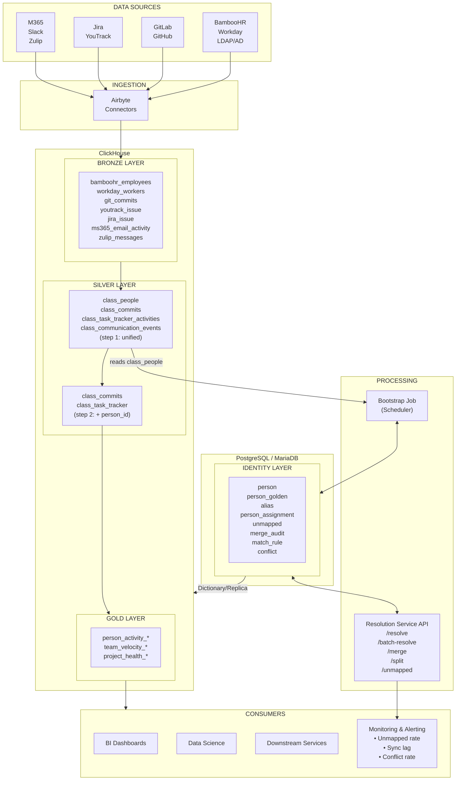

# Identity Resolution Architecture v4

> Canonical architecture for resolving and unifying person identities across data sources

**Supersedes:** [IDENTITY_RESOLUTION_V3.md](./IDENTITY_RESOLUTION_V3.md)

---

## 1. Executive Summary

Identity Resolution is the process of mapping disparate identity signals (emails, usernames, employee IDs) from multiple source systems into canonical person records. This enables cross-system analytics: correlating a person's Git commits with their Jira tasks, calendar events, and HR data.

**Key capabilities:**

- Multi-alias support (one person → many identifiers across systems)
- Full history preservation (SCD Type 2 on person and assignments)
- Department/team transfers with correct historical attribution
- Name changes, email changes, account migrations
- Merge/split operations with rollback support
- RDBMS-agnostic (PostgreSQL or MariaDB)
- **Source Federation** — combine data from multiple HR/directory systems
- **Golden Record Pattern** — assemble best values with configurable priority
- **Conflict Detection** — identify and resolve when sources disagree
- **Silver Layer Contract** — defined schemas for class_people, class_commits, class_task_tracker_activities with append-only ingestion (unified from per-source Bronze tables)

### Key Changes from V3

| # | Improvement | Section | Summary |
| --- | ------------- | --------- | --------- |
| 1 | Header & meta update | 1 | Title updated to V4; supersedes V3 |
| 2 | API idempotency keys | 9.3 | `Idempotency-Key` header on mutating endpoints; server-side dedup with 24h TTL |
| 3 | Consistent golden record schemas | 14.3 | PG and MariaDB `person_golden` now have identical field sets |
| 4 | Expanded golden record fields | 14.3 | Added `username`, `role`, `manager_person_id`, `location` and per-field `_source` columns |
| 5 | Match rule versioning | 6.9 | `updated_by` column + `match_rule_audit` table for change tracking |
| 6 | DEFERRABLE FK constraints | 6.11 | FKs recommended with `DEFERRABLE INITIALLY DEFERRED` (PG); application-level fallback for MariaDB |
| 7 | CDC / event-driven pipeline | 15.5 | Debezium CDC from RDBMS to Kafka to ClickHouse as polling alternative |
| 8 | Bootstrap parallelization | 10.6 | Partition-by-source worker pool with advisory locks |
| 9 | GDPR right to erasure | 18.1 | Hard purge procedure, cascading deletion order, ClickHouse cleanup, legal holds |
| 10 | Multi-tenancy | 21.5 | Row-level vs schema-per-tenant strategies; `tenant_id` column guidance |
| 11 | Eventual consistency budget | 20.7 | End-to-end latency SLA: <60 min standard; alias lookup <1 min, dashboards <10 min (CDC) |
| 12 | Org hierarchy re-org handling | 6.4.5 | SCD Type 2 versioning on `org_unit` for re-organizations (history-preserving) |
| 13 | Dictionary push invalidation | 15.6 | `SYSTEM RELOAD DICTIONARY` triggered via pg_notify for sub-second propagation |
| 14 | `person_entity` FK anchor | 6.0 | Immutable identity table; all FKs reference `person_entity(person_id)` instead of SCD2 `person` |
| 15 | `department`/`team` in assignment_type | 6.4.2 | Added as flat-string legacy types for bootstrap before org_unit mapping is configured |
| 16 | Half-open temporal intervals | 2.1 | Standardized `[valid_from, valid_to)` — `>=`/`<` everywhere, no `BETWEEN` for temporal joins |
| 17 | Golden Record DDL↔Builder alignment | 14.3-14.4 | `ATTRIBUTE_RULES` and `completeness_score` now match DDL column names exactly |
| 18 | Cross-source bootstrap lookup | 10.3 | Bootstrap checks email/username across all sources before minting new `person_id` |
| 19 | `person_golden` declared as derived | 14.3 | Explicit: golden is a read model rebuilt from `person_source_contribution`, never independently authored |
| 20 | Source contribution versioning | 14.3 | `record_hash`, `previous_attributes`, `last_changed_at` for change-level provenance |
| 21 | ClickHouse delete propagation | 15.3 | `is_deleted` column on local replica tables + reconciliation pattern |
| 22 | Realistic SLA split | 20.7 | Separated alias SLA (<1 min) from dashboard SLA (<10 min); removed false <5 min claim |
| 23 | Canonical attribute vocabulary | 3.2.2 | Normative mapping from source fields (`department`, `title`, `manager`) to canonical names |
| 24 | Temporal alias ownership | 6.2, 17 | `owned_from`/`owned_until` on alias table; merge/split preserves queryable alias history |
| 25 | `org_unit_entity` FK anchor | 6.4.0 | Immutable anchor for `org_unit` SCD2; replaced `UNIQUE(org_unit_id)` with partial unique index |
| 26 | Alias temporal uniqueness constraint | 6.2 | Partial unique index `idx_alias_current_owner` (PG) / generated column trick (MariaDB) prevents duplicate active ownership |
| 27 | Org hierarchy temporal guards | 6.4.3 | All hierarchy queries append `AND ou.valid_to IS NULL` to prevent stale version joins |
| 28 | ClickHouse dictionary temporal filter | 6.4.4 | Dictionary WHERE clause updated with `AND valid_to IS NULL` for current-version-only loading |
| 29 | SCD2 re-org handling | 6.4.5 | Re-org rewritten from in-place UPDATE to close-old + insert-new SCD2 pattern |
| 30 | Bootstrap golden-record alignment | 10.3 | Removed direct `create_golden_record()` calls; bootstrap uses `upsert_source_contribution` + `GoldenRecordBuilder` |
| 31 | `person_entity` lifecycle completeness | 6.11, 10.3, 18.1 | Entity created in bootstrap, referenced by MariaDB FKs, purged in GDPR flow |
| 32 | Executive SLA wording alignment | Key Changes | Row 11 updated to match Section 20.7 corrected SLA values |
| 33 | Multi-tenancy scoped uniqueness | 21.5 | `tenant_id` added to `person_entity` and `org_unit_entity`; alias uniqueness index scoped to tenant |
| 34 | ClickHouse active-record views | 15.3 | `person_golden_active` and `person_assignment_active` views filter `is_deleted = 0` |
| 35 | `person_golden.org_unit_id` FK fix | 14.3 | FK now references `org_unit_entity(org_unit_id)` instead of SCD2 `org_unit` |
| 36 | GDPR-safe `merge_audit` FKs | 6.8, 6.11, 18.1 | `target_person_id` nullable + `ON DELETE SET NULL`; person FKs nulled during purge before entity deletion |
| 37 | ERD + relationship summary anchors | 6.10 | ERD redrawn with `person_entity`/`org_unit_entity` as FK parents; relationship table updated |
| 38 | Alias lookup `owned_until` guard | 7.2, 8.1 | Dictionary WHERE and Silver enrichment now filter `AND owned_until IS NULL` |
| 39 | `unmapped` table name consistency | 18.1, 20.2, 1.1 | All `unmapped_alias` references replaced with `unmapped` to match DDL |
| 40 | MariaDB `person_golden_audit` DDL | 14.3 | Added MariaDB DDL for audit table; MariaDB GDPR now deletes `person_entity` |
| 41 | Multi-tenancy completeness | 21.5 | Tenancy matrix table; RLS on all PG tables; MariaDB entity anchors get `tenant_id`; ClickHouse local replicas get `tenant_id` |
| 42 | `merge_audit.performed_at` consistency | 20.2 | Monitoring query uses `performed_at` matching DDL (was `created_at`) |
| 43 | Half-open interval enforcement | 19.3 | `BETWEEN` on `commit_date` replaced with `>=`/`<` half-open bounds |
| 44 | `person` SCD2 unique current guard | 6.1 | PG: partial unique index `idx_person_current`; MariaDB: `valid_to_key` generated column + unique key |
| 45 | Section 15.4 tombstone awareness | 15.4 | Gold mart example uses `person_assignment_active` view instead of raw local table |
| 46 | `person_assignment.source_system` rename | 6.4.2 | Column renamed from `source` to `source_system` for registry consistency |
| 47 | MariaDB `merge_audit.target_person_id` nullable | 6.8 | Matches PG: nullable for GDPR purge flow |
| 48 | Full multi-tenancy coverage | 21.5 | `tenant_id` added to `person_source_contribution`, `merge_audit`, `unmapped`, `person_golden_audit` (PG + MariaDB); tenancy matrix expanded |
| 49 | ERD `person_golden_audit` anchor | 6.10 | Audit log FK parent changed from `person_golden` to `person_entity` |
| 50 | ERD/ClickHouse `source_system` alignment | 6.10, 15.3 | ERD and ClickHouse local replica use `source_system` (was `source`) |
| 51 | Circuit-breaker `owned_until` guard | 20.6 | `resolve_alias()` query now filters `status = 'active' AND owned_until IS NULL` |
| 52 | Integrity check uses `person_entity` | 6.11 | Orphan alias check validates against `person_entity`, not SCD2 `person` |
| 53 | Bootstrap employee_id `owned_until` guard | 10.3 | Step 1 alias lookup now filters `a.status = 'active' AND a.owned_until IS NULL` |
| 54 | ClickHouse replica `tenant_id` inline | 15.3 | `tenant_id` added directly to `person_golden_local`/`person_assignment_local` DDL and sync queries |
| 55 | Full tenant coverage | 21.5 | `person_availability`, `person_name_history`, `conflict` added to tenant matrix and ALTERs |
| 56 | FK anchors for all child tables | 6.11 | Added `fk_merge_source`, `fk_availability_person`, `fk_name_history_person` DEFERRABLE FKs |
| 57 | `person_assignment` source registry FK | 6.10, 6.12 | ERD and relationship summary include `source_system → person_assignment` relationship |
| 58 | MariaDB DATETIME precision guards | 6.1, 6.2 | `valid_to_key`/`owned_until_key` use DATETIME (not DATE) for same-day SCD2/alias transfers |
| 59 | `org_unit_entity` FK in all DDL | 6.4.1, 6.4.2 | `person_assignment` and MariaDB `org_unit` now have explicit `FOREIGN KEY → org_unit_entity` |
| 60 | Tenant-scoped uniqueness everywhere | 21.5 | MariaDB alias and unmapped uniqueness rewritten with `tenant_id`; PG unmapped also scoped |
| 61 | ERD column accuracy | 6.10 | `person_golden` PK corrected; `person_source_contribution` columns match DDL |
| 62 | RLS on all tenant-scoped PG tables | 21.5 | RLS enabled on all 11 tenant-scoped tables (was 5) |
| 63 | API field name alignment | 14.6 | `source` → `source_system`, `source_type` → `system_type`, `is_enabled` → `sync_enabled` |
| 64 | V3→V4 summary corrections | Appendix | SLA and re-org strategy text updated to match corrected sections |
| 65 | Circuit-breaker `source_system` param | 20.6 | `resolve_alias()` now requires `source_system` for per-instance alias correctness |
| 66 | `person_golden_audit` FK + nullable | 6.11, 14.3 | FK to `person_entity` with `ON DELETE SET NULL`; `person_id` nullable in PG + MariaDB |
| 67 | RLS on all tenant-scoped PG tables | 21.5 | Added RLS for `person_entity`, `org_unit_entity`, `person_golden_audit` |
| 68 | MariaDB `person_golden.org_unit_id` FK | 14.3 | Added `FOREIGN KEY → org_unit_entity` to MariaDB DDL |
| 69 | MariaDB `org_unit` SCD2 guard | 6.4.1 | `valid_to_key DATETIME` generated column + unique key prevents duplicate current versions |
| 70 | ERD `org_unit` FK not UK | 6.10 | `org_unit_id` marked as FK (was UK), matching SCD2 semantics |
| 71 | `source_system` naming in all tables | 6.5, 6.6 | `person_availability` and `person_name_history` columns renamed from `source` to `source_system` |
| 72 | ERD `source_system` full coverage | 6.10 | Added ERD relationships for `org_unit`, `person_availability`, `person_name_history`, `person_golden_audit` |
| 73 | Golden Record diagram DDL alignment | 14.3 | Diagram fields updated to match DDL (`role`, `username`, `location` instead of `department`, `github_username`) |
| 74 | MariaDB `person_golden_audit` FK | 14.3 | Added `FOREIGN KEY (person_id) REFERENCES person_entity ON DELETE SET NULL` |
| 75 | ERD `merge_audit.source_person_id` FK | 6.10 | Both `target_person_id` and `source_person_id` marked as FK in ERD |
| 76 | ClickHouse tenant offboarding clarity | 21.5 | Removed contradictory `DROP PARTITION` claim for bucketed partitioning |
| 77 | Canonical vocabulary in priority tables | 12.2-12.3 | `is_authoritative_for` and attribute table use canonical names (`org_unit_id`, `manager_person_id`, `username`) |
| 78 | Disjoint-populations example alignment | 14.3 | Updated to use `source_system`, `role`, `username` instead of legacy field names |
| 79 | Tenant-scoped alias resolution | 7.2, 8.1, 20.6 | `tenant_id` added to ClickHouse dictionary key, Silver enrichment join, and `resolve_alias()` function |
| 80 | ERD `alias` temporal columns | 6.10 | `owned_from`/`owned_until` added to alias ERD block |
| 81 | ERD `person_golden` full columns | 6.10 | `username`, `role`, `manager_person_id`, `location` added to ERD block |
| 82 | Seed data canonical vocabulary | 12.1 | `is_authoritative_for` seed uses `org_unit_id`/`manager_person_id` (was `department`/`manager`) |
| 83 | Federation example canonical names | 11.1 | Diagram uses `org_unit_id`, `username` (was `department`, `github_username`) |
| 84 | Golden Record narrative fix | 14.2 | "contributing_sources" instead of incorrect "source_system = ad" |
| 85 | Relationship summary completeness | 6.10 | `merge_audit` join columns include both `target_person_id` and `source_person_id` |
| 86 | Golden Record derivation clarity | 14.3 | Narrative clarified: upstream write models → `person_source_contribution` → `GoldenRecordBuilder` |
| 87 | Two-stage naming convention | 3.2.2 | Bronze uses interchange names (`department`, `team`); Bootstrap resolves to canonical (`org_unit_id`, `role`) |
| 88 | Alias lookup mode documentation | 6.3 | Source-scoped (hot path) vs cross-source (bootstrap) lookup modes documented |
| 89 | Conflict detection source column mapping | 13.4 | `SOURCE_COLUMN_MAP` aligns with DDL (`manager_source`, not `manager_person_id_source`) |
| 90 | `github_username` → `username` alias type | 6.3 | Standardized to `username` distinguished by `source_system` |
| 91 | Silver `tenant_id` column | 8.2 | `tenant_id` added to `silver.commits` DDL; ORDER BY includes `tenant_id` |
| 92 | Silver `tenant_id` column | 3.3, 3.4 | `tenant_id` added to `class_people`, `class_commits`, `class_task_tracker_activities` DDLs with ORDER BY |
| 93 | Global alias scope clarification | 6.3 | "Global*" scope footnote: value is globally meaningful, but uniqueness index includes `source_system` for provenance |
| 94 | `org_unit.code` partial unique | 6.4.1 | `code UNIQUE` replaced with partial unique index `idx_org_code_current` (PG) / generated-column unique key (MariaDB) to allow SCD2 versioning |
| 95 | Historical hierarchy temporal join | 6.4.5 | Uses `:query_date` (event time) instead of `pa.valid_from` for correct org path resolution during re-orgs |
| 96 | `connector_source` → `source_system` | 8.1, 8.2 | Silver DDL and Bronze→Silver join use `source_system` matching Bronze DDL |
| 97 | Flat assignment types documented | 3.2.2 | Note on `department`/`team` as valid legacy `assignment_type` values alongside canonical `org_unit` |
| 98 | Bootstrap canonical source contribution | 3.2.2, 10.3 | `upsert_source_contribution` now writes canonical names (`role`, `org_unit_id`, `manager_person_id`) |
| 99 | `class_people.location` column | 3.3 | Added `location` to Silver DDL matching bootstrap code and unified fields summary |
| 100 | `title` storage target fix | 3.2.2 | Unified fields summary corrected: `title` → `person_golden.role` (canonical name) |
| 101 | Assignment API `org_unit_id` | 9.1 | API contract includes optional `org_unit_id` for `assignment_type='org_unit'` |
| 102 | Silver `tenant_id` completeness | 3.4, 3.15 | `tenant_id` added to `class_communication_events`, `class_crm_deals`, `class_calendar_events`, `class_activities` DDLs |
| 103 | ClickHouse replica `tenant_id` dedup | 21.5 | Removed redundant ALTER TABLE for local replicas (already defined inline in Section 15.3) |

---

### 1.1 System Architecture Overview



**Data Flow:**

- Sources → Airbyte → Bronze (per-source tables, ClickHouse) → Silver step 1 (unified class_* tables) → Bootstrap → Identity (RDBMS)
- Silver step 1 + Identity → Silver step 2 (+ person_id) → Gold
- Identity ──Dictionary/Replica──▶ ClickHouse (for JOINs)

**Data Flow Summary:**

| Step | Component | Action |
| ------ | ----------- | -------- |
| 1 | Airbyte Connectors | Extract from sources → per-source Bronze tables (ClickHouse) |
| 2 | Silver step 1 | Unify per-source Bronze → class_* tables (ClickHouse) |
| 3 | Bootstrap Job | class_people (Silver step 1) → Identity tables (RDBMS). Triggered on schedule. |
| 4 | Resolution Service | Resolve aliases, merge/split, manage conflicts |
| 5 | Silver step 2 | JOIN Silver step 1 + Identity → class_* with person_id (ClickHouse) |
| 5 | Gold Aggregation | Aggregate Silver → Gold marts (ClickHouse) |
| 6 | Dictionary/Replica | Sync Identity → ClickHouse for fast lookups |

---

## 2. Position in Data Pipeline

Identity Resolution sits **between Silver step 1 (unified) and Silver step 2 (identity-resolved)** in the Medallion Architecture:

```text
┌──────────────────────────────────────────────────────────────────────────────────────────┐
│                                      DATA PIPELINE                                        │
├──────────────────────────────────────────────────────────────────────────────────────────┤
│                                                                                           │
│  CONNECTORS        BRONZE              SILVER step 1       SILVER step 2    GOLD          │
│  ──────────        ──────              ─────────────       ─────────────    ────          │
│                                        (unified)           (+ person_id)                  │
│  ┌─────────┐    ┌───────────────┐    ┌───────────────┐                   ┌──────────┐    │
│  │ GitLab  │───▶│ git_commits   │───▶│ class_commits │──┐  class_commits │ person_  │    │
│  │ GitHub  │    └───────────────┘    └───────────────┘  │  (+ person_id)─▶│ activity │    │
│  └─────────┘                                            │       ▲        │ summary  │    │
│                                                         │       │        └──────────┘    │
│  ┌─────────┐    ┌───────────────┐    ┌───────────────┐  │       │                        │
│  │ Jira    │───▶│ jira_issue    │───▶│ class_task_   │──┤  ┌────┴─────┐                  │
│  │ YouTrack│    │ youtrack_issue│    │ tracker_      │  │  │ IDENTITY │                  │
│  └─────────┘    └───────────────┘    │ activities    │  ├─▶│RESOLUTION│                  │
│                                      └───────────────┘  │  │ SERVICE  │                  │
│  ┌─────────┐    ┌───────────────┐    ┌───────────────┐  │  └────┬─────┘                  │
│  │ M365    │───▶│ ms365_email   │───▶│ class_comms   │──┤       │                        │
│  │ Zulip   │    │ zulip_messages│    │ _events       │  │       ▼                        │
│  └─────────┘    └───────────────┘    └───────────────┘  │  ┌──────────┐                  │
│                                                         │  │PostgreSQL│                  │
│  ┌─────────┐    ┌───────────────┐    ┌───────────────┐  │  │    or    │                  │
│  │BambooHR │───▶│ bamboohr_     │───▶│ class_people  │──┘  │ MariaDB  │                  │
│  │ Workday │    │ employees     │    │               │     └──────────┘                  │
│  └─────────┘    │ workday_      │    └───────┬───────┘          │                        │
│                 │ workers       │            │   Bootstrap      │                        │
│                 └───────────────┘            └─────────────────▶│                        │
│                                                                                           │
│  ClickHouse                                              External Engine / Dictionary     │
│  ══════════                                              ═══════════════════════════      │
│                                                                                           │
└──────────────────────────────────────────────────────────────────────────────────────────┘
```

### Why Between Bronze and Silver?

| Principle | Rationale |
| ----------- | ----------- |
| **Bronze immutability** | Raw data stays unchanged; can re-process if rules change |
| **Silver = enriched** | Industry standard: Silver tier contains cleaned, validated, joined data |
| **Separation of concerns** | Connectors don't need to know about identity; they just extract |
| **Replay capability** | If identity rules improve, re-run Silver transformation |

This aligns with **Medallion Architecture** (Databricks), **Data Vault 2.0** (raw vault → business vault), and **Kimball** (staging → dimension conforming).

---

### 2.1 Terminology: Medallion Architecture & SCD Type 2

#### Medallion Architecture (Bronze → Silver → Gold)

Medallion Architecture is a multi-layered data organization pattern in Data Lake/Lakehouse, where each tier has a specific purpose:

```text
┌──────────────────────────────────────────────────────────────────────────────────────┐
│                              MEDALLION ARCHITECTURE                                    │
├──────────────────────────────────────────────────────────────────────────────────────┤
│                                                                                       │
│  BRONZE (Raw)            SILVER step 1 (Unified)   SILVER step 2         GOLD        │
│  ═════════════           ════════════════════════   ═══════════════   ════════════    │
│                                                     (+ person_id)                     │
│  • Per-source tables     • Cross-source unified     • Identity-resolved  • Aggregates │
│  • Append-only           • Cleaned, validated       • person_id joined   • BI-ready   │
│  • Source-native schema  • Schema-on-write          • Final Silver       • Denormalized│
│  • Full history          • Deduplicated             • Ready for Gold     • Pre-computed│
│                                                                                       │
│  bamboohr_employees      class_people               class_people         person_      │
│  git_commits             class_commits              (+ person_id)        activity_    │
│  youtrack_issue          class_task_tracker_         class_commits        daily        │
│  ms365_email_activity     activities                (+ person_id)        team_        │
│  zulip_messages          class_communication_        class_task_tracker   velocity_   │
│                           events                                         weekly       │
│                                                                                       │
│  ClickHouse              ClickHouse                 ClickHouse           ClickHouse   │
│  (ReplacingMergeTree)    (MergeTree /               (join with Person    (Summing/    │
│                           ReplacingMergeTree)        Registry)            Aggregating) │
│                                                                                       │
└──────────────────────────────────────────────────────────────────────────────────────┘
```

| Tier | Purpose | Typical Operations | Data Quality |
| ------ | --------- | ------------------- | -------------- |
| **Bronze** | Raw data archive | INSERT only | As-is from source |
| **Silver** | Cleaned, linked data | JOIN, dedup, enrich | Validated, complete |
| **Gold** | Business aggregates | GROUP BY, SUM, AVG | Ready for analysis |

**Why not transform directly to Gold?**

- Bronze allows reprocessing data if transformation rules change
- Silver can be recalculated from Bronze without re-fetching from sources
- Gold can be recalculated from Silver for different time slices/periods

#### SCD Type 2 (Slowly Changing Dimension Type 2)

SCD Type 2 is a pattern for storing historical changes in dimensions (reference tables). Instead of overwriting records, a new version is created with temporal validity:

```text
┌─────────────────────────────────────────────────────────────────────────────┐
│                          SCD TYPE 2 EXAMPLE                                  │
├─────────────────────────────────────────────────────────────────────────────┤
│                                                                              │
│   Event: John Smith transfers from Engineering to Product on March 1, 2026  │
│                                                                              │
│   ══════════════════════════════════════════════════════════════════════    │
│                                                                              │
│   SCD Type 1 (overwrite — history lost):                                    │
│   ┌──────────────────────────────────────────────────────────────────┐     │
│   │  person_id │ name        │ department │ updated_at              │     │
│   │  1         │ John Smith  │ Product    │ 2026-03-01              │     │
│   └──────────────────────────────────────────────────────────────────┘     │
│   ❌ Don't know John was ever in Engineering                                │
│                                                                              │
│   ══════════════════════════════════════════════════════════════════════    │
│                                                                              │
│   SCD Type 2 (versioning — history preserved):                              │
│   ┌──────────────────────────────────────────────────────────────────┐     │
│   │  id │ person_id │ department  │ valid_from  │ valid_to          │     │
│   │  1  │ 1         │ Engineering │ 2024-01-15  │ 2026-02-28        │     │
│   │  2  │ 1         │ Product     │ 2026-03-01  │ NULL (current)    │     │
│   └──────────────────────────────────────────────────────────────────┘     │
│   ✅ Full history: know when John was in which department                   │
│                                                                              │
└─────────────────────────────────────────────────────────────────────────────┘
```

**Why SCD Type 2 matters for Identity Resolution:**

| Question | Without SCD2 | With SCD2 |
| ---------- | -------------- | ----------- |
| "Which department for commit on Feb 15?" | Product (wrong!) | Engineering ✅ |
| "When did John move to Product?" | Unknown | March 1, 2026 ✅ |
| "How many people were in Engineering in January?" | Wrong count | Accurate count ✅ |

**Query pattern for SCD Type 2:**

> **🔴 Codex Challenge (Critical #4 — Half-Open Intervals):** All temporal ranges use **half-open intervals `[valid_from, valid_to)`**. `valid_from` is inclusive, `valid_to` is exclusive. Use `>=` and `<` (never `BETWEEN`). This prevents double attribution on boundary dates when one version closes and another opens on the same day. `valid_to IS NULL` means "current/open-ended".

```sql
-- Current state (active records)
SELECT * FROM person_assignment WHERE valid_to IS NULL;

-- State at specific date (point-in-time query, half-open)
SELECT * FROM person_assignment
WHERE valid_from <= '2026-02-15'
  AND (valid_to IS NULL OR valid_to > '2026-02-15');

-- JOIN with facts by event date (half-open)
SELECT c.*, pa.assignment_value AS department
FROM commits c
JOIN person_assignment pa
  ON c.person_id = pa.person_id
  AND c.commit_date >= pa.valid_from
  AND (pa.valid_to IS NULL OR c.commit_date < pa.valid_to);
```

---

## 3. Bronze Layer: Raw Tables Contract

### 3.1 Ingestion Philosophy

Bronze layer follows the **append-only** pattern. For production use, we recommend the **Two-Table Pattern** (see Section 3.13-3.14):

- `class_*_history` (MergeTree) — stores all versions, full audit trail
- `class_*_latest` (ReplacingMergeTree) — deduplicated view for pipelines

```text
┌─────────────────────────────────────────────────────────────────────────────┐
│                         BRONZE INGESTION PATTERN                             │
├─────────────────────────────────────────────────────────────────────────────┤
│                                                                              │
│   Connector polls source on configurable schedule (per-connector cron)      │
│                     │                                                        │
│                     ▼                                                        │
│   ┌─────────────────────────────────────────────────────────────────────┐   │
│   │  EXTRACTION (Connector)                                              │   │
│   │                                                                      │   │
│   │  • Incremental: WHERE updated_at > last_cursor                      │   │
│   │                   AND updated_at < NOW() - safe_window              │   │
│   │    (safe_window avoids data loss from concurrent transactions)      │   │
│   │  • OR Full refresh: all records (for sources without updated_at)   │   │
│   │  • Cursor stored per connector+endpoint in state table (PostgreSQL)│   │
│   └─────────────────────────────────────────────────────────────────────┘   │
│                     │                                                        │
│                     ▼                                                        │
│   ┌─────────────────────────────────────────────────────────────────────┐   │
│   │  LOAD TO BRONZE (ClickHouse)                                         │   │
│   │                                                                      │   │
│   │  INSERT INTO class_people (...)                                       │   │
│   │  VALUES (...)                                                        │   │
│   │                                                                      │   │
│   │  • Always INSERT, never UPDATE                                      │   │
│   │  • Same record may appear multiple times (different _synced_at)     │   │
│   │  • Two-Table Pattern: insert to both _history and _latest          │   │
│   └─────────────────────────────────────────────────────────────────────┘   │
│                     │                                                        │
│                     ▼                                                        │
│   ┌─────────────────────────────────────────────────────────────────────┐   │
│   │  TWO-TABLE PATTERN (Recommended — see Section 3.13-3.14)             │   │
│   │                                                                      │   │
│   │  class_*_history (MergeTree):                                         │   │
│   │     • ALL versions kept forever                                     │   │
│   │     • Full audit trail                                              │   │
│   │                                                                      │   │
│   │  class_*_latest (ReplacingMergeTree):                                 │   │
│   │     • Auto-deduped, keeps only latest                               │   │
│   │     • Safe to OPTIMIZE                                              │   │
│   │     • Used by Identity Resolution pipeline                          │   │
│   └─────────────────────────────────────────────────────────────────────┘   │
│                                                                              │
└─────────────────────────────────────────────────────────────────────────────┘
```

**⚠️ Important Notes:**

| Concern | Explanation |
| --------- | ------------- |
| **FINAL performance** | Adds ~10-30% overhead. For large tables, use Materialized Views or pre-aggregated tables instead |
| **OPTIMIZE history** | Running `OPTIMIZE TABLE FINAL` physically **deletes** old versions. **Never use on tables where source doesn't preserve history!** See 3.12-3.14 |
| **Safe window** | The `NOW() - safe_window` offset prevents missing records when source has concurrent writes with out-of-order timestamps |

### 3.2 Bronze Storage Engine Options

| Approach | Pros | Cons | When to Use |
| ---------- | ------ | ------ | ------------- |
| **MergeTree (plain)** | Full history forever, simple | Manual dedup in queries | **Recommended for Bronze history** |
| **ReplacingMergeTree** | Auto-dedup, keeps latest | ⚠️ **Loses history on merge/OPTIMIZE** | Hot path queries only |
| **Two-Table Pattern** | History + fast queries | More complexity | **Production recommendation** |
| **Upsert (UPDATE or INSERT)** | Compact storage | Complex, loses history | Never in Bronze |

**See sections 3.12-3.14 for detailed history preservation strategies.**

### 3.2.1 Bronze Schema Flexibility: Raw Payload Preservation

**Problem:** Bronze tables with fixed schemas lose source-specific data that may be needed later.

```text
┌─────────────────────────────────────────────────────────────────────────────┐
│                    THE SCHEMA EVOLUTION PROBLEM                              │
├─────────────────────────────────────────────────────────────────────────────┤
│                                                                              │
│   Today: We create class_task_tracker_activities with fields we think we need                   │
│                                                                              │
│   CREATE TABLE class_task_tracker_activities (                                                  │
│       task_id, title, status, assignee_id,                                  │
│       sprint_id, story_points, ...                                          │
│   )                                                                          │
│                                                                              │
│   6 months later: "We need Jira's custom field 'Business Value'"            │
│                                                                              │
│   Problem: That field was in the API response, but we didn't store it!      │
│   → Cannot backfill from Bronze (data lost)                                 │
│   → Must re-sync from source (if source still has history)                  │
│   → Jira Cloud only keeps 30 days of history → DATA GONE FOREVER            │
│                                                                              │
└─────────────────────────────────────────────────────────────────────────────┘
```

**Solution: Hybrid Schema with Mandatory `_raw_json`**

| Schema Component | Purpose | Required? |
| ------------------ | --------- | ---------- |
| **Primary Key fields** | `source_system`, `task_id` | ✅ Yes |
| **Indexable fields** | Fields used in WHERE/JOIN frequently | ✅ Yes (minimal set) |
| **Timestamp fields** | `created_at`, `updated_at`, `_synced_at` | ✅ Yes |
| **Ingestion metadata** | `_connector_id`, `_batch_id` | ✅ Yes |
| **`_raw_json`** | **Complete API response** | ✅ **MANDATORY** |
| **Convenience fields** | `title`, `status`, `assignee_email` | Optional (can extract from JSON) |

**Key insight:** `_raw_json` is NOT for debugging — it's the **source of truth**. Convenience fields are just pre-extracted for query performance.

```sql
-- RECOMMENDED: Hybrid Bronze Schema
CREATE TABLE silver.class_task_tracker_activities (
    -- === PRIMARY KEY (required for dedup/ordering) ===
    task_id             String,
    source_system       String,         -- Must match identity.source_system.code (Section 6.12)
    
    -- === INDEXABLE FIELDS (for efficient filtering) ===
    project_id          String,
    updated_at          DateTime64(3),
    
    -- === PRE-EXTRACTED CONVENIENCE FIELDS (optional, can be added later) ===
    -- These can always be re-extracted from _raw_json if schema evolves
    title               String MATERIALIZED JSONExtractString(_raw_json, 'title'),
    status              String MATERIALIZED JSONExtractString(_raw_json, 'status'),
    assignee_email      String MATERIALIZED JSONExtractString(_raw_json, 'assignee', 'email'),
    
    -- === INGESTION METADATA (required) ===
    _source_id          String,
    _source_updated_at  DateTime64(3),
    _synced_at          DateTime64(3) DEFAULT now64(3),
    _connector_id       String,
    _batch_id           String,
    
    -- === RAW PAYLOAD (MANDATORY - source of truth) ===
    _raw_json           String  -- NOT optional! Full API response
)
ENGINE = MergeTree()  -- or ReplacingMergeTree for _latest table
PARTITION BY toYYYYMM(updated_at)
ORDER BY (source_system, project_id, task_id, _synced_at);
```

**MATERIALIZED columns:** ClickHouse extracts values from `_raw_json` at INSERT time and stores them as regular columns. No runtime JSON parsing overhead.

**Schema evolution workflow:**

```text
┌─────────────────────────────────────────────────────────────────────────────┐
│                    ADDING NEW FIELD FROM _raw_json                           │
├─────────────────────────────────────────────────────────────────────────────┤
│                                                                              │
│   1. Need a new field? Extract from existing _raw_json:                     │
│                                                                              │
│      SELECT                                                                  │
│          task_id,                                                            │
│          JSONExtractFloat(_raw_json, 'fields', 'customfield_10042')         │
│              AS business_value                                               │
│      FROM silver.class_task_tracker_activities                                                  │
│      WHERE source_system = 'jira'                                           │
│                                                                              │
│   2. Want it as a regular column? Add MATERIALIZED:                         │
│                                                                              │
│      ALTER TABLE silver.class_task_tracker_activities                                           │
│      ADD COLUMN business_value Float32                                       │
│          MATERIALIZED JSONExtractFloat(_raw_json, 'fields', 'customfield_10042');
│                                                                              │
│   3. Backfill existing rows:                                                │
│                                                                              │
│      ALTER TABLE silver.class_task_tracker_activities                                           │
│      UPDATE business_value = JSONExtractFloat(...)                          │
│      WHERE source_system = 'jira';                                          │
│                                                                              │
└─────────────────────────────────────────────────────────────────────────────┘
```

**Source-specific JSON examples:**

```json
// Jira _raw_json
{
  "id": "10042",
  "key": "PROJ-123",
  "fields": {
    "summary": "Fix login bug",
    "status": {"name": "In Progress"},
    "assignee": {"emailAddress": "john@corp.com"},
    "customfield_10042": 8.5,  // Business Value - Jira specific
    "customfield_10015": "2026-Q1"  // Target Quarter - Jira specific
  }
}

// YouTrack _raw_json  
{
  "id": "YT-456",
  "summary": "Fix login bug",
  "state": {"name": "In Progress"},
  "assignee": {"email": "john@corp.com"},
  "customFields": [
    {"name": "Subsystem", "value": "Auth"},  // YouTrack specific
    {"name": "Estimation", "value": {"minutes": 480}}  // YouTrack specific
  ]
}

// Linear _raw_json
{
  "id": "LIN-789",
  "title": "Fix login bug",
  "state": {"name": "In Progress"},
  "assignee": {"email": "john@corp.com"},
  "cycle": {"name": "Sprint 42"},  // Linear specific (not sprint_id)
  "estimate": 5  // Linear specific (not story_points)
}
```

All source-specific fields are preserved in `_raw_json` and can be extracted anytime.

### 3.2.2 Normalization Strategy: Connector vs Bootstrap Job

**Question:** Data from Workday, BambooHR, and AD arrives in different formats. Where should normalization happen?

```text
┌─────────────────────────────────────────────────────────────────────────────┐
│                    NORMALIZATION ARCHITECTURE DECISION                       │
├─────────────────────────────────────────────────────────────────────────────┤
│                                                                              │
│   OPTION A: Normalize in Connector (RECOMMENDED)                            │
│   ─────────────────────────────────────────────────                         │
│                                                                              │
│   Workday API ──▶ Workday Connector ──▶ workday_workers (Bronze)            │
│                   ├─ primary_email = record['emailAddress']                 │
│                   ├─ display_name = record['preferredName']                 │
│                   └─ _raw_json = original response                          │
│                                                                              │
│   BambooHR API ─▶ BambooHR Connector ─▶ bamboohr_employees (Bronze)         │
│                   ├─ primary_email = record['workEmail']                    │
│                   ├─ display_name = firstName + " " + lastName              │
│                   └─ _raw_json = original response                          │
│                                                                              │
│   AD/LDAP ──────▶ LDAP Connector ────▶ ldap_users (Bronze)                  │
│                   ├─ primary_email = record['mail']                         │
│                   ├─ display_name = record['displayName']                   │
│                   └─ _raw_json = original response                          │
│                                                                              │
│   Silver unification: Bronze tables → class_people (unified schema)        │
│   Bootstrap Job: reads class_people, NO source-specific logic              │
│                                                                              │
│   ══════════════════════════════════════════════════════════════════════    │
│                                                                              │
│   OPTION B: Normalize in Bootstrap Job (NOT recommended)                    │
│   ───────────────────────────────────────────────────────                   │
│                                                                              │
│   All APIs ────▶ Generic Connector ──▶ {source}_people (_raw_json only)      │
│                                              │                               │
│                                              ▼                               │
│   Bootstrap Job:                                                             │
│     if source_system == 'workday':                                          │
│         email = JSONExtract(_raw_json, 'emailAddress')                      │
│     elif source_system == 'bamboohr':                                       │
│         email = JSONExtract(_raw_json, 'workEmail')                         │
│     elif source_system == 'ldap':                                           │
│         email = JSONExtract(_raw_json, 'mail')                              │
│     ...                                                                      │
│                                                                              │
│   Problem: Bootstrap Job becomes complex, tightly coupled to all sources    │
│                                                                              │
└─────────────────────────────────────────────────────────────────────────────┘
```

**Why Option A (Connector Normalization) is recommended:**

| Factor | Option A (Connector) | Option B (Bootstrap) |
| -------- | --------------------- | --------------------- |
| **Connector complexity** | Each connector knows its source | Generic, simple |
| **Bootstrap complexity** | Simple, source-agnostic | Complex, switch per source |
| **Adding new source** | New connector only | New connector + Bootstrap changes |
| **Testing** | Test connector in isolation | Must test Bootstrap for each source |
| **Separation of concerns** | ✅ Clear boundaries | ❌ Mixed responsibilities |
| **Bronze queryability** | Direct SELECT on unified fields | Must parse JSON per source |

#### Implementation: Connector normalizes to unified schema

```python
# Each connector normalizes to SAME schema
class WorkdayConnector(BaseHRConnector):
    def transform(self, record) -> dict:
        return {
            # Unified fields (same for all HR connectors)
            'employee_id': record['employeeID'],
            'source_system': 'workday',
            
            # Emails (primary + additional)
            'primary_email': record['emailAddress'],
            'additional_emails': record.get('additionalEmails', []),
            
            # Identity
            'display_name': record['preferredName'] or f"{record['firstName']} {record['lastName']}",
            'username': record.get('userId'),  # Workday login
            
            # Status & dates
            'status': self.map_status(record['workerStatus']),
            'start_date': self.parse_date(record.get('hireDate')),
            'termination_date': self.parse_date(record.get('terminationDate')),
            
            # Organizational
            'department': record.get('supervisoryOrganization', {}).get('name'),
            'team': record.get('team', {}).get('name'),
            'title': record.get('businessTitle'),
            'manager_employee_id': record.get('manager', {}).get('employeeID'),
            
            # Raw payload for future schema evolution
            '_raw_json': json.dumps(record)
        }

class BambooHRConnector(BaseHRConnector):
    def transform(self, record) -> dict:
        # BambooHR may have multiple emails in customFields
        additional = [record.get('homeEmail')] if record.get('homeEmail') else []
        
        return {
            'employee_id': record['id'],
            'source_system': 'bamboohr',
            
            'primary_email': record['workEmail'],
            'additional_emails': additional,
            
            'display_name': f"{record['firstName']} {record['lastName']}",
            'username': record.get('workEmail', '').split('@')[0],  # Derive from email
            
            'status': self.map_status(record['status']),
            'start_date': self.parse_date(record.get('hireDate')),
            'termination_date': self.parse_date(record.get('terminationDate')),
            
            'department': record.get('department'),
            'team': record.get('division'),  # BambooHR calls it "division"
            'title': record.get('jobTitle'),
            'manager_employee_id': record.get('supervisorId'),
            
            '_raw_json': json.dumps(record)
        }

class LDAPConnector(BaseHRConnector):
    def transform(self, record) -> dict:
        # LDAP may have proxyAddresses with multiple emails
        proxy_emails = self.extract_proxy_emails(record.get('proxyAddresses', []))
        
        return {
            'employee_id': record['employeeNumber'] or record['sAMAccountName'],
            'source_system': 'ldap',
            
            'primary_email': record['mail'],
            'additional_emails': proxy_emails,
            
            'display_name': record['displayName'],
            'username': record['sAMAccountName'],  # AD login name
            
            'status': 'active' if record.get('userAccountControl') != 514 else 'inactive',
            'start_date': None,  # LDAP often doesn't have hire date
            'termination_date': None,
            
            'department': record.get('department'),
            'team': record.get('division'),
            'title': record.get('title'),
            'manager_employee_id': self.extract_manager_id(record.get('manager')),
            
            '_raw_json': json.dumps(record)
        }
    
    def extract_proxy_emails(self, proxy_addresses: list) -> list:
        """Extract SMTP addresses from AD proxyAddresses"""
        # proxyAddresses: ['SMTP:john@corp.com', 'smtp:j.smith@corp.com']
        return [addr[5:] for addr in proxy_addresses 
                if addr.lower().startswith('smtp:') and addr != f'SMTP:{self.primary_email}']
```

#### Bootstrap Job: Source-agnostic (reads unified fields)

```python
# Bootstrap Job does NOT know about source-specific formats
def bootstrap_person(record: dict):
    """
    Works with ANY source - fields are already normalized by connector.
    Uses unified schema fields, never parses _raw_json.
    """
    
    # 1. Find or create person
    person_id = find_or_create_person(
        employee_id=record['employee_id'],
        source_system=record['source_system'],
        display_name=record['display_name'],
        status=record['status']
    )
    
    # 2. Create aliases (for cross-system matching)
    create_alias(person_id, 'employee_id', record['employee_id'], record['source_system'])
    create_alias(person_id, 'email', record['primary_email'], record['source_system'])
    
    # Additional emails as separate aliases
    for email in record.get('additional_emails', []):
        create_alias(person_id, 'email', email, record['source_system'])
    
    # Username alias (for Git/Jira matching)
    if record.get('username'):
        create_alias(person_id, 'username', record['username'], record['source_system'])
    
    # 3. Create organizational assignments (SCD Type 2)
    valid_from = record.get('start_date') or date.today()
    
    if record.get('department'):
        create_assignment(person_id, 'department', record['department'], valid_from)
    
    if record.get('team'):
        create_assignment(person_id, 'team', record['team'], valid_from)
    
    # 4. Create source contribution with CANONICAL names (must match person_golden DDL)
    # Bronze interchange names are resolved here: department→org_unit_id, title→role, etc.
    canonical_attrs = {
        'display_name': record['display_name'],
        'email': record['primary_email'],
        'username': record.get('username'),
        'role': record.get('title'),  # title → role (canonical vocabulary)
        'status': record['status'],
        'location': record.get('location'),
        # org_unit_id and manager_person_id resolved by assignment/alias lookup above
    }
    upsert_source_contribution(person_id, record['source_system'], canonical_attrs)
    GoldenRecordBuilder().rebuild(person_id)
    
    return person_id
```

**Unified Schema Fields Summary:**

| Field | Type | Purpose | Used In |
| ------- | ------ | --------- | --------- |
| `employee_id` | String | Primary key per source | alias |
| `source_system` | String | Source identifier | all |
| `primary_email` | String | Main work email | alias (email) |
| `additional_emails` | Array | Other emails | alias (email) |
| `display_name` | String | Full name | person, person_golden |
| `username` | String | Login/username | alias (username) |
| `status` | String | Employment status | person, person_golden |
| `start_date` | Date | Hire date | person_assignment.valid_from |
| `termination_date` | Date | Exit date | person.valid_to |
| `department` | String | Department name | person_assignment (flat) or org_unit lookup |
| `team` | String | Team within dept | person_assignment (flat) or org_unit lookup |
| `title` | String | Job title | `person_golden.role` (canonical: `role`) |
| `manager_employee_id` | String | Manager reference | Resolved to `manager_person_id` via alias lookup |
| `location` | String | Work location / office | person_golden.location |

**Key principle:** Each connector is an expert on its source system. Bootstrap Job is an expert on Identity Resolution. Keep responsibilities separate.

> **Two-stage naming:** The unified fields above (`department`, `team`, `title`, `manager_employee_id`) are the **Bronze-layer interchange format** — human-readable, source-agnostic, but not yet resolved. The Bootstrap Job (Section 10.3) resolves these to **canonical identity names** (`org_unit_id`, `role`, `manager_person_id`) during person creation. The canonical vocabulary below defines this second-stage mapping.

> **🟡 Codex Challenge (High #11 — Canonical Attribute Vocabulary):** Source systems use different names for the same concept. The mapping below is **normative** for the identity layer (Sections 6-21). Bronze/raw fields use the unified interchange names above; the Bootstrap Job resolves them to canonical names during identity resolution.

**Canonical Attribute Vocabulary (Source → Canonical):**

| Source Field(s) | Canonical Name | Storage | Notes |
| ----------------- | ---------------- | --------- | ------- |
| `department`, `supervisoryOrganization`, `ou` | `org_unit_id` | `person_assignment` (type=`org_unit`) | Resolved via org_unit name/code lookup; falls back to flat `department` type |
| `team`, `division`, `squad` | `org_unit_id` | `person_assignment` (type=`org_unit`) | Same as above; `team`/`division` are org_unit subtypes |
| `title`, `businessTitle`, `jobTitle` | `role` | `person_golden.role` | Single canonical name; do NOT store both `role` and `title` |
| `manager`, `supervisorId`, `managerId` | `manager_person_id` | `person_golden.manager_person_id` | Requires identity resolution first (employee_id → person_id) |
| `location`, `workLocation`, `office` | `location` | `person_golden.location` | Free text; future: normalize to location_id |
| `username`, `sAMAccountName`, `login` | `username` | `person_golden.username` + alias | Also stored as alias (type=`username`) |

> **Note on `person_assignment` types:** The canonical resolution target is `org_unit_id` via `assignment_type = 'org_unit'`. However, flat-string legacy types (`department`, `team`) remain valid `assignment_type` values (see Key Change #15, Section 6.4.2) for bootstrap when `org_unit` mapping is not yet configured. Analytical queries (Sections 8.3, 15.4, 19.2) use these flat types because they work for both legacy and org_unit-mapped deployments. When org_unit mapping is available, prefer joining through `org_unit` for hierarchical queries.

### 3.3 `class_people` Table Schema (ClickHouse)

**⚠️ Note:** This shows a simplified single-table schema. For production, use the **Two-Table Pattern** (Section 3.13-3.14):

- `class_people_history` (MergeTree) — full audit trail, never optimized
- `class_people_latest` (ReplacingMergeTree) — deduplicated, used for pipelines

The schema below can be used for either table (just change the engine):

```sql
-- For Two-Table Pattern: create both tables with this schema
-- class_people_history: ENGINE = MergeTree()
-- class_people_latest:  ENGINE = ReplacingMergeTree(_synced_at)

CREATE TABLE silver.class_people (
    -- === TENANT & PRIMARY KEY FIELDS ===
    tenant_id           UUID,           -- Multi-tenancy (Section 21.5)
    employee_id         String,         -- HR system identifier
    source_system       String,         -- FK: identity.source_system.code (Section 6.12)
    
    -- === PRE-EXTRACTED CONVENIENCE FIELDS ===
    -- Can always be re-extracted from _raw_json if schema evolves
    -- These are the MINIMUM fields needed for Identity Resolution
    
    -- Person identity
    primary_email       String,                     -- Main work email
    additional_emails   Array(String) DEFAULT [],   -- Aliases, personal email, etc.
    display_name        String,
    username            Nullable(String),           -- Login/username for cross-system matching
    
    -- Status & dates
    status              String,                     -- active, inactive, terminated, on_leave
    start_date          Nullable(Date),             -- Hire date (for SCD2 valid_from)
    termination_date    Nullable(Date),             -- When person left (for closing records)
    
    -- Organizational
    department          Nullable(String),
    team                Nullable(String),           -- Team within department
    title               Nullable(String),
    manager_employee_id Nullable(String),
    location            Nullable(String),           -- Work location / office
    
    -- === SOURCE METADATA ===
    _source_id          String,         -- Original ID from source system
    _source_updated_at  DateTime64(3),  -- When record was updated in source
    
    -- === INGESTION METADATA ===
    _synced_at          DateTime64(3) DEFAULT now64(3),
    _connector_id       String,
    _batch_id           String,
    
    -- === RAW PAYLOAD (MANDATORY - source of truth) ===
    _raw_json           String          -- Full API response, enables schema evolution
)
ENGINE = ReplacingMergeTree(_synced_at)
PARTITION BY toYYYYMM(_synced_at)
ORDER BY (tenant_id, source_system, employee_id)
SETTINGS index_granularity = 8192;

-- Extract source-specific fields at query time:
-- Workday: JSONExtractString(_raw_json, 'Worker', 'Worker_Data', 'Employment_Data', 'Position_Data', 'Position_Title')
-- BambooHR: JSONExtract(_raw_json, 'customFields', 'Array(JSON)') for custom fields
-- LDAP: JSONExtractString(_raw_json, 'memberOf') for group membership

-- Indexes for cross-source matching lookups
ALTER TABLE silver.class_people ADD INDEX idx_email primary_email TYPE bloom_filter GRANULARITY 1;
ALTER TABLE silver.class_people ADD INDEX idx_username username TYPE bloom_filter GRANULARITY 1;

-- For searching in additional_emails array:
-- SELECT * FROM class_people WHERE has(additional_emails, 'john.alias@corp.com')
```

### 3.4 Other Raw Tables

```sql
-- class_commits: Git activity from GitLab, GitHub, Bitbucket
-- Note: Uses Hybrid Schema - minimal indexed fields + full _raw_json
CREATE TABLE silver.class_commits (
    -- === TENANT & PRIMARY KEY FIELDS ===
    tenant_id           UUID,           -- Multi-tenancy (Section 21.5)
    commit_hash         String,
    repo_id             String,
    source_system       String,         -- FK: identity.source_system.code
    
    -- === TIMESTAMPS ===
    commit_date         DateTime64(3),
    
    -- === PRE-EXTRACTED CONVENIENCE FIELDS ===
    author_email        String,
    author_name         String,
    lines_added         UInt32 DEFAULT 0,
    lines_deleted       UInt32 DEFAULT 0,
    files_changed       UInt32 DEFAULT 0,
    
    -- === INGESTION METADATA ===
    _source_id          String,
    _source_updated_at  DateTime64(3),
    _synced_at          DateTime64(3) DEFAULT now64(3),
    _connector_id       String,
    _batch_id           String,
    
    -- === RAW PAYLOAD (MANDATORY) ===
    _raw_json           String          -- Full commit object (diff stats, parents, GPG sig, etc.)
)
ENGINE = ReplacingMergeTree(_synced_at)
PARTITION BY toYYYYMM(commit_date)
ORDER BY (tenant_id, source_system, repo_id, commit_hash);

-- Extract source-specific fields at query time:
-- GitHub: JSONExtractBool(_raw_json, 'commit', 'verification', 'verified') AS gpg_verified
-- GitLab: JSONExtract(_raw_json, 'stats', 'JSON') for detailed diff stats
-- Bitbucket: JSONExtractString(_raw_json, 'links', 'html', 'href') AS web_url


-- class_task_tracker_activities: Issues/tasks from Jira, YouTrack, Linear
-- Note: Uses Hybrid Schema - minimal indexed fields + full _raw_json
CREATE TABLE silver.class_task_tracker_activities (
    -- === TENANT & PRIMARY KEY FIELDS ===
    tenant_id           UUID,           -- Multi-tenancy (Section 21.5)
    task_id             String,         -- Jira key, YouTrack ID, Linear ID
    source_system       String,         -- FK: identity.source_system.code
    project_id          String,
    
    -- === TIMESTAMPS (for partitioning/filtering) ===
    created_at          DateTime64(3),
    updated_at          DateTime64(3),
    
    -- === PRE-EXTRACTED CONVENIENCE FIELDS ===
    -- Can always be re-extracted from _raw_json if needed
    title               String,
    status              String,
    assignee_email      Nullable(String),
    
    -- === INGESTION METADATA ===
    _source_id          String,
    _source_updated_at  DateTime64(3),
    _synced_at          DateTime64(3) DEFAULT now64(3),
    _connector_id       String,
    _batch_id           String,
    
    -- === RAW PAYLOAD (MANDATORY - source of truth) ===
    _raw_json           String          -- Full API response, enables schema evolution
)
ENGINE = ReplacingMergeTree(_synced_at)
PARTITION BY toYYYYMM(updated_at)
ORDER BY (tenant_id, source_system, project_id, task_id);

-- Extract source-specific fields at query time:
-- Jira: JSONExtractFloat(_raw_json, 'fields', 'customfield_10042') AS story_points
-- YouTrack: JSONExtract(_raw_json, 'customFields', 'Array(JSON)') for custom fields
-- Linear: JSONExtractFloat(_raw_json, 'estimate') AS estimate


-- class_communication_events: Communication from Slack, Zulip, Teams
-- Note: Uses Hybrid Schema - minimal indexed fields + full _raw_json
CREATE TABLE silver.class_communication_events (
    -- === TENANT & PRIMARY KEY FIELDS ===
    tenant_id           UUID,           -- Multi-tenancy (Section 21.5)
    message_id          String,
    source_system       String,         -- FK: identity.source_system.code
    channel_id          String,
    
    -- === TIMESTAMPS ===
    sent_at             DateTime64(3),
    
    -- === PRE-EXTRACTED CONVENIENCE FIELDS ===
    sender_id           String,
    sender_email        Nullable(String),
    content_length      UInt32,         -- for metrics, actual content in _raw_json
    
    -- === INGESTION METADATA ===
    _source_id          String,
    _source_updated_at  DateTime64(3),
    _synced_at          DateTime64(3) DEFAULT now64(3),
    _connector_id       String,
    _batch_id           String,
    
    -- === RAW PAYLOAD (MANDATORY) ===
    _raw_json           String          -- Full message metadata (content may be hashed/redacted)
)
ENGINE = ReplacingMergeTree(_synced_at)
PARTITION BY toYYYYMM(sent_at)
ORDER BY (tenant_id, source_system, channel_id, message_id);
```

### 3.5 Connector Sync Pattern

```python
class HRConnector:
    """
    Example: BambooHR connector with configurable schedule and safe window
    """
    
    def __init__(self, config):
        self.source_system = 'bamboohr'
        self.connector_id = f"bamboohr-{config.tenant_id}"
        
        # Per-connector configuration
        self.schedule = config.get('schedule', '*/15 * * * *')  # Default: every 15 min
        self.sync_mode = config.get('sync_mode', 'incremental')  # incremental | full_refresh
        self.safe_window_minutes = config.get('safe_window_minutes', 1)  # Offset to avoid data loss
        
    def sync(self):
        # 1. Get last sync cursor from state
        last_cursor = self.get_state('last_sync_cursor')  # e.g., '2026-02-13T10:00:00Z'
        
        # 2. Calculate safe upper bound (avoid volatile recent data)
        safe_upper_bound = datetime.utcnow() - timedelta(minutes=self.safe_window_minutes)
        
        # 3. Extract from source (incremental or full)
        if self.sync_mode == 'incremental' and last_cursor:
            # Incremental: only changed records within safe window
            # This avoids missing records from concurrent transactions
            records = self.api.get_employees(
                updated_since=last_cursor,
                updated_before=safe_upper_bound  # ← Key: don't sync most recent data
            )
        else:
            # Full refresh: first sync, reset, or source doesn't support incremental
            records = self.api.get_all_employees()
        
        # 3. Transform to class_people schema (Hybrid Schema pattern)
        batch_id = str(uuid4())
        rows = []
        for record in records:
            rows.append({
                # Primary keys
                'employee_id': record['id'],
                'source_system': self.source_system,
                
                # Pre-extracted convenience fields (can be re-extracted from _raw_json)
                'primary_email': record['workEmail'],
                'display_name': f"{record['firstName']} {record['lastName']}",
                'status': self.map_status(record['status']),
                'department': record.get('department'),
                'title': record.get('jobTitle'),
                'manager_employee_id': record.get('supervisorId'),
                
                # Ingestion metadata
                '_source_id': record['id'],
                '_source_updated_at': record['lastChanged'],
                '_connector_id': self.connector_id,
                '_batch_id': batch_id,
                
                # RAW PAYLOAD - MANDATORY! Source of truth for schema evolution
                '_raw_json': json.dumps(record)
            })
        
        # 4. Load to ClickHouse (INSERT, not UPDATE!)
        if rows:
            self.clickhouse.insert('bronze.bamboohr_employees', rows)

        # 5. Update sync cursor to safe_upper_bound (not max record timestamp!)
        # This ensures next sync starts from where we stopped, not from latest record
        if rows:
            self.set_state('last_sync_cursor', safe_upper_bound.isoformat())

        return {'records_synced': len(rows), 'batch_id': batch_id}
```

**Why `safe_upper_bound` matters:**

```text
┌─────────────────────────────────────────────────────────────────────────────┐
│          CONCURRENT TRANSACTION PROBLEM (without safe_window)               │
├─────────────────────────────────────────────────────────────────────────────┤
│                                                                              │
│   Timeline:                                                                  │
│   ────────────────────────────────────────────────────────────────────►     │
│                                                                              │
│   10:00:00.100  Transaction A starts (updated_at = 10:00:00.100)           │
│   10:00:00.200  Transaction B starts (updated_at = 10:00:00.200)           │
│   10:00:00.250  Transaction B commits (faster connection pool)              │
│   10:00:00.300  Our sync runs, sees B, sets cursor = 10:00:00.200          │
│   10:00:00.400  Transaction A commits (slower, but earlier updated_at!)    │
│                                                                              │
│   Result: Transaction A is LOST forever (cursor already past it)            │
│                                                                              │
├─────────────────────────────────────────────────────────────────────────────┤
│          SOLUTION: safe_window_minutes = 1                                   │
├─────────────────────────────────────────────────────────────────────────────┤
│                                                                              │
│   Sync at 10:00:00.300:                                                     │
│     WHERE updated_at > last_cursor                                          │
│       AND updated_at < NOW() - 1 minute                                     │
│     → upper_bound = 09:59:00.300                                            │
│     → Transaction A and B both have updated_at > 09:59:00, so NOT synced   │
│                                                                              │
│   Next sync at 10:01:00.300:                                                │
│     → upper_bound = 10:00:00.300                                            │
│     → Both A and B are now within range and synced correctly               │
│                                                                              │
└─────────────────────────────────────────────────────────────────────────────┘
```

### 3.6 How ReplacingMergeTree Handles Duplicates

> **ℹ️ Note:** This section explains ReplacingMergeTree mechanics for educational purposes. For production, we recommend the **Two-Table Pattern** (see Section 3.13-3.14) which uses MergeTree for history + ReplacingMergeTree for hot-path queries.

```text
┌─────────────────────────────────────────────────────────────────────────────┐
│                    REPLACINGMERGETREE DEDUPLICATION                          │
├─────────────────────────────────────────────────────────────────────────────┤
│                                                                              │
│   Sync 1 (10:00):                                                           │
│   INSERT INTO class_people VALUES                                             │
│     ('EMP-123', 'workday', 'john@corp.com', 'John Smith', 'Engineering',   │
│      '2026-02-14 10:00:00')                                                 │
│                                                                              │
│   Sync 2 (10:05):  -- John's department changed in Workday                  │
│   INSERT INTO class_people VALUES                                             │
│     ('EMP-123', 'workday', 'john@corp.com', 'John Smith', 'Product',       │
│      '2026-02-14 10:05:00')                                                 │
│                                                                              │
│   ══════════════════════════════════════════════════════════════════════    │
│                                                                              │
│   Physical storage (both rows exist):                                       │
│   ┌──────────────────────────────────────────────────────────────────┐     │
│   │  EMP-123 │ workday │ Engineering │ 2026-02-14 10:00:00          │     │
│   │  EMP-123 │ workday │ Product     │ 2026-02-14 10:05:00          │     │
│   └──────────────────────────────────────────────────────────────────┘     │
│                                                                              │
│   Query WITHOUT FINAL:                                                      │
│   SELECT * FROM class_people WHERE employee_id = 'EMP-123'                    │
│   → Returns BOTH rows (may see duplicates)                                  │
│                                                                              │
│   Query WITH FINAL:                                                         │
│   SELECT * FROM class_people FINAL WHERE employee_id = 'EMP-123'              │
│   → Returns ONLY latest: 'Product', '2026-02-14 10:05:00'                  │
│                                                                              │
│   Background optimization (runs periodically):                              │
│   OPTIMIZE TABLE class_people FINAL                                           │
│   → Physically removes old versions, keeps only latest                      │
│                                                                              │
└─────────────────────────────────────────────────────────────────────────────┘
```

### 3.7 History Tracking: Bronze vs Identity Layer

> **Cross-references:**
>
> - **Section 5** — Storage Architecture (why RDBMS for Identity)
> - **Section 7** — ClickHouse Integration and performance considerations
> - **Section 15** — Synchronization strategies for cross-system joins

| Concern | Bronze (ClickHouse) | Identity (PostgreSQL/MariaDB) |
| --------- | --------------------- | ------------------------------- |
| **Purpose** | Store raw snapshots from source | Track person state changes |
| **History model** | Two-Table pattern (recommended) | SCD Type 2 (valid_from/valid_to) |
| **What's kept** | All versions in _history table | Every state change with timestamps |
| **Query pattern** | Use _latest table for current | `WHERE valid_to IS NULL` for current |
| **Why two systems?** | ClickHouse: analytics at scale | RDBMS: ACID, complex updates, referential integrity |

**⚠️ Performance note:** Identity data lives in RDBMS, but heavy analytical queries run in ClickHouse. Section 15 covers synchronization strategies (Dictionary, Local Replica) to avoid slow cross-system JOINs.

**Key insight:** Bronze keeps "what we synced" (full history), Identity keeps "what changed and when" (SCD Type 2 semantics).

### 3.8 Full Refresh vs Incremental

| Pattern | When to Use | Implementation | Source Requirement |
| --------- | ------------- | ---------------- | -------------------- |
| **Incremental** | Large tables, frequent syncs | `WHERE updated_at > cursor AND updated_at < NOW() - safe_window` | Source MUST expose `updated_at` or equivalent |
| **Full refresh** | Small tables (<10K rows), no reliable cursor | Sync all, ReplacingMergeTree dedupes | None — works for any source |
| **Hybrid** | Medium tables | Full refresh daily, incremental hourly | Preferred if source supports both |

**⚠️ Incremental sync requirements:**

- Source system must expose a reliable `updated_at` (or `modified_at`, `lastChanged`) field
- Field must be indexed in source for efficient queries
- Source must support range queries (`updated_at > X AND updated_at < Y`)
- If source doesn't support this, fall back to Full Refresh

```python
# Full refresh connector example
class LDAPConnector:
    def sync(self):
        # LDAP often doesn't have reliable updated_at
        # Full refresh every sync, dedupe handles it
        all_users = self.ldap.get_all_users()
        
        batch_id = str(uuid4())
        rows = [self.transform(u, batch_id) for u in all_users]
        
        # INSERT all (ReplacingMergeTree keeps latest per employee_id)
        self.clickhouse.insert('bronze.ldap_users', rows)
```

### 3.9 Do We Need to Merge in Bronze?

**No.** Bronze is intentionally denormalized and append-only:

| Question | Answer |
| ---------- | -------- |
| Multiple syncs of same record? | Depends on engine choice (see 3.13) |
| Same person from different sources? | Different `source_system` = different rows, merged in Identity layer |
| Need historical changes? | Use MergeTree or Two-Table pattern (see 3.13-3.14) |
| When to merge? | Never in Bronze. Source Federation happens in Identity Resolution |

**⚠️ Important:** If using ReplacingMergeTree, history will be lost during background merges or OPTIMIZE. See sections 3.12-3.14 for history preservation strategies.

### 3.10 Connector State Management

The **state table** stores sync cursors and configuration per connector. It lives in PostgreSQL (same DB as Identity Resolution):

```sql
-- PostgreSQL: Connector State Table
CREATE TABLE connector_state (
    connector_id        VARCHAR(255) NOT NULL,
    endpoint_name       VARCHAR(255) NOT NULL DEFAULT '_default',  -- For multi-endpoint connectors
    
    -- Sync state
    last_sync_cursor    JSONB,              -- Opaque: timestamp, integer ID, page token, or complex state
    last_sync_at        TIMESTAMPTZ,
    last_sync_status    VARCHAR(50),        -- success, failed, partial
    last_sync_records   INTEGER DEFAULT 0,
    last_error_message  TEXT,
    
    -- Configuration
    schedule_cron       VARCHAR(100) NOT NULL DEFAULT '*/15 * * * *',  -- Cron expression
    sync_mode           VARCHAR(50) NOT NULL DEFAULT 'incremental',    -- incremental, full_refresh
    safe_window_minutes INTEGER NOT NULL DEFAULT 1,
    is_enabled          BOOLEAN NOT NULL DEFAULT TRUE,
    
    -- Metadata
    created_at          TIMESTAMPTZ NOT NULL DEFAULT NOW(),
    updated_at          TIMESTAMPTZ NOT NULL DEFAULT NOW(),
    
    PRIMARY KEY (connector_id, endpoint_name)
);

-- Example data
INSERT INTO connector_state (connector_id, endpoint_name, schedule_cron, sync_mode, safe_window_minutes)
VALUES 
    ('bamboohr-acme', '_default', '*/15 * * * *', 'incremental', 1),
    ('hubspot-acme', 'emails', '*/30 * * * *', 'incremental', 2),
    ('hubspot-acme', 'contacts', '0 * * * *', 'incremental', 1),      -- Hourly
    ('ldap-corp', '_default', '0 */6 * * *', 'full_refresh', 0);      -- Every 6 hours, full
```

**State methods in connector base class:**

```python
class BaseConnector:
    def get_state(self, key: str) -> Optional[Any]:
        """Get value from state table for this connector+endpoint.
        Returns deserialized JSON (str, int, dict, etc.)"""
        row = self.db.execute(
            "SELECT last_sync_cursor FROM connector_state "
            "WHERE connector_id = %s AND endpoint_name = %s",
            (self.connector_id, self.current_endpoint or '_default')
        ).fetchone()
        return row[0] if row else None

    def set_state(self, key: str, value: Any):
        """Update state in table (upsert). Value is stored as JSONB."""
        self.db.execute("""
            INSERT INTO connector_state (connector_id, endpoint_name, last_sync_cursor, last_sync_at, updated_at)
            VALUES (%s, %s, %s::jsonb, NOW(), NOW())
            ON CONFLICT (connector_id, endpoint_name)
            DO UPDATE SET last_sync_cursor = %s::jsonb, last_sync_at = NOW(), updated_at = NOW()
        """, (self.connector_id, self.current_endpoint or '_default',
              json.dumps(value), json.dumps(value)))
```

**Scheduler reads from this table:**

```python
# Scheduler daemon (runs continuously)
while True:
    connectors = db.execute("""
        SELECT connector_id, endpoint_name, schedule_cron, sync_mode, safe_window_minutes
        FROM connector_state
        WHERE is_enabled = TRUE
          AND (last_sync_at IS NULL OR 
               last_sync_at < NOW() - make_interval(mins => safe_window_minutes))
        ORDER BY last_sync_at NULLS FIRST
    """).fetchall()
    
    for conn in connectors:
        if cron_matches_now(conn.schedule_cron):
            run_connector(conn.connector_id, conn.endpoint_name)
    
    sleep(60)  # Check every minute
```

### 3.11 FINAL Performance Considerations

> **ℹ️ Note:** This section discusses FINAL for ReplacingMergeTree. If you use the **recommended Two-Table Pattern** (Section 3.14), use `class_*_latest` tables directly — they are already deduplicated, no FINAL needed.

**Problem:** `SELECT ... FINAL` forces ClickHouse to deduplicate on-the-fly, which adds CPU overhead.

| Table Size | FINAL Overhead | Recommendation |
| ------------ | ---------------- | ---------------- |
| < 1M rows | ~5-10% | Acceptable for simple setups |
| 1M - 100M rows | ~10-30% | Use Two-Table Pattern |
| > 100M rows | ~30-50%+ | **Must** use Two-Table Pattern |

**Solutions (in order of preference):**

```sql
-- SOLUTION 1 (RECOMMENDED): Two-Table Pattern
-- See Section 3.13-3.14 for full details
-- _history table: MergeTree, keeps all versions
-- _latest table: ReplacingMergeTree, can OPTIMIZE freely

SELECT * FROM silver.class_people_latest WHERE employee_id = 'EMP-123';
-- No FINAL needed, table is always deduplicated


-- SOLUTION 2: Materialized View (for simpler setups)

CREATE MATERIALIZED VIEW silver.class_people_latest
ENGINE = ReplacingMergeTree()
ORDER BY (source_system, employee_id)
AS SELECT * FROM silver.class_people FINAL;

-- Query the MV instead (no FINAL needed)
SELECT * FROM silver.class_people_latest WHERE employee_id = 'EMP-123';


-- SOLUTION 2: Batch processing with OPTIMIZE (for ETL pipelines)
-- Run AFTER each sync batch completes

CREATE TABLE silver.class_people_optimized AS silver.class_people;

-- After ETL:
INSERT INTO silver.class_people_optimized SELECT * FROM silver.class_people FINAL;
TRUNCATE TABLE silver.class_people;


-- SOLUTION 3: Partition-level OPTIMIZE (preserves recent history)
-- Only optimize old partitions, keep recent ones for history

-- Keep last 7 days unoptimized (preserves sync history)
OPTIMIZE TABLE silver.class_people 
  PARTITION toYYYYMM(now() - INTERVAL 1 MONTH) FINAL;
```

**⚠️ CRITICAL: OPTIMIZE and History Loss:**

| Action | Bronze History | When Safe |
| -------- | ---------------- | ----------- |
| `SELECT ... FINAL` | ✅ Preserved (read-only) | Always |
| `OPTIMIZE TABLE FINAL` | ❌ **DESTROYED** (rows merged) | **Almost never** |
| Background merge | ⚠️ Gradually merges | Unpredictable |

### 3.12 Bronze History: Why It Matters and How to Preserve It

**The Problem:** ReplacingMergeTree is designed to keep only the *latest* version of each record. This is fundamentally incompatible with historical preservation if:

1. Source system doesn't maintain history (most HR systems overwrite records)
2. You need to reconstruct "what did we know at time T?"
3. You need audit trail of data changes

```text
┌─────────────────────────────────────────────────────────────────────────────┐
│              WHY BRONZE HISTORY MATTERS (CANNOT BE RECOVERED)                │
├─────────────────────────────────────────────────────────────────────────────┤
│                                                                              │
│   Example: HR System (BambooHR) - overwrites records, no history            │
│                                                                              │
│   January 1:  John Smith, dept = Engineering                                │
│               ↓ We sync to Bronze                                           │
│               class_people: (John, Engineering, _synced_at = Jan-01)          │
│                                                                              │
│   February 1: John transfers to Product (HR updates record in-place)        │
│               ↓ We sync to Bronze                                           │
│               class_people: (John, Engineering, Jan-01)  ← OLD                │
│                           (John, Product, Feb-01)      ← NEW                │
│                                                                              │
│   IF WE RUN OPTIMIZE FINAL:                                                 │
│               class_people: (John, Product, Feb-01)      ← ONLY THIS REMAINS  │
│                                                                              │
│   Problem: BambooHR doesn't have history either!                            │
│   → We have PERMANENTLY LOST the fact that John was in Engineering          │
│   → Cannot attribute Jan commits to Engineering anymore                     │
│   → Cannot answer "which department was John in on Jan 15?"                 │
│                                                                              │
└─────────────────────────────────────────────────────────────────────────────┘
```

**Why Identity Resolution SCD2 is NOT enough:**

| Concern | Identity SCD2 | Bronze History |
| --------- | --------------- | ---------------- |
| Tracks person state changes | ✅ Yes | ✅ Yes |
| Tracks **all source fields** changes | ❌ Only key attributes | ✅ Full record |
| Can reconstruct exactly what source sent | ❌ No | ✅ Yes |
| Audit/compliance requirements | ⚠️ Partial | ✅ Full |
| Debug connector issues | ❌ No | ✅ Yes |

**Conclusion:** Identity Resolution SCD2 tracks *person identity* changes (department, title, email). But if you need to know *exactly what the source sent us on January 15th* for audit, debugging, or full field-level history — **only Bronze can provide that**.

### 3.13 Recommended Approach: Don't Use ReplacingMergeTree for Historical Bronze

#### Option A: MergeTree (recommended for full history preservation)

```sql
-- Use plain MergeTree — keeps ALL versions forever
CREATE TABLE silver.class_people_history (
    employee_id         String,
    source_system       String,         -- FK: identity.source_system.code
    primary_email       String,
    display_name        String,
    department          Nullable(String),
    -- ... all fields ...
    
    _source_id          String,
    _source_updated_at  DateTime64(3),
    _synced_at          DateTime64(3) DEFAULT now64(3),
    _connector_id       String,
    _batch_id           String
)
ENGINE = MergeTree()
PARTITION BY toYYYYMM(_synced_at)
ORDER BY (source_system, employee_id, _synced_at);  -- _synced_at in ORDER BY!

-- Query latest version manually:
SELECT * FROM silver.class_people_history
WHERE (source_system, employee_id, _synced_at) IN (
    SELECT source_system, employee_id, max(_synced_at)
    FROM silver.class_people_history
    GROUP BY source_system, employee_id
);

-- Query state at specific point in time:
SELECT * FROM silver.class_people_history
WHERE _synced_at <= '2026-01-15 00:00:00'
  AND (source_system, employee_id, _synced_at) IN (
    SELECT source_system, employee_id, max(_synced_at)
    FROM silver.class_people_history
    WHERE _synced_at <= '2026-01-15 00:00:00'
    GROUP BY source_system, employee_id
  );
```

#### Option B: Two-Table Pattern (history + latest)

```sql
-- Table 1: Full history (MergeTree, never optimized)
CREATE TABLE silver.class_people_history (...)
ENGINE = MergeTree()
ORDER BY (source_system, employee_id, _synced_at);

-- Table 2: Latest snapshot only (ReplacingMergeTree, optimized)
CREATE TABLE silver.class_people_latest (...)
ENGINE = ReplacingMergeTree(_synced_at)
ORDER BY (source_system, employee_id);

-- On each sync: insert to both
INSERT INTO silver.class_people_history VALUES (...);
INSERT INTO silver.class_people_latest VALUES (...);

-- Can safely OPTIMIZE latest table
OPTIMIZE TABLE silver.class_people_latest FINAL;
```

#### Option C: ReplacingMergeTree + Archive before OPTIMIZE

```sql
-- Before running OPTIMIZE, archive all versions to cold storage
INSERT INTO silver.class_people_archive
SELECT * FROM silver.class_people;

-- Now safe to optimize (history is in archive)
OPTIMIZE TABLE silver.class_people FINAL;
```

### 3.14 Decision Matrix: Which Approach to Use

| Factor | MergeTree (Option A) | Two-Table (Option B) | Archive+Optimize (Option C) |
| -------- | --------------------- | --------------------- | --------------------------- |
| **Storage cost** | High (all versions) | Medium (dup latest) | Medium (archive separate) |
| **Query complexity** | High (manual dedup) | Low (use _latest) | Low |
| **History preserved** | ✅ Always | ✅ Always | ✅ In archive |
| **Audit compliance** | ✅ Full | ✅ Full | ✅ Full |
| **Operational complexity** | Low | Medium | High |
| **Recommended for** | Small-medium datasets | Large datasets | Very large datasets |

**Our recommendation:** Use **Option B (Two-Table Pattern)** for production:

- `class_people_history` — never touched, full audit trail
- `class_people_latest` — optimized, fast queries for Identity Resolution pipeline

```text
┌─────────────────────────────────────────────────────────────────────────────┐
│                    RECOMMENDED: TWO-TABLE PATTERN                            │
├─────────────────────────────────────────────────────────────────────────────┤
│                                                                              │
│   Connector Sync                                                             │
│        │                                                                     │
│        ├──────────────────────┬──────────────────────┐                      │
│        ▼                      ▼                      │                      │
│   class_people_history    class_people_latest            │                      │
│   (MergeTree)           (ReplacingMergeTree)         │                      │
│   ┌──────────────┐     ┌──────────────┐             │                      │
│   │ ALL versions │     │ Latest only  │◄────────────┘                      │
│   │ kept forever │     │ (OPTIMIZE OK)│   Identity Resolution reads        │
│   └──────────────┘     └──────────────┘   from _latest for performance     │
│         │                     │                  │                  │          │
│         │                     │                  │                  │          │
│         ▼                     ▼                  ▼                  │          │
│   ┌──────────────────┐ ┌──────────────────┐ ┌──────────────────┐           │
│   │  class_communication_events    │ │  class_crm_deals       │ │  class_people      │           │
│   │                  │ │                  │ │                  │           │
│   │  source_system:  │ │  source_system:  │ │  source_system:  │           │
│   │  hubspot         │ │  hubspot         │ │  hubspot         │           │
│   └──────────────────┘ └──────────────────┘ └──────────────────┘           │
│                                                                              │
└─────────────────────────────────────────────────────────────────────────────┘
```

### 3.15 Multi-Class Connectors

A single source system often provides **multiple types of data**. For example:

| Source | Data Classes | Target Bronze Tables | Silver Unified |
| -------- | -------------- | --------------------- | -------------- |
| **HubSpot** | Emails sent, Deals, Activity logs | hubspot_emails, hubspot_deals, hubspot_activities | class_communication_events, class_crm_deals, class_activities |
| **Microsoft 365** | Emails, Calendar, Teams messages | ms365_email_activity, ms365_teams_activity | class_communication_events, class_calendar_events |
| **Salesforce** | Contacts, Activities, Cases | salesforce_contacts, salesforce_activities, salesforce_cases | class_people, class_activities, class_task_tracker_activities |
| **GitHub** | Commits, PRs, Issues, Users | github_commits, github_pull_requests, github_issues, github_users | class_commits, class_pr_activity, class_task_tracker_activities, class_people |

#### Architecture: One Connector → Multiple Endpoints → Multiple Tables

```text
┌─────────────────────────────────────────────────────────────────────────────────────────┐
│                          MULTI-CLASS CONNECTOR PATTERN                                    │
├─────────────────────────────────────────────────────────────────────────────────────────┤
│                                                                                          │
│   ┌──────────────────────────────────────────────────────────────────────────────────┐  │
│   │                           HubSpot Connector                                       │  │
│   │  connector_id: hubspot-acme    source_system: hubspot                            │  │
│   │                                                                                   │  │
│   │  endpoints:                                                                       │  │
│   │  ┌───────────────────┬───────────────────┬───────────────────┐                   │  │
│   │  │  /emails           │  /deals           │  /contacts        │                   │  │
│   │  │  → hubspot_emails  │  → hubspot_deals  │  → hubspot_       │                   │  │
│   │  │    (Bronze)        │    (Bronze)        │   contacts (Brz)  │                   │  │
│   │  └─────────┬─────────┴─────────┬─────────┴─────────┬─────────┘                   │  │
│   └────────────┼───────────────────┼───────────────────┼──────────────────────────────┘  │
│                │                   │                   │                                  │
│                ▼                   ▼                   ▼                                  │
│   ┌─────────────────────┐ ┌─────────────────┐ ┌─────────────────┐  (Silver unified)     │
│   │ class_communication │ │ class_crm_deals │ │ class_people    │                        │
│   │  _events            │ │                 │ │                 │                        │
│   │ source_system:      │ │ source_system:  │ │ source_system:  │                        │
│   │  hubspot            │ │  hubspot        │ │  hubspot        │                        │
│   └─────────────────────┘ └─────────────────┘ └─────────────────┘                        │
│                                                                                          │
└─────────────────────────────────────────────────────────────────────────────────────────┘
```

**Connector Implementation Pattern:**

```python
class HubSpotConnector:
    """
    Multi-class connector: extracts emails, deals, and contacts
    """
    
    def __init__(self, config):
        self.source_system = 'hubspot'
        self.connector_id = f"hubspot-{config.tenant_id}"
        
        # Define endpoints with their target tables and entity mappings
        self.endpoints = [
            {
                'name': 'emails',
                'api_path': '/crm/v3/objects/emails',
                'target_table': 'bronze.hubspot_emails',
                'entity_type': 'message',
                'cursor_field': 'updatedAt',
                'transform': self._transform_email
            },
            {
                'name': 'deals',
                'api_path': '/crm/v3/objects/deals',
                'target_table': 'bronze.hubspot_deals',
                'entity_type': 'deal',
                'cursor_field': 'updatedAt',
                'transform': self._transform_deal
            },
            {
                'name': 'contacts',
                'api_path': '/crm/v3/objects/contacts',
                'target_table': 'bronze.hubspot_contacts',
                'entity_type': 'person',
                'cursor_field': 'updatedAt',
                'transform': self._transform_contact
            }
        ]
    
    def sync(self):
        """
        Sync all endpoints. Each endpoint has its own cursor.
        """
        results = {}
        batch_id = str(uuid4())
        
        for endpoint in self.endpoints:
            # Get cursor for this specific endpoint
            cursor_key = f"{endpoint['name']}_cursor"
            last_cursor = self.get_state(cursor_key)
            
            # Extract from API
            records = self.api.get(
                endpoint['api_path'],
                updated_since=last_cursor
            )
            
            # Transform to target schema
            rows = [
                endpoint['transform'](r, batch_id) 
                for r in records
            ]
            
            # Load to appropriate Bronze table
            if rows:
                self.clickhouse.insert(endpoint['target_table'], rows)
            
            # Update cursor for this endpoint
            if rows:
                new_cursor = max(r['_source_updated_at'] for r in rows)
                self.set_state(cursor_key, new_cursor)
            
            results[endpoint['name']] = len(rows)
        
        return results
    
    def _transform_email(self, record, batch_id):
        """Transform HubSpot email to class_communication_events schema (Hybrid Schema)"""
        return {
            'message_id': record['id'],
            'source_system': self.source_system,
            'channel_id': record['properties'].get('hs_email_thread_id', ''),
            'sent_at': record['properties'].get('hs_timestamp'),
            'sender_email': record['properties'].get('hs_email_from'),
            'content_length': len(record['properties'].get('hs_email_text', '')),
            '_source_id': record['id'],
            '_source_updated_at': record['updatedAt'],
            '_connector_id': self.connector_id,
            '_batch_id': batch_id,
            '_raw_json': json.dumps(record)  # MANDATORY: full HubSpot email object
        }
    
    def _transform_contact(self, record, batch_id):
        """Transform HubSpot contact to class_people schema (Hybrid Schema)"""
        return {
            'employee_id': record['id'],
            'source_system': self.source_system,
            'primary_email': record['properties'].get('email'),
            'display_name': f"{record['properties'].get('firstname', '')} {record['properties'].get('lastname', '')}".strip(),
            'status': 'active' if not record.get('archived') else 'inactive',
            '_source_id': record['id'],
            '_source_updated_at': record['updatedAt'],
            '_connector_id': self.connector_id,
            '_batch_id': batch_id,
            '_raw_json': json.dumps(record)  # MANDATORY: full HubSpot contact with custom properties
        }
```

**Key Points:**

| Aspect | Handling |
| -------- | ---------- |
| Same `source_system` across tables | Yes — `hubspot` appears in class_communication_events, class_crm_deals, class_people |
| Independent cursors per endpoint | Yes — each endpoint tracks its own sync position |
| Identity Resolution | Contacts from HubSpot feed into Person Registry like any other HR source |
| Cross-referencing | Can JOIN by source_system + sender_email to link messages to people |

**Additional Raw Tables for Multi-Class Sources:**

Note: All tables follow the Hybrid Schema pattern with mandatory `_raw_json`.

```sql
-- class_crm_deals: Sales/CRM data from HubSpot, Salesforce, Pipedrive
CREATE TABLE silver.class_crm_deals (
    -- === TENANT & PRIMARY KEY FIELDS ===
    tenant_id           UUID,           -- Multi-tenancy (Section 21.5)
    deal_id             String,
    source_system       String,         -- FK: identity.source_system.code
    
    -- === TIMESTAMPS ===
    created_at          DateTime64(3),
    updated_at          DateTime64(3),
    
    -- === PRE-EXTRACTED CONVENIENCE FIELDS ===
    name                String,
    stage               String,
    owner_email         Nullable(String),
    
    -- === INGESTION METADATA ===
    _source_id          String,
    _source_updated_at  DateTime64(3),
    _synced_at          DateTime64(3) DEFAULT now64(3),
    _connector_id       String,
    _batch_id           String,
    
    -- === RAW PAYLOAD (MANDATORY) ===
    _raw_json           String          -- Full deal object (amount, custom fields, associations)
)
ENGINE = ReplacingMergeTree(_synced_at)
PARTITION BY toYYYYMM(updated_at)
ORDER BY (tenant_id, source_system, deal_id);


-- class_calendar_events: Calendar events from M365, Google Calendar
CREATE TABLE silver.class_calendar_events (
    -- === TENANT & PRIMARY KEY FIELDS ===
    tenant_id           UUID,           -- Multi-tenancy (Section 21.5)
    event_id            String,
    source_system       String,         -- FK: identity.source_system.code
    calendar_id         String,
    
    -- === TIMESTAMPS ===
    start_time          DateTime64(3),
    end_time            DateTime64(3),
    subject             String,
    duration_minutes    UInt32,
    attendee_count      UInt16 DEFAULT 0,
    
    -- === INGESTION METADATA ===
    _source_id          String,
    _source_updated_at  DateTime64(3),
    _synced_at          DateTime64(3) DEFAULT now64(3),
    _connector_id       String,
    _batch_id           String,
    
    -- === RAW PAYLOAD (MANDATORY) ===
    _raw_json           String          -- Full event (attendees list, recurrence, location, etc.)
)
ENGINE = ReplacingMergeTree(_synced_at)
PARTITION BY toYYYYMM(start_time)
ORDER BY (tenant_id, source_system, calendar_id, event_id);


-- class_activities: Generic activity/audit logs from multiple sources
CREATE TABLE silver.class_activities (
    -- === TENANT & PRIMARY KEY FIELDS ===
    tenant_id           UUID,           -- Multi-tenancy (Section 21.5)
    activity_id         String,
    source_system       String,         -- FK: identity.source_system.code
    
    -- === TIMESTAMPS ===
    occurred_at         DateTime64(3),
    
    -- === PRE-EXTRACTED CONVENIENCE FIELDS ===
    actor_email         Nullable(String),
    action_type         String,         -- login, view, edit, create, delete
    object_type         Nullable(String),
    object_id           Nullable(String),
    
    -- === INGESTION METADATA ===
    _source_id          String,
    _source_updated_at  DateTime64(3),
    _synced_at          DateTime64(3) DEFAULT now64(3),
    _connector_id       String,
    _batch_id           String,
    
    -- === RAW PAYLOAD (MANDATORY) ===
    _raw_json           String          -- Full activity event (actor details, object snapshot, context)
)
ENGINE = MergeTree()  -- No dedup needed for activity logs
PARTITION BY toYYYYMM(occurred_at)
ORDER BY (tenant_id, source_system, occurred_at, activity_id);
```

---

## 4. Design Principles

1. **System-agnostic** — No single HR system is architecturally privileged. Any connector that writes to a per-source Bronze HR table (feeding `class_people` at Silver) can seed the Person Registry.

2. **Full SCD Type 2** — Both person records and organizational assignments track complete history with `valid_from`/`valid_to`. Can answer "what team was this person on when they made this commit?"

3. **Explicit ownership** — Every alias belongs to exactly one person in one source system. No ambiguous many-to-many.

4. **Fail-safe defaults** — Unknown identities are quarantined in unmapped queue, never auto-linked below confidence threshold.

5. **RDBMS-agnostic** — Works with PostgreSQL or MariaDB. Schema provided for both.

6. **ClickHouse-native analytics** — Identity data accessible via External Engine (PostgreSQL/MySQL protocol) and Dictionaries. No separate ETL required.

7. **Conservative matching** — Deterministic matching first (exact email, exact HR ID). Fuzzy matching is opt-in and disabled by default due to false positive risk.

---

## 5. Storage Architecture

### Dual-Database Design

| Database | Role | Workload |
| ---------- | ------ | ---------- |
| **PostgreSQL / MariaDB** | OLTP store for identity | Transactional: resolve, merge, split, CRUD |
| **ClickHouse** | Analytics on metrics | Read-only JOINs in Silver/Gold; reads identity via External Engine |

**Why RDBMS for identity (not ClickHouse)?**

- ACID transactions required for merge/split atomicity
- Point lookups for alias resolution (O(1) via index)
- Complex updates with referential integrity
- ClickHouse lacks UPDATE/DELETE semantics needed for rollback

### Architecture Diagram

```text
┌─────────────────────────────────────────────────────────────────────────────┐
│                         IDENTITY RESOLUTION LAYER                            │
├─────────────────────────────────────────────────────────────────────────────┤
│                                                                              │
│   ┌────────────────────────────────────────────────────────────────────┐    │
│   │                     RESOLUTION SERVICE (API)                        │    │
│   │                                                                     │    │
│   │  • POST /resolve        — single alias → person_id                 │    │
│   │  • POST /batch-resolve  — aliases[] → person_ids                   │    │
│   │  • POST /merge          — combine two persons                      │    │
│   │  • POST /split          — rollback merge                           │    │
│   │  • GET  /unmapped       — pending resolution queue                 │    │
│   │  • CRUD /persons, /aliases, /assignments, /availability            │    │
│   └─────────────────────────────────┬──────────────────────────────────┘    │
│                                     │                                        │
│                                     ▼                                        │
│   ┌─────────────────────────────────────────────────────────────────────┐   │
│   │               PostgreSQL / MariaDB (identity schema)                 │   │
│   │                                                                      │   │
│   │  ┌──────────────┐  ┌──────────────┐  ┌──────────────┐               │   │
│   │  │    person    │  │    alias     │  │   unmapped   │               │   │
│   │  │  (SCD Type 2)│  │              │  │    queue     │               │   │
│   │  └──────────────┘  └──────────────┘  └──────────────┘               │   │
│   │                                                                      │   │
│   │  ┌──────────────┐  ┌──────────────┐  ┌──────────────┐               │   │
│   │  │  person_     │  │   person_    │  │    person_   │               │   │
│   │  │  assignment  │  │ availability │  │ name_history │               │   │
│   │  │ (SCD Type 2) │  │              │  │              │               │   │
│   │  └──────────────┘  └──────────────┘  └──────────────┘               │   │
│   │                                                                      │   │
│   │  ┌──────────────┐  ┌──────────────┐                                 │   │
│   │  │ merge_audit  │  │  match_rule  │                                 │   │
│   │  │              │  │              │                                 │   │
│   │  └──────────────┘  └──────────────┘                                 │   │
│   └─────────────────────────────────────────────────────────────────────┘   │
│                                     │                                        │
│                                     │ External Engine                        │
│                                     │ (PostgreSQL / MySQL protocol)          │
│                                     ▼                                        │
│   ┌─────────────────────────────────────────────────────────────────────┐   │
│   │                         ClickHouse                                   │   │
│   │                                                                      │   │
│   │  identity_ext.*  ←─── Real-time access to RDBMS tables              │   │
│   │  Dictionaries    ←─── Cached lookups (30-60s refresh)               │   │
│   └─────────────────────────────────────────────────────────────────────┘   │
│                                                                              │
└─────────────────────────────────────────────────────────────────────────────┘
```

### ⚠️ Cross-System Join Performance

Having Identity in RDBMS and metrics in ClickHouse introduces a performance challenge:

| Access Method | Latency | Performance | Use Case |
| --------------- | --------- | ------------- | ---------- |
| **External Engine** | Real-time | Slow (network round-trip per query) | Admin queries, debugging |
| **Dictionary** | 30-120 sec | Fast (in-memory) | Alias lookups in pipelines |
| **Local Replica** | 1-5 min | Native CH speed | Heavy analytics, Gold marts |

**Production recommendation:** Use the **Hybrid Approach** described in **Section 15**:

- Dictionary for hot-path alias resolution
- Local Replica tables for analytical JOINs
- External Engine only for admin/debugging queries

This ensures analytical queries never hit RDBMS directly, maintaining sub-second response times.

---

## 6. Data Schema

### 6.0 Person Entity (Immutable Identity Anchor)

> **🔴 Codex Challenge (Critical #3 — FK Integrity):** The `person` table uses SCD Type 2 with multiple rows per `person_id`. This makes `person_id` non-unique and invalid as an FK target. The `person_entity` table solves this by providing a single immutable row per logical person, serving as the FK anchor for all child tables (`alias`, `person_assignment`, `person_golden`, `person_source_contribution`, `merge_audit`).

**PostgreSQL:**

```sql
CREATE SCHEMA IF NOT EXISTS identity;

-- Immutable identity anchor: one row per logical person, never versioned
CREATE TABLE identity.person_entity (
    person_id       UUID PRIMARY KEY DEFAULT gen_random_uuid(),
    created_at      TIMESTAMPTZ NOT NULL DEFAULT now(),
    created_by      TEXT
);
```

**MariaDB:**

```sql
CREATE TABLE person_entity (
    person_id       CHAR(36) PRIMARY KEY,
    created_at      TIMESTAMP NOT NULL DEFAULT CURRENT_TIMESTAMP,
    created_by      VARCHAR(100)
) ENGINE=InnoDB DEFAULT CHARSET=utf8mb4;
```

All child tables reference `person_entity(person_id)` for FK integrity. The `person` table stores SCD Type 2 versions of mutable attributes.

---

### 6.1 Person Registry (SCD Type 2)

**PostgreSQL:**

```sql
-- Canonical person records with full history (SCD Type 2)
-- Each row is one version; person_entity holds the stable FK anchor.
CREATE TABLE identity.person (
    id              SERIAL PRIMARY KEY,
    person_id       UUID NOT NULL DEFAULT gen_random_uuid(),
    
    -- Attributes (can change over time)
    display_name    TEXT,
    status          TEXT NOT NULL DEFAULT 'active'
                    CHECK (status IN ('active', 'inactive', 'external', 'bot', 'deleted')),
    display_name_source TEXT DEFAULT 'auto'
                    CHECK (display_name_source IN ('manual', 'hr', 'git', 'communication', 'auto')),
    
    -- SCD Type 2 versioning
    version         INTEGER NOT NULL DEFAULT 1,
    valid_from      TIMESTAMPTZ NOT NULL DEFAULT now(),
    valid_to        TIMESTAMPTZ,  -- NULL = current version
    
    -- Audit
    created_at      TIMESTAMPTZ NOT NULL DEFAULT now(),
    created_by      TEXT,
    
    UNIQUE (person_id, version)
);

-- Enforce single current version per person_id (SCD2 guard)
CREATE UNIQUE INDEX idx_person_current ON identity.person (person_id)
    WHERE valid_to IS NULL;

-- Index for point-in-time queries
CREATE INDEX idx_person_temporal ON identity.person (person_id, valid_from, valid_to);
```

**MariaDB:**

```sql
CREATE DATABASE IF NOT EXISTS identity;
USE identity;

CREATE TABLE person (
    id                  INT UNSIGNED AUTO_INCREMENT PRIMARY KEY,
    person_id           CHAR(36) NOT NULL,  -- UUID as string
    
    -- Attributes
    display_name        VARCHAR(255),
    status              ENUM('active', 'inactive', 'external', 'bot', 'deleted')
                        NOT NULL DEFAULT 'active',
    display_name_source ENUM('manual', 'hr', 'git', 'communication', 'auto')
                        DEFAULT 'auto',
    
    -- SCD Type 2 versioning
    version             INT UNSIGNED NOT NULL DEFAULT 1,
    valid_from          TIMESTAMP NOT NULL DEFAULT CURRENT_TIMESTAMP,
    valid_to            TIMESTAMP NULL,
    
    -- Audit
    created_at          TIMESTAMP NOT NULL DEFAULT CURRENT_TIMESTAMP,
    created_by          VARCHAR(100),
    
    -- SCD2 guard: generated column for unique current version (DATETIME precision for same-day versions)
    valid_to_key DATETIME AS (COALESCE(valid_to, '9999-12-31 23:59:59')) STORED,

    UNIQUE KEY uk_person_version (person_id, version),
    UNIQUE KEY uk_person_current (person_id, valid_to_key),
    INDEX idx_person_current (person_id, valid_to),
    INDEX idx_person_temporal (person_id, valid_from, valid_to)
) ENGINE=InnoDB DEFAULT CHARSET=utf8mb4;
```

### 6.2 Alias Registry

**PostgreSQL:**

```sql
CREATE TABLE identity.alias (
    id              SERIAL PRIMARY KEY,
    person_id       UUID NOT NULL,
    alias_type      TEXT NOT NULL,
    alias_value     TEXT NOT NULL,
    source_system   TEXT NOT NULL,  -- FK: source_system.code (Section 6.12)
    confidence      NUMERIC(3,2) NOT NULL DEFAULT 1.0,
    status          TEXT NOT NULL DEFAULT 'active'
                    CHECK (status IN ('active', 'inactive')),

    -- Temporal ownership (for merge/split history, see Section 17)
    owned_from      TIMESTAMPTZ NOT NULL DEFAULT now(),
    owned_until     TIMESTAMPTZ,  -- NULL = current owner

    -- Audit
    created_at      TIMESTAMPTZ NOT NULL DEFAULT now(),
    created_by      TEXT
);

-- Current-owner uniqueness: only one active owner per alias at a time
CREATE UNIQUE INDEX idx_alias_current_owner
    ON identity.alias (alias_type, alias_value, source_system)
    WHERE owned_until IS NULL;

-- Lookup indexes
CREATE INDEX idx_alias_lookup ON identity.alias (alias_type, alias_value, source_system)
    WHERE status = 'active' AND owned_until IS NULL;
CREATE INDEX idx_alias_person ON identity.alias (person_id)
    WHERE owned_until IS NULL;
```

**MariaDB:**

```sql
CREATE TABLE alias (
    id              INT UNSIGNED AUTO_INCREMENT PRIMARY KEY,
    person_id       CHAR(36) NOT NULL,
    alias_type      VARCHAR(50) NOT NULL,
    alias_value     VARCHAR(500) NOT NULL,
    source_system   VARCHAR(100) NOT NULL,  -- FK: source_system.code
    confidence      DECIMAL(3,2) NOT NULL DEFAULT 1.00,
    status          ENUM('active', 'inactive') NOT NULL DEFAULT 'active',

    -- Temporal ownership (for merge/split history)
    owned_from      TIMESTAMP NOT NULL DEFAULT CURRENT_TIMESTAMP,
    owned_until     TIMESTAMP NULL,  -- NULL = current owner

    created_at      TIMESTAMP NOT NULL DEFAULT CURRENT_TIMESTAMP,
    created_by      VARCHAR(100),

    -- MariaDB: no partial unique index. Use generated column for current-owner uniqueness.
    -- owned_until_key uses DATETIME precision for same-day alias transfers.
    owned_until_key DATETIME AS (COALESCE(owned_until, '9999-12-31 23:59:59')) STORED,
    UNIQUE KEY uk_alias_current (alias_type, alias_value, source_system, owned_until_key),
    INDEX idx_alias_person (person_id),
    INDEX idx_alias_lookup (alias_type, alias_value, source_system, status)
) ENGINE=InnoDB DEFAULT CHARSET=utf8mb4;
```

### 6.3 Alias Types

| alias_type | Examples | Sources | Scope |
| ------------ | ---------- | --------- | ------- |
| `email` | `john@corp.com`, `j.doe@corp.io` | Git, M365, Zulip | Global* |
| `youtrack_id` | 24-12345 | YouTrack | Per-instance |
| `jira_user` | jdoe | Jira | Per-instance |
| `gitlab_id` | 12345 | GitLab | Per-instance |
| `username` | johndoe, jsmith | Git, LDAP | Global* |
| `cursor_id` | uuid | Cursor | Per-tenant |
| `mcp_id` | uuid | MCP | Per-tenant |
| `bamboo_id` | EMP-123 | BambooHR | Per-tenant |
| `workday_id` | WD-456 | Workday | Per-tenant |
| `ms_user_id` | uuid | M365/Teams | Per-tenant |
| `ldap_dn` | cn=john,ou=users | LDAP | Per-domain |

**\*Global scope:** "Global" means the alias value is meaningful across sources (an email address is the same everywhere). However, the **uniqueness index** still includes `source_system` as a key component `(alias_type, alias_value, source_system)` to track which source contributed each alias. This means the same email can appear as separate alias rows from different sources — all pointing to the same `person_id`. The bootstrap cross-source lookup intentionally searches across all sources to find the person.

**Disambiguation:** `source_system` field distinguishes aliases of same type from different installations (e.g., `jira_user:jdoe` in ProjectA vs ProjectB).

**Two lookup modes:**

| Mode | When Used | `source_system` Filter | Sections |
| ------ | ---------- | ----------------------- | ---------- |
| **Source-scoped** (hot path) | Silver enrichment, dictionary, `resolve_alias()` | Required — alias matched to the same source that produced the signal | 7.2, 8.1, 20.6 |
| **Cross-source** (bootstrap) | Finding existing person before minting new UUID | Omitted — email/username searched across all sources to prevent duplicates | 10.3 |

The cross-source lookup is intentionally broader: during bootstrap, the goal is to discover *any* existing person with the same email/username regardless of which source created the alias. Hot-path resolution is narrower because the source producing the signal is known.

### 6.4 Organizational Assignments (SCD Type 2)

This table tracks **where** a person belonged over time. Critical for correct metric attribution when people transfer between teams.

#### 6.4.0 Org Unit Entity (Immutable Anchor)

> **🔴 Codex R2 Challenge (R2-1 — org_unit SCD2 vs UNIQUE):** `org_unit` is now SCD2-versioned (Section 6.4.5), but `UNIQUE(org_unit_id)` prevents multiple versions. Solution: `org_unit_entity` as immutable anchor (same pattern as `person_entity`).

**PostgreSQL:**

```sql
CREATE TABLE identity.org_unit_entity (
    org_unit_id     UUID PRIMARY KEY DEFAULT gen_random_uuid(),
    created_at      TIMESTAMPTZ NOT NULL DEFAULT now()
);
```

**MariaDB:**

```sql
CREATE TABLE org_unit_entity (
    org_unit_id     CHAR(36) PRIMARY KEY,
    created_at      TIMESTAMP NOT NULL DEFAULT CURRENT_TIMESTAMP
) ENGINE=InnoDB DEFAULT CHARSET=utf8mb4;
```

All tables referencing `org_unit_id` (including `person_assignment`, `person_golden`) use FK to `org_unit_entity(org_unit_id)`. The `org_unit` table stores versioned rows per `org_unit_id`.

#### 6.4.1 Organizational Hierarchy (org_unit)

**Problem:** The flat `assignment_value` approach doesn't support:

- Hierarchical visibility ("manager sees their teams and all sub-teams")
- Roll-up queries ("department totals include all nested teams")
- Consistent org unit references across systems

**Solution:** Dedicated `org_unit` table with hierarchy support.

**PostgreSQL:**

```sql
CREATE TABLE identity.org_unit (
    id                  SERIAL PRIMARY KEY,
    org_unit_id         UUID NOT NULL DEFAULT gen_random_uuid(),
    
    -- Identity
    name                TEXT NOT NULL,
    code                TEXT,                      -- HR system code, e.g., "ENG-PLATFORM"
    unit_type           TEXT NOT NULL
                        CHECK (unit_type IN ('company', 'division', 'department', 
                               'team', 'squad', 'chapter', 'guild', 'project')),
    
    -- Hierarchy
    parent_id           UUID,                     -- NULL = root (company level)
    path                TEXT NOT NULL,            -- Materialized path: "/company/eng/platform/core"
    depth               INTEGER NOT NULL DEFAULT 0,
    
    -- Metadata
    manager_person_id   UUID,                     -- Team lead / manager
    cost_center         TEXT,
    location            TEXT,
    
    -- Lifecycle
    status              TEXT NOT NULL DEFAULT 'active'
                        CHECK (status IN ('active', 'inactive', 'archived')),
    valid_from          DATE NOT NULL DEFAULT CURRENT_DATE,
    valid_to            DATE,                     -- NULL = current
    
    -- Audit
    source_system       TEXT,                     -- FK: source_system.code (Section 6.12)
    external_id         TEXT,                     -- ID in source system
    created_at          TIMESTAMPTZ NOT NULL DEFAULT now(),
    updated_at          TIMESTAMPTZ NOT NULL DEFAULT now(),
    
    FOREIGN KEY (org_unit_id) REFERENCES identity.org_unit_entity(org_unit_id)
);

-- Current version lookup (one active version per org_unit_id)
CREATE UNIQUE INDEX idx_org_current ON identity.org_unit (org_unit_id) WHERE valid_to IS NULL;

-- Code uniqueness: only among current versions (SCD2 allows same code in closed versions)
CREATE UNIQUE INDEX idx_org_code_current ON identity.org_unit (code) WHERE valid_to IS NULL;

-- Indexes for hierarchy traversal
CREATE INDEX idx_org_parent ON identity.org_unit (parent_id) WHERE valid_to IS NULL;
CREATE INDEX idx_org_path ON identity.org_unit USING gin (path gin_trgm_ops);
CREATE INDEX idx_org_path_prefix ON identity.org_unit (path text_pattern_ops);
CREATE INDEX idx_org_manager ON identity.org_unit (manager_person_id) WHERE valid_to IS NULL;
CREATE INDEX idx_org_type ON identity.org_unit (unit_type, status) WHERE valid_to IS NULL;

-- Extension for path queries
CREATE EXTENSION IF NOT EXISTS pg_trgm;
```

**MariaDB:**

```sql
CREATE TABLE org_unit (
    id                  INT UNSIGNED AUTO_INCREMENT PRIMARY KEY,
    org_unit_id         CHAR(36) NOT NULL,
    
    name                VARCHAR(255) NOT NULL,
    code                VARCHAR(100),             -- Uniqueness enforced via generated column (see below)
    unit_type           ENUM('company', 'division', 'department', 'team', 
                             'squad', 'chapter', 'guild', 'project') NOT NULL,
    
    parent_id           CHAR(36),
    path                VARCHAR(1000) NOT NULL,
    depth               TINYINT UNSIGNED NOT NULL DEFAULT 0,
    
    manager_person_id   CHAR(36),
    cost_center         VARCHAR(50),
    location            VARCHAR(100),
    
    status              ENUM('active', 'inactive', 'archived') NOT NULL DEFAULT 'active',
    valid_from          DATE NOT NULL DEFAULT (CURRENT_DATE),
    valid_to            DATE,
    
    source_system       VARCHAR(50),              -- FK: source_system.code
    external_id         VARCHAR(100),
    created_at          TIMESTAMP NOT NULL DEFAULT CURRENT_TIMESTAMP,
    updated_at          TIMESTAMP NOT NULL DEFAULT CURRENT_TIMESTAMP ON UPDATE CURRENT_TIMESTAMP,
    
    -- SCD2 guard: generated column for unique current version (DATETIME precision)
    valid_to_key DATETIME AS (COALESCE(valid_to, '9999-12-31')) STORED,

    FOREIGN KEY (org_unit_id) REFERENCES org_unit_entity(org_unit_id),
    UNIQUE KEY uk_org_current (org_unit_id, valid_to_key),
    UNIQUE KEY uk_org_code_current (code, valid_to_key),  -- code unique among current versions
    INDEX idx_org_current (org_unit_id, valid_to),
    INDEX idx_org_parent (parent_id),
    INDEX idx_org_path (path),
    INDEX idx_org_manager (manager_person_id, status),
    INDEX idx_org_type (unit_type, status)
) ENGINE=InnoDB DEFAULT CHARSET=utf8mb4;
```

**Example Org Structure:**

```text
Acme Corp (company)
├── Engineering (division)
│   ├── Platform (department)
│   │   ├── Core Team (team)          ← Maria manages
│   │   │   ├── API Squad (squad)
│   │   │   └── Infra Squad (squad)
│   │   └── Frontend Team (team)
│   └── Product (department)
│       └── Mobile Team (team)
└── Operations (division)
    └── DevOps (department)
```

**Materialized Paths:**

| name | path | depth |
| ------ | ------ | ------- |
| Acme Corp | /acme | 0 |
| Engineering | /acme/eng | 1 |
| Platform | /acme/eng/platform | 2 |
| Core Team | /acme/eng/platform/core | 3 |
| API Squad | /acme/eng/platform/core/api | 4 |

#### 6.4.2 Person Assignment (Enhanced)

Now `person_assignment` references `org_unit` for structural assignments:

**PostgreSQL:**

```sql
CREATE TABLE identity.person_assignment (
    id                  SERIAL PRIMARY KEY,
    person_id           UUID NOT NULL,
    
    -- What (supports org_unit reference, flat legacy types, and simple values)
    assignment_type     TEXT NOT NULL
                        CHECK (assignment_type IN ('org_unit', 'department', 'team',
                               'role', 'manager', 'project', 'location',
                               'cost_center', 'functional_team')),
    
    -- For org_unit type: reference to org_unit table
    org_unit_id         UUID,
    
    -- For non-structural assignments (role, project, etc.)
    assignment_value    TEXT,
    
    -- Constraint: org_unit type requires org_unit_id; all others use assignment_value
    -- 'department' and 'team' are flat-string legacy types for bootstrapping
    -- when org_unit mapping is not yet configured. Prefer org_unit for normalized hierarchy.
    CONSTRAINT chk_assignment_target CHECK (
        (assignment_type = 'org_unit' AND org_unit_id IS NOT NULL AND assignment_value IS NULL) OR
        (assignment_type != 'org_unit' AND org_unit_id IS NULL AND assignment_value IS NOT NULL)
    ),
    
    -- When (SCD Type 2)
    valid_from          DATE NOT NULL,
    valid_to            DATE,  -- NULL = current assignment
    
    -- Source and audit
    source_system       TEXT,  -- FK: source_system.code (Section 6.12)
    created_at          TIMESTAMPTZ NOT NULL DEFAULT now(),
    created_by          TEXT,
    notes               TEXT,

    FOREIGN KEY (org_unit_id) REFERENCES identity.org_unit_entity(org_unit_id)
);

CREATE INDEX idx_assign_person ON identity.person_assignment (person_id);
CREATE INDEX idx_assign_org_unit ON identity.person_assignment (org_unit_id) WHERE org_unit_id IS NOT NULL;
CREATE INDEX idx_assign_current ON identity.person_assignment (person_id, assignment_type) 
    WHERE valid_to IS NULL;
CREATE INDEX idx_assign_temporal ON identity.person_assignment 
    (assignment_type, valid_from, valid_to);
```

**MariaDB:**

```sql
CREATE TABLE person_assignment (
    id                  INT UNSIGNED AUTO_INCREMENT PRIMARY KEY,
    person_id           CHAR(36) NOT NULL,
    
    assignment_type     ENUM('org_unit', 'department', 'team', 'role', 'manager',
                             'project', 'location', 'cost_center', 'functional_team') NOT NULL,
    
    org_unit_id         CHAR(36),
    assignment_value    VARCHAR(255),
    
    valid_from          DATE NOT NULL,
    valid_to            DATE,
    
    source_system       VARCHAR(100),  -- FK: source_system.code (Section 6.12)
    created_at          TIMESTAMP NOT NULL DEFAULT CURRENT_TIMESTAMP,
    created_by          VARCHAR(100),
    notes               TEXT,

    FOREIGN KEY (org_unit_id) REFERENCES org_unit_entity(org_unit_id),
    INDEX idx_assign_person (person_id),
    INDEX idx_assign_org_unit (org_unit_id),
    INDEX idx_assign_current (person_id, assignment_type, valid_to),
    INDEX idx_assign_temporal (assignment_type, valid_from, valid_to)
) ENGINE=InnoDB DEFAULT CHARSET=utf8mb4;
```

#### 6.4.3 Hierarchical Access Queries

#### Use Case 1: Manager sees their direct team

```sql
-- Get all people in Maria's directly managed team
SELECT p.person_id, p.display_name
FROM identity.person p
JOIN identity.person_assignment pa ON pa.person_id = p.person_id
JOIN identity.org_unit ou ON ou.org_unit_id = pa.org_unit_id
WHERE ou.manager_person_id = :maria_person_id
  AND ou.valid_to IS NULL            -- current org version
  AND pa.assignment_type = 'org_unit'
  AND pa.valid_to IS NULL
  AND p.valid_to IS NULL;
```

#### Use Case 2: Manager sees all nested sub-teams (hierarchical)

```sql
-- Get all people under Maria's org unit(s) including all sub-teams
WITH manager_units AS (
    -- Find all org units Maria manages
    SELECT org_unit_id, path
    FROM identity.org_unit
    WHERE manager_person_id = :maria_person_id
      AND status = 'active' AND valid_to IS NULL
)
SELECT DISTINCT p.person_id, p.display_name, ou.name AS team_name, ou.path
FROM identity.person p
JOIN identity.person_assignment pa ON pa.person_id = p.person_id
JOIN identity.org_unit ou ON ou.org_unit_id = pa.org_unit_id
JOIN manager_units mu ON ou.path LIKE mu.path || '/%' OR ou.org_unit_id = mu.org_unit_id
WHERE pa.assignment_type = 'org_unit'
  AND pa.valid_to IS NULL
  AND p.valid_to IS NULL
  AND ou.status = 'active' AND ou.valid_to IS NULL
ORDER BY ou.path, p.display_name;
```

#### Use Case 3: Department head sees all teams in department

```sql
-- Everyone in Platform department (depth 2) and below
SELECT p.person_id, p.display_name, ou.name AS team_name, ou.unit_type
FROM identity.person p
JOIN identity.person_assignment pa ON pa.person_id = p.person_id
JOIN identity.org_unit ou ON ou.org_unit_id = pa.org_unit_id
WHERE ou.path LIKE '/acme/eng/platform%'  -- Platform and all sub-units
  AND pa.assignment_type = 'org_unit'
  AND pa.valid_to IS NULL
  AND p.valid_to IS NULL
ORDER BY ou.depth, ou.name;
```

#### Use Case 4: Check if user can view target person's data

```sql
-- Can viewer_person_id see target_person_id's metrics?
CREATE OR REPLACE FUNCTION identity.can_view_person(
    viewer_person_id UUID,
    target_person_id UUID
) RETURNS BOOLEAN AS $$
BEGIN
    -- User can always view themselves
    IF viewer_person_id = target_person_id THEN
        RETURN TRUE;
    END IF;
    
    -- Check if viewer manages any org unit that contains target
    RETURN EXISTS (
        SELECT 1
        FROM identity.org_unit viewer_ou
        JOIN identity.org_unit target_ou ON target_ou.path LIKE viewer_ou.path || '%'
        JOIN identity.person_assignment pa ON pa.org_unit_id = target_ou.org_unit_id
        WHERE viewer_ou.manager_person_id = viewer_person_id
          AND pa.person_id = target_person_id
          AND pa.valid_to IS NULL
          AND viewer_ou.status = 'active' AND viewer_ou.valid_to IS NULL
          AND target_ou.status = 'active' AND target_ou.valid_to IS NULL
    );
END;
$$ LANGUAGE plpgsql STABLE;

-- Usage
SELECT identity.can_view_person(:viewer_id, :target_id);
```

#### Use Case 5: Get org unit ancestry (breadcrumb)

```sql
-- Get full path from person to company root
WITH RECURSIVE ancestry AS (
    -- Start from person's current org unit
    SELECT ou.org_unit_id, ou.name, ou.unit_type, ou.parent_id, ou.depth
    FROM identity.org_unit ou
    JOIN identity.person_assignment pa ON pa.org_unit_id = ou.org_unit_id
    WHERE pa.person_id = :person_id
      AND pa.assignment_type = 'org_unit'
      AND pa.valid_to IS NULL
    
    UNION ALL
    
    -- Walk up the tree
    SELECT parent.org_unit_id, parent.name, parent.unit_type, parent.parent_id, parent.depth
    FROM identity.org_unit parent
    JOIN ancestry child ON child.parent_id = parent.org_unit_id
)
SELECT * FROM ancestry ORDER BY depth;

-- Result for API Squad developer:
-- depth | name        | unit_type
-- 0     | Acme Corp   | company
-- 1     | Engineering | division
-- 2     | Platform    | department
-- 3     | Core Team   | team
-- 4     | API Squad   | squad
```

#### 6.4.4 ClickHouse Org Hierarchy Replica

For analytics queries, replicate org_unit to ClickHouse:

```sql
-- Dictionary for org unit lookup
CREATE DICTIONARY identity.org_unit_dict (
    org_unit_id UUID,
    name String,
    code Nullable(String),
    unit_type String,
    parent_id Nullable(UUID),
    path String,
    depth UInt8,
    manager_person_id Nullable(UUID)
)
PRIMARY KEY org_unit_id
SOURCE(POSTGRESQL(
    port 5432
    host 'postgres-host'
    user 'ch_reader'
    password '***'
    db 'analytics'
    table 'identity.org_unit'
    where 'status = ''active'' AND valid_to IS NULL'
))
LAYOUT(FLAT())
LIFETIME(MIN 300 MAX 600);

-- Materialized view for hierarchical rollups
CREATE TABLE analytics.person_org_hierarchy
(
    person_id UUID,
    org_unit_id UUID,
    org_path String,
    org_depth UInt8,
    -- Denormalized for fast filtering
    company String,
    division Nullable(String),
    department Nullable(String),
    team Nullable(String),
    squad Nullable(String)
)
ENGINE = ReplacingMergeTree()
ORDER BY (person_id)
SETTINGS index_granularity = 8192;
```

#### 6.4.5 Handling Re-Organizations (SCD Type 2 on org_unit)

> **🔴 Codex Challenge (Critical #5 — History Preservation):** `org_unit` has `valid_from`/`valid_to` columns, which implies temporal semantics. Updating `path` and `parent_id` in place would rewrite history: historical queries would project old assignments onto the new hierarchy. The correct approach is SCD Type 2 on org_unit: close the old version, create a new version with the updated path.

When the company restructures (e.g., "Platform" department moves from "Engineering" to "Technology"), the org_unit is **versioned**, not mutated in place:

#### PostgreSQL: SCD Type 2 Re-Org

```sql
BEGIN;

-- 1. Close current versions of moved units
UPDATE identity.org_unit
SET valid_to = CURRENT_DATE,
    updated_at = now()
WHERE path LIKE '/acme/eng/platform%'
  AND valid_to IS NULL;

-- 2. Create new versions with updated hierarchy
INSERT INTO identity.org_unit (
    org_unit_id, name, code, unit_type, parent_id, path, depth,
    manager_person_id, cost_center, location, status,
    valid_from, source_system, external_id
)
SELECT
    org_unit_id,  -- same UUID, new version
    name, code, unit_type,
    CASE WHEN path = '/acme/eng/platform'
         THEN (SELECT org_unit_id FROM identity.org_unit WHERE path = '/acme/tech' AND valid_to IS NULL)
         ELSE parent_id
    END AS parent_id,
    '/acme/tech/platform' || COALESCE(substring(path FROM length('/acme/eng/platform') + 1), '') AS path,
    depth,
    manager_person_id, cost_center, location, status,
    CURRENT_DATE,  -- new version starts today
    source_system, external_id
FROM identity.org_unit
WHERE path LIKE '/acme/eng/platform%'
  AND valid_to = CURRENT_DATE  -- just-closed versions
  AND updated_at = now();      -- from step 1

COMMIT;
```

#### Why this matters

- `person_assignment` references `org_unit_id` (UUID) which stays the same across versions.
- Historical hierarchical queries JOIN `org_unit` with temporal predicates and get the **correct path at that point in time**.
- Current queries use `WHERE org_unit.valid_to IS NULL` and see the new structure.

#### Temporal join for historical hierarchy

```sql
-- "What was the org path at a given point in time?"
-- Use the event/query date, not pa.valid_from, to get the correct org version
SELECT pa.*, ou.path, ou.name
FROM identity.person_assignment pa
JOIN identity.org_unit ou
  ON pa.org_unit_id = ou.org_unit_id
  AND ou.valid_from <= :query_date
  AND (ou.valid_to IS NULL OR ou.valid_to > :query_date)
WHERE pa.valid_from <= :query_date
  AND (pa.valid_to IS NULL OR pa.valid_to > :query_date);
```

> **Note:** The `:query_date` parameter should be the event date (e.g., commit date, task date) or the desired point-in-time. Using `pa.valid_from` instead would always resolve to the org version at assignment start, missing subsequent re-orgs.

#### Transaction Safety

- Both close + insert run in a single transaction to prevent inconsistent state.
- Use `SELECT ... FOR UPDATE` on the root of the moved subtree if concurrent writes are possible.
- For large re-orgs (>1000 units), consider a maintenance window or advisory lock.

#### Impact on person_assignment

Re-organizations do **not** require changes to `person_assignment`. The assignment references `org_unit_id` (UUID), not the materialized path. Since `org_unit_id` is preserved across versions, existing assignments automatically resolve to the correct historical path via temporal join.

#### ClickHouse Replica Refresh

After a re-org, force-reload the ClickHouse org_unit dictionary and re-sync the `person_org_hierarchy` table:

```sql
-- Force dictionary reload (immediate)
SYSTEM RELOAD DICTIONARY identity.org_unit_dict;

-- Re-sync the hierarchy materialized table
TRUNCATE TABLE analytics.person_org_hierarchy;
INSERT INTO analytics.person_org_hierarchy
SELECT ... FROM identity_ext.person_assignment pa
JOIN identity_ext.org_unit ou ON pa.org_unit_id = ou.org_unit_id
WHERE pa.valid_to IS NULL AND ou.status = 'active' AND ou.valid_to IS NULL;
```

### 6.5 Availability / Capacity

Tracks periods when a person is unavailable (vacation, leave) for capacity-adjusted metrics.

**PostgreSQL:**

```sql
CREATE TABLE identity.person_availability (
    id                  SERIAL PRIMARY KEY,
    person_id           UUID NOT NULL,
    
    -- Period (inclusive)
    period_start        DATE NOT NULL,
    period_end          DATE NOT NULL,
    
    -- Type and capacity
    availability_type   TEXT NOT NULL
                        CHECK (availability_type IN ('vacation', 'sick_leave', 
                               'parental_leave', 'sabbatical', 'unpaid_leave',
                               'public_holiday', 'part_time', 'ramping')),
    capacity_factor     NUMERIC(3,2) NOT NULL DEFAULT 0.00
                        CHECK (capacity_factor >= 0 AND capacity_factor <= 1),

    -- Audit
    source_system       TEXT,  -- FK: source_system.code (Section 6.12)
    created_at          TIMESTAMPTZ NOT NULL DEFAULT now(),
    notes               TEXT,

    CONSTRAINT chk_period CHECK (period_end >= period_start)
);

CREATE INDEX idx_avail_person ON identity.person_availability (person_id);
CREATE INDEX idx_avail_range ON identity.person_availability (period_start, period_end);
```

**MariaDB:**

```sql
CREATE TABLE person_availability (
    id                  INT UNSIGNED AUTO_INCREMENT PRIMARY KEY,
    person_id           CHAR(36) NOT NULL,
    
    period_start        DATE NOT NULL,
    period_end          DATE NOT NULL,
    
    availability_type   ENUM('vacation', 'sick_leave', 'parental_leave', 'sabbatical',
                             'unpaid_leave', 'public_holiday', 'part_time', 'ramping')
                        NOT NULL,
    capacity_factor     DECIMAL(3,2) NOT NULL DEFAULT 0.00,

    source_system       VARCHAR(100),  -- FK: source_system.code (Section 6.12)
    created_at          TIMESTAMP NOT NULL DEFAULT CURRENT_TIMESTAMP,
    notes               TEXT,
    
    INDEX idx_avail_person (person_id),
    INDEX idx_avail_range (period_start, period_end),
    
    CONSTRAINT chk_period CHECK (period_end >= period_start),
    CONSTRAINT chk_capacity CHECK (capacity_factor >= 0 AND capacity_factor <= 1)
) ENGINE=InnoDB DEFAULT CHARSET=utf8mb4;
```

### 6.6 Name Change History

Tracks display name changes for audit and search purposes.

**PostgreSQL:**

```sql
CREATE TABLE identity.person_name_history (
    id              SERIAL PRIMARY KEY,
    person_id       UUID NOT NULL,
    previous_name   TEXT NOT NULL,
    new_name        TEXT NOT NULL,
    changed_at      TIMESTAMPTZ NOT NULL DEFAULT now(),
    reason          TEXT,  -- marriage, legal_change, correction, manual
    source_system   TEXT,  -- FK: source_system.code (Section 6.12)
    changed_by      TEXT
);

CREATE INDEX idx_name_person ON identity.person_name_history (person_id);
CREATE INDEX idx_name_search ON identity.person_name_history (previous_name);
```

**MariaDB:**

```sql
CREATE TABLE person_name_history (
    id              INT UNSIGNED AUTO_INCREMENT PRIMARY KEY,
    person_id       CHAR(36) NOT NULL,
    previous_name   VARCHAR(255) NOT NULL,
    new_name        VARCHAR(255) NOT NULL,
    changed_at      TIMESTAMP NOT NULL DEFAULT CURRENT_TIMESTAMP,
    reason          VARCHAR(100),
    source_system   VARCHAR(100),  -- FK: source_system.code (Section 6.12)
    changed_by      VARCHAR(100),
    
    INDEX idx_name_person (person_id),
    INDEX idx_name_search (previous_name)
) ENGINE=InnoDB DEFAULT CHARSET=utf8mb4;
```

### 6.7 Unmapped Queue

Aliases that couldn't be auto-resolved, awaiting manual review.

**PostgreSQL:**

```sql
CREATE TABLE identity.unmapped (
    id                      SERIAL PRIMARY KEY,
    alias_type              TEXT NOT NULL,
    alias_value             TEXT NOT NULL,
    source_system           TEXT NOT NULL,  -- FK: source_system.code (Section 6.12)
    
    -- Statistics
    first_seen              TIMESTAMPTZ NOT NULL DEFAULT now(),
    last_seen               TIMESTAMPTZ NOT NULL DEFAULT now(),
    occurrence_count        INTEGER NOT NULL DEFAULT 1,
    
    -- Workflow
    status                  TEXT NOT NULL DEFAULT 'pending'
                            CHECK (status IN ('pending', 'in_review', 'resolved', 
                                   'ignored', 'auto_created')),
    assigned_to             TEXT,
    due_date                DATE,
    
    -- Suggestions
    suggested_person_id     UUID,
    suggestion_confidence   NUMERIC(3,2),
    
    -- Resolution
    resolved_person_id      UUID,
    resolved_at             TIMESTAMPTZ,
    resolved_by             TEXT,
    resolution_type         TEXT CHECK (resolution_type IN ('linked', 'new_person', 'ignored')),
    notes                   TEXT,
    
    UNIQUE (alias_type, alias_value, source_system)
);

CREATE INDEX idx_unmapped_pending ON identity.unmapped (status, due_date) 
    WHERE status IN ('pending', 'in_review');
```

**MariaDB:**

```sql
CREATE TABLE unmapped (
    id                      INT UNSIGNED AUTO_INCREMENT PRIMARY KEY,
    alias_type              VARCHAR(50) NOT NULL,
    alias_value             VARCHAR(500) NOT NULL,
    source_system           VARCHAR(100) NOT NULL,  -- FK: source_system.code
    
    first_seen              TIMESTAMP NOT NULL DEFAULT CURRENT_TIMESTAMP,
    last_seen               TIMESTAMP NOT NULL DEFAULT CURRENT_TIMESTAMP,
    occurrence_count        INT UNSIGNED NOT NULL DEFAULT 1,
    
    status                  ENUM('pending', 'in_review', 'resolved', 'ignored', 'auto_created')
                            NOT NULL DEFAULT 'pending',
    assigned_to             VARCHAR(100),
    due_date                DATE,
    
    suggested_person_id     CHAR(36),
    suggestion_confidence   DECIMAL(3,2),
    
    resolved_person_id      CHAR(36),
    resolved_at             TIMESTAMP NULL,
    resolved_by             VARCHAR(100),
    resolution_type         ENUM('linked', 'new_person', 'ignored'),
    notes                   TEXT,
    
    UNIQUE KEY uk_unmapped (alias_type, alias_value, source_system),
    INDEX idx_unmapped_pending (status, due_date)
) ENGINE=InnoDB DEFAULT CHARSET=utf8mb4;
```

### 6.8 Merge Audit

Full audit trail with snapshots for rollback support.

**PostgreSQL:**

```sql
CREATE TABLE identity.merge_audit (
    id                  SERIAL PRIMARY KEY,
    action              TEXT NOT NULL
                        CHECK (action IN ('merge', 'split', 'alias_add', 
                               'alias_remove', 'status_change', 'name_change')),
    
    -- Participants
    target_person_id    UUID,  -- NULLable: set to NULL during GDPR purge
    source_person_id    UUID,  -- NULL for non-merge actions
    
    -- Full snapshots for rollback
    snapshot_before     JSONB NOT NULL,
    snapshot_after      JSONB NOT NULL,
    
    -- Audit
    reason              TEXT,
    performed_by        TEXT NOT NULL,
    performed_at        TIMESTAMPTZ NOT NULL DEFAULT now(),
    
    -- Rollback tracking
    rolled_back         BOOLEAN NOT NULL DEFAULT false,
    rolled_back_at      TIMESTAMPTZ,
    rolled_back_by      TEXT
);

CREATE INDEX idx_audit_person ON identity.merge_audit (target_person_id);
CREATE INDEX idx_audit_rollback ON identity.merge_audit (id) WHERE rolled_back = false;
```

**MariaDB:**

```sql
CREATE TABLE merge_audit (
    id                  INT UNSIGNED AUTO_INCREMENT PRIMARY KEY,
    action              ENUM('merge', 'split', 'alias_add', 'alias_remove', 
                             'status_change', 'name_change') NOT NULL,
    
    target_person_id    CHAR(36),  -- NULLable: set to NULL during GDPR purge
    source_person_id    CHAR(36),
    
    snapshot_before     JSON NOT NULL,
    snapshot_after      JSON NOT NULL,
    
    reason              TEXT,
    performed_by        VARCHAR(100) NOT NULL,
    performed_at        TIMESTAMP NOT NULL DEFAULT CURRENT_TIMESTAMP,
    
    rolled_back         TINYINT(1) NOT NULL DEFAULT 0,
    rolled_back_at      TIMESTAMP NULL,
    rolled_back_by      VARCHAR(100),
    
    INDEX idx_audit_person (target_person_id),
    INDEX idx_audit_rollback (id, rolled_back)
) ENGINE=InnoDB DEFAULT CHARSET=utf8mb4;
```

### 6.9 Match Rules (Configurable)

**PostgreSQL:**

```sql
CREATE TABLE identity.match_rule (
    id              SERIAL PRIMARY KEY,
    name            TEXT NOT NULL UNIQUE,
    description     TEXT,
    rule_type       TEXT NOT NULL
                    CHECK (rule_type IN ('exact', 'normalization', 'cross_system', 'fuzzy')),
    weight          NUMERIC(3,2) NOT NULL DEFAULT 1.0,
    is_enabled      BOOLEAN NOT NULL DEFAULT true,
    phase           TEXT NOT NULL DEFAULT 'B1'
                    CHECK (phase IN ('B1', 'B2', 'B3')),
    
    -- Rule definition
    condition_type  TEXT NOT NULL,
    config          JSONB DEFAULT '{}',
    
    sort_order      INTEGER NOT NULL DEFAULT 0,
    created_at      TIMESTAMPTZ NOT NULL DEFAULT now(),
    updated_at      TIMESTAMPTZ NOT NULL DEFAULT now(),
    updated_by      TEXT                               -- who last modified this rule
);

CREATE INDEX idx_rule_enabled ON identity.match_rule (is_enabled, sort_order);

-- Audit trail for match rule changes
CREATE TABLE identity.match_rule_audit (
    id              SERIAL PRIMARY KEY,
    rule_id         INTEGER NOT NULL,                  -- FK: match_rule.id
    old_config      JSONB NOT NULL,                    -- full row snapshot before change
    new_config      JSONB NOT NULL,                    -- full row snapshot after change
    changed_at      TIMESTAMPTZ NOT NULL DEFAULT now(),
    changed_by      TEXT NOT NULL
);

CREATE INDEX idx_rule_audit_rule ON identity.match_rule_audit (rule_id);
CREATE INDEX idx_rule_audit_time ON identity.match_rule_audit (changed_at);

-- Seed default rules
INSERT INTO identity.match_rule (name, description, rule_type, weight, phase, condition_type, config, sort_order) VALUES
    ('email_exact',       'Exact email match across systems',               'exact',         1.00, 'B1', 'email_exact',      '{}', 1),
    ('hr_id_match',       'HR system employee ID match',                    'exact',         1.00, 'B1', 'hr_id_exact',      '{}', 2),
    ('username_same_sys', 'Same username in same system type',              'exact',         0.95, 'B1', 'username_exact',   '{}', 3),
    ('email_case_norm',   'Email match ignoring case',                      'normalization', 0.95, 'B2', 'email_normalize',  '{"transform": "lowercase"}', 10),
    ('email_domain_alias','Same local part, known domain alias',            'normalization', 0.92, 'B2', 'email_domain',     '{"aliases": {}}', 11),
    ('email_plus_tag',    'Email match ignoring +tag',                      'normalization', 0.93, 'B2', 'email_normalize',  '{"transform": "remove_plus_tags"}', 12),
    ('username_cross_sys','Same username in related systems',               'cross_system',  0.85, 'B2', 'username_cross',   '{"system_pairs": [["gitlab","github"],["gitlab","jira"]]}', 20),
    ('email_to_username', 'Email local part matches username',              'cross_system',  0.72, 'B2', 'email_username',   '{}', 21);
```

**MariaDB:**

```sql
CREATE TABLE match_rule (
    id              INT UNSIGNED AUTO_INCREMENT PRIMARY KEY,
    name            VARCHAR(100) NOT NULL UNIQUE,
    description     TEXT,
    rule_type       ENUM('exact', 'normalization', 'cross_system', 'fuzzy') NOT NULL,
    weight          DECIMAL(3,2) NOT NULL DEFAULT 1.00,
    is_enabled      TINYINT(1) NOT NULL DEFAULT 1,
    phase           ENUM('B1', 'B2', 'B3') NOT NULL DEFAULT 'B1',
    
    condition_type  VARCHAR(50) NOT NULL,
    config          JSON,
    
    sort_order      INT UNSIGNED NOT NULL DEFAULT 0,
    created_at      TIMESTAMP NOT NULL DEFAULT CURRENT_TIMESTAMP,
    updated_at      TIMESTAMP NOT NULL DEFAULT CURRENT_TIMESTAMP ON UPDATE CURRENT_TIMESTAMP,
    updated_by      VARCHAR(255),

    INDEX idx_rule_enabled (is_enabled, sort_order)
) ENGINE=InnoDB DEFAULT CHARSET=utf8mb4;

-- Audit trail for match rule changes
CREATE TABLE match_rule_audit (
    id              INT UNSIGNED AUTO_INCREMENT PRIMARY KEY,
    rule_id         INT UNSIGNED NOT NULL,
    old_config      JSON NOT NULL,
    new_config      JSON NOT NULL,
    changed_at      TIMESTAMP NOT NULL DEFAULT CURRENT_TIMESTAMP,
    changed_by      VARCHAR(255) NOT NULL,

    INDEX idx_rule_audit_rule (rule_id),
    INDEX idx_rule_audit_time (changed_at)
) ENGINE=InnoDB DEFAULT CHARSET=utf8mb4;

-- Seed default rules (same as PostgreSQL)
INSERT INTO match_rule (name, description, rule_type, weight, phase, condition_type, config, sort_order) VALUES
    ('email_exact',       'Exact email match across systems',               'exact',         1.00, 'B1', 'email_exact',      '{}', 1),
    ('hr_id_match',       'HR system employee ID match',                    'exact',         1.00, 'B1', 'hr_id_exact',      '{}', 2),
    ('username_same_sys', 'Same username in same system type',              'exact',         0.95, 'B1', 'username_exact',   '{}', 3),
    ('email_case_norm',   'Email match ignoring case',                      'normalization', 0.95, 'B2', 'email_normalize',  '{"transform": "lowercase"}', 10),
    ('email_domain_alias','Same local part, known domain alias',            'normalization', 0.92, 'B2', 'email_domain',     '{"aliases": {}}', 11),
    ('email_plus_tag',    'Email match ignoring +tag',                      'normalization', 0.93, 'B2', 'email_normalize',  '{"transform": "remove_plus_tags"}', 12),
    ('username_cross_sys','Same username in related systems',               'cross_system',  0.85, 'B2', 'username_cross',   '{"system_pairs": [["gitlab","github"],["gitlab","jira"]]}', 20),
    ('email_to_username', 'Email local part matches username',              'cross_system',  0.72, 'B2', 'email_username',   '{}', 21);
```

### 6.10 Entity Relationship Diagram

Visual representation of Identity Registry tables and their logical relationships:

```mermaid
erDiagram
    person_entity ||--o{ person : "SCD2 versions"
    person_entity ||--o{ alias : "has many"
    person_entity ||--o{ person_assignment : "has many"
    person_entity ||--o{ person_availability : "has many"
    person_entity ||--o{ person_name_history : "has many"
    person_entity ||--|| person_golden : "has one"
    person_entity ||--o{ person_source_contribution : "has many"
    person_entity ||--o{ merge_audit : "target/source_person"
    org_unit_entity ||--o{ org_unit : "SCD2 versions"
    org_unit_entity ||--o{ person_assignment : "assigned to"
    org_unit ||--o{ org_unit : "parent-child"
    source_system ||--o{ alias : "referenced by"
    source_system ||--o{ person_assignment : "referenced by"
    source_system ||--o{ person_source_contribution : "referenced by"
    source_system ||--o{ unmapped : "referenced by"
    source_system ||--o{ org_unit : "referenced by"
    source_system ||--o{ person_availability : "referenced by"
    source_system ||--o{ person_name_history : "referenced by"
    source_system ||--o{ person_golden_audit : "referenced by"

    person_entity {
        uuid person_id PK
        timestamptz created_at
    }

    org_unit_entity {
        uuid org_unit_id PK
        timestamptz created_at
    }

    person {
        serial id PK
        uuid person_id FK
        text display_name
        text status
        int version
        timestamptz valid_from
        timestamptz valid_to
    }
    
    source_system {
        serial id PK
        text code UK
        text display_name
        text system_type
        text[] data_category
        int priority
        text[] is_authoritative_for
        text trust_level
        text status
    }
    
    org_unit {
        serial id PK
        uuid org_unit_id FK
        text name
        text code UK
        text unit_type
        uuid parent_id FK
        text path
        int depth
        uuid manager_person_id FK
        text status
    }
    
    alias {
        serial id PK
        uuid person_id FK
        text alias_type
        text alias_value
        text source_system FK
        numeric confidence
        text status
        timestamptz owned_from
        timestamptz owned_until
    }
    
    person_assignment {
        serial id PK
        uuid person_id FK
        text assignment_type
        uuid org_unit_id FK
        text assignment_value
        date valid_from
        date valid_to
        text source_system
    }
    
    person_availability {
        serial id PK
        uuid person_id FK
        date period_start
        date period_end
        text availability_type
        numeric capacity_factor
    }
    
    person_name_history {
        serial id PK
        uuid person_id FK
        text previous_name
        text new_name
        timestamptz changed_at
    }
    

    person_golden {
        uuid person_id PK_FK
        text display_name
        text email
        text username
        text role
        uuid manager_person_id FK
        text location
        uuid org_unit_id FK
        text status
        numeric completeness_score
        int conflict_count
        timestamptz last_updated_at
        jsonb contributing_sources
    }

    person_golden_audit {
        serial id PK
        uuid person_id FK
        text attribute
        text value
        text source_system
        timestamptz updated_at
    }
    person_entity ||--o{ person_golden_audit : "audit log"
    
    person_source_contribution {
        serial id PK
        uuid person_id FK
        text source_system FK
        json attributes_provided
        varchar record_hash
        boolean is_active
    }
    
    unmapped {
        serial id PK
        text alias_type
        text alias_value
        text source_system FK
        text status
        uuid suggested_person_id
        uuid resolved_person_id
    }
    
    merge_audit {
        serial id PK
        uuid target_person_id FK
        uuid source_person_id FK
        text action
        jsonb snapshot_before
        jsonb snapshot_after
    }
    
    match_rule {
        serial id PK
        text name UK
        text rule_type
        numeric weight
        text phase
        boolean is_enabled
    }
```

#### Relationships Summary

| Parent | Child | Cardinality | Join Column |
| -------- | ------- | ------------- | ------------- |
| **person_entity** | person | 1:N | person_id (SCD2 versions) |
| **person_entity** | alias | 1:N | person_id |
| **person_entity** | person_assignment | 1:N | person_id |
| **person_entity** | person_availability | 1:N | person_id |
| **person_entity** | person_name_history | 1:N | person_id |
| **person_entity** | person_golden | 1:1 | person_id |
| **person_entity** | person_source_contribution | 1:N | person_id |
| **person_entity** | merge_audit | 1:N | target_person_id, source_person_id |
| **org_unit_entity** | org_unit | 1:N | org_unit_id (SCD2 versions) |
| **org_unit_entity** | person_assignment | 1:N | org_unit_id |
| org_unit | org_unit | 1:N | parent_id (self-ref) |
| **source_system** | **alias** | **1:N** | **source_system → code** |
| **source_system** | **person_assignment** | **1:N** | **source_system → code** |
| **source_system** | **person_source_contribution** | **1:N** | **source_system → code** |
| **source_system** | **unmapped** | **1:N** | **source_system → code** |

### 6.11 Foreign Key Strategy (Recommended with DEFERRABLE)

**Design Decision:** The Identity Registry schema **recommends FOREIGN KEY constraints with `DEFERRABLE INITIALLY DEFERRED`** on PostgreSQL. For MariaDB (which does not support `DEFERRABLE`), application-level integrity is the fallback.

**Rationale:**

| Factor | Without FK | With FK (non-deferred) | With FK + DEFERRABLE (recommended) |
| -------- | ------------ | ------------------------ | ------------------------------------- |
| Insert Order | Any order | Parent before child | Any order within transaction |
| ETL Performance | Maximum throughput | 30-50% slower (per-statement checks) | ~5-10% overhead (checked at COMMIT) |
| Bulk Loading | Load any table independently | Requires careful ordering | Load freely, validated at COMMIT |
| Orphan Detection | Application-level only | Immediate | At COMMIT time |
| Cascading Deletes | Explicit in code | Automatic | Automatic (use RESTRICT for safety) |
| Eventual Consistency | Fully supported | Not possible | Supported within transaction boundary |

#### PostgreSQL: DEFERRABLE FK Constraints (Recommended)

All child tables reference `person_entity(person_id)` — the immutable identity anchor (Section 6.0). This avoids the SCD Type 2 non-uniqueness problem entirely.

```sql
-- All FKs point to person_entity (immutable, one row per person)
-- DEFERRABLE INITIALLY DEFERRED = checked at COMMIT, not at each INSERT

ALTER TABLE identity.person
    ADD CONSTRAINT fk_person_entity
    FOREIGN KEY (person_id) REFERENCES identity.person_entity(person_id)
    ON DELETE RESTRICT ON UPDATE CASCADE
    DEFERRABLE INITIALLY DEFERRED;

ALTER TABLE identity.alias
    ADD CONSTRAINT fk_alias_person
    FOREIGN KEY (person_id) REFERENCES identity.person_entity(person_id)
    ON DELETE RESTRICT ON UPDATE CASCADE
    DEFERRABLE INITIALLY DEFERRED;

ALTER TABLE identity.person_assignment
    ADD CONSTRAINT fk_assignment_person
    FOREIGN KEY (person_id) REFERENCES identity.person_entity(person_id)
    ON DELETE RESTRICT ON UPDATE CASCADE
    DEFERRABLE INITIALLY DEFERRED;

ALTER TABLE identity.person_golden
    ADD CONSTRAINT fk_golden_person
    FOREIGN KEY (person_id) REFERENCES identity.person_entity(person_id)
    ON DELETE RESTRICT ON UPDATE CASCADE
    DEFERRABLE INITIALLY DEFERRED;

ALTER TABLE identity.person_source_contribution
    ADD CONSTRAINT fk_contribution_person
    FOREIGN KEY (person_id) REFERENCES identity.person_entity(person_id)
    ON DELETE RESTRICT ON UPDATE CASCADE
    DEFERRABLE INITIALLY DEFERRED;

ALTER TABLE identity.merge_audit
    ADD CONSTRAINT fk_merge_target
    FOREIGN KEY (target_person_id) REFERENCES identity.person_entity(person_id)
    ON DELETE SET NULL
    DEFERRABLE INITIALLY DEFERRED;

ALTER TABLE identity.merge_audit
    ADD CONSTRAINT fk_merge_source
    FOREIGN KEY (source_person_id) REFERENCES identity.person_entity(person_id)
    ON DELETE SET NULL
    DEFERRABLE INITIALLY DEFERRED;

ALTER TABLE identity.person_availability
    ADD CONSTRAINT fk_availability_person
    FOREIGN KEY (person_id) REFERENCES identity.person_entity(person_id)
    ON DELETE RESTRICT ON UPDATE CASCADE
    DEFERRABLE INITIALLY DEFERRED;

ALTER TABLE identity.person_name_history
    ADD CONSTRAINT fk_name_history_person
    FOREIGN KEY (person_id) REFERENCES identity.person_entity(person_id)
    ON DELETE RESTRICT ON UPDATE CASCADE
    DEFERRABLE INITIALLY DEFERRED;

ALTER TABLE identity.person_golden_audit
    ADD CONSTRAINT fk_golden_audit_person
    FOREIGN KEY (person_id) REFERENCES identity.person_entity(person_id)
    ON DELETE SET NULL
    DEFERRABLE INITIALLY DEFERRED;
```

#### Why person_entity and not person

The `person` table uses SCD Type 2 with multiple rows per `person_id` (one per version). The `person_id` column alone is NOT unique — only `(person_id, version)` is. `person_entity` provides a stable, immutable FK anchor with `person_id` as PRIMARY KEY.

#### Bootstrap: insert order within transaction

```python
def create_identity(self, row: dict):
    with db.transaction():  # BEGIN
        # Order does not matter with DEFERRABLE
        self.create_person_entity(person_id)   # anchor row first
        self.create_person_version(person_id, row)  # SCD2 v1
        self.create_aliases(person_id, row)
        self.upsert_source_contribution(person_id, row)
        GoldenRecordBuilder().rebuild(person_id)  # derived, not direct write
    # COMMIT -- FK checks happen here
```

#### MariaDB: Application-Level Integrity (Fallback)

MariaDB does not support `DEFERRABLE` constraints. FK constraints can still be added but require strict insert ordering:

```sql
-- MariaDB: standard FK referencing person_entity (immutable anchor)
ALTER TABLE alias
    ADD CONSTRAINT fk_alias_person
    FOREIGN KEY (person_id) REFERENCES person_entity(person_id)
    ON DELETE RESTRICT ON UPDATE CASCADE;

-- For bulk loading, temporarily disable checks:
SET FOREIGN_KEY_CHECKS = 0;
-- ... bulk insert ...
SET FOREIGN_KEY_CHECKS = 1;
```

For MariaDB deployments, rely on application-level integrity in the Identity Service:

```python
class IdentityService:
    def add_alias(self, person_id: UUID, alias: Alias):
        if not self.person_exists(person_id):
            raise PersonNotFoundError(person_id)
        # Safe to insert
```

**When to Omit FK Constraints Entirely:**

- Initial bulk migration with millions of records (add FK after load)
- MariaDB deployment where `SET FOREIGN_KEY_CHECKS = 0` is not acceptable
- Extreme write throughput requirements (>10k inserts/sec)

**Periodic Integrity Check (Always Recommended):**

```sql
-- Find orphaned aliases (should return 0 in healthy system)
SELECT COUNT(*) FROM identity.alias a
WHERE NOT EXISTS (
    SELECT 1 FROM identity.person_entity pe WHERE pe.person_id = a.person_id
);
```

> **Codex Challenge:** "DEFERRABLE adds complexity and still has overhead -- why not just omit FKs and rely on application checks?"
>
> Application-level integrity works until it doesn't. A single code path that bypasses the service (ad-hoc migration script, manual SQL fix, new microservice) can silently create orphans. DEFERRABLE FKs provide a safety net with minimal overhead (~5-10% at COMMIT) while preserving the flexibility of arbitrary insert order within transactions. The real-world cost of debugging orphaned data in production far exceeds the cost of deferred constraint checks. For MariaDB, application-level integrity is acceptable because the `SET FOREIGN_KEY_CHECKS` escape hatch exists for bulk operations.

### 6.12 Source System Registry

The `source_system` field appears in many tables (`alias`, `class_people`, `class_commits`, `person_assignment`, etc.). A dedicated registry provides:

- **Consistency** — no typos like "gitlab-prod" vs "GitLab-Prod"
- **Metadata** — connection info, sync status, data owner
- **Validation** — FK constraint catches invalid source names
- **Analytics** — easy to query "which sources provide what data"

**PostgreSQL:**

```sql
CREATE TABLE identity.source_system (
    id                  SERIAL PRIMARY KEY,
    code                TEXT NOT NULL UNIQUE,        -- 'workday', 'gitlab-prod', 'jira-cloud'
    display_name        TEXT NOT NULL,               -- 'Workday HR', 'GitLab (Production)'
    
    -- Classification
    system_type         TEXT NOT NULL
                        CHECK (system_type IN ('hr', 'contractor', 'directory', 'git', 
                               'tracker', 'communication', 'calendar', 'crm', 'manual')),
    data_category       TEXT[] DEFAULT '{}',         -- ['people', 'commits', 'tasks']
    
    -- Connection metadata
    base_url            TEXT,                        -- 'https://company.workday.com'
    api_version         TEXT,
    connection_type     TEXT CHECK (connection_type IN ('airbyte', 'api', 'database', 'file', 'manual')),
    
    -- Sync status
    sync_enabled        BOOLEAN NOT NULL DEFAULT true,
    last_sync_at        TIMESTAMPTZ,
    sync_frequency      INTERVAL,                    -- '30 minutes', '1 day'
    sync_status         TEXT DEFAULT 'unknown'
                        CHECK (sync_status IN ('healthy', 'degraded', 'failed', 'unknown', 'disabled')),
    
    -- Identity Resolution config
    priority            INTEGER NOT NULL DEFAULT 50, -- Lower = higher priority (1-100)
    is_authoritative_for TEXT[] DEFAULT '{}',        -- ['display_name', 'department']
    trust_level         TEXT DEFAULT 'standard'
                        CHECK (trust_level IN ('authoritative', 'standard', 'low', 'unverified')),
    
    -- Ownership
    owner_team          TEXT,                        -- 'platform', 'hr-ops'
    owner_contact       TEXT,                        -- 'hr-team@company.com'
    documentation_url   TEXT,
    
    -- Lifecycle
    status              TEXT NOT NULL DEFAULT 'active'
                        CHECK (status IN ('active', 'deprecated', 'disabled', 'pending')),
    deprecation_date    DATE,
    replacement_source  TEXT,                        -- code of replacing source
    
    -- Audit
    created_at          TIMESTAMPTZ NOT NULL DEFAULT now(),
    updated_at          TIMESTAMPTZ NOT NULL DEFAULT now(),
    notes               TEXT
);

CREATE INDEX idx_source_type ON identity.source_system (system_type) WHERE status = 'active';
CREATE INDEX idx_source_category ON identity.source_system USING gin (data_category);

-- Seed default sources
INSERT INTO identity.source_system (code, display_name, system_type, data_category, priority, is_authoritative_for, trust_level, connection_type) VALUES
    -- HR Systems (highest priority for people data)
    ('workday',         'Workday HR',           'hr',           '{"people"}',   10, '{"display_name","org_unit_id","role","manager_person_id","status"}', 'authoritative', 'airbyte'),
    ('bamboohr',        'BambooHR',             'hr',           '{"people"}',   15, '{"display_name","org_unit_id","role","manager_person_id","status"}', 'authoritative', 'airbyte'),
    ('ldap',            'Corporate LDAP',       'directory',    '{"people"}',   30, '{"email","username"}',                                    'authoritative', 'api'),
    
    -- Git Systems
    ('gitlab-prod',     'GitLab (Production)',  'git',          '{"commits"}',  40, '{}',                                                      'standard',      'airbyte'),
    ('gitlab-internal', 'GitLab (Internal)',    'git',          '{"commits"}',  40, '{}',                                                      'standard',      'airbyte'),
    ('github-oss',      'GitHub (OSS)',         'git',          '{"commits"}',  45, '{}',                                                      'standard',      'airbyte'),
    
    -- Trackers
    ('jira-cloud',      'Jira Cloud',           'tracker',      '{"tasks"}',    40, '{}',                                                      'standard',      'airbyte'),
    ('youtrack',        'YouTrack',             'tracker',      '{"tasks"}',    40, '{}',                                                      'standard',      'airbyte'),
    
    -- Communication
    ('slack',           'Slack',                'communication','{"messages"}', 50, '{}',                                                      'standard',      'airbyte'),
    ('zulip',           'Zulip',                'communication','{"messages"}', 50, '{}',                                                      'standard',      'api'),
    ('teams',           'Microsoft Teams',      'communication','{"messages"}', 50, '{}',                                                      'standard',      'airbyte'),
    
    -- Calendar
    ('m365-calendar',   'Microsoft 365 Calendar','calendar',    '{"events"}',   50, '{}',                                                      'standard',      'airbyte'),
    ('google-calendar', 'Google Calendar',      'calendar',     '{"events"}',   50, '{}',                                                      'standard',      'airbyte'),
    
    -- CRM
    ('hubspot',         'HubSpot CRM',          'crm',          '{"deals","contacts"}', 50, '{}',                                              'standard',      'airbyte'),
    ('salesforce',      'Salesforce',           'crm',          '{"deals","contacts"}', 50, '{}',                                              'standard',      'airbyte'),
    
    -- Manual
    ('manual',          'Manual Admin Entry',   'manual',       '{"people"}',    1, '{"*"}',                                                   'authoritative', 'manual');
```

**MariaDB:**

```sql
CREATE TABLE source_system (
    id                  INT UNSIGNED AUTO_INCREMENT PRIMARY KEY,
    code                VARCHAR(100) NOT NULL UNIQUE,
    display_name        VARCHAR(255) NOT NULL,
    
    system_type         ENUM('hr', 'contractor', 'directory', 'git', 'tracker', 
                             'communication', 'calendar', 'crm', 'manual') NOT NULL,
    data_category       JSON DEFAULT '[]',
    
    base_url            VARCHAR(500),
    api_version         VARCHAR(50),
    connection_type     ENUM('airbyte', 'api', 'database', 'file', 'manual'),
    
    sync_enabled        TINYINT(1) NOT NULL DEFAULT 1,
    last_sync_at        TIMESTAMP NULL,
    sync_frequency_minutes INT UNSIGNED,
    sync_status         ENUM('healthy', 'degraded', 'failed', 'unknown', 'disabled') DEFAULT 'unknown',
    
    priority            TINYINT UNSIGNED NOT NULL DEFAULT 50,
    is_authoritative_for JSON DEFAULT '[]',
    trust_level         ENUM('authoritative', 'standard', 'low', 'unverified') DEFAULT 'standard',
    
    owner_team          VARCHAR(100),
    owner_contact       VARCHAR(255),
    documentation_url   VARCHAR(500),
    
    status              ENUM('active', 'deprecated', 'disabled', 'pending') NOT NULL DEFAULT 'active',
    deprecation_date    DATE,
    replacement_source  VARCHAR(100),
    
    created_at          TIMESTAMP NOT NULL DEFAULT CURRENT_TIMESTAMP,
    updated_at          TIMESTAMP NOT NULL DEFAULT CURRENT_TIMESTAMP ON UPDATE CURRENT_TIMESTAMP,
    notes               TEXT,
    
    INDEX idx_source_type (system_type, status),
    INDEX idx_source_status (status)
) ENGINE=InnoDB DEFAULT CHARSET=utf8mb4;
```

**Useful Queries:**

```sql
-- List all active sources and their data types
SELECT code, display_name, system_type, data_category, sync_status
FROM identity.source_system
WHERE status = 'active'
ORDER BY priority;

-- Find which sources provide people data
SELECT code, display_name, priority, is_authoritative_for
FROM identity.source_system
WHERE 'people' = ANY(data_category)
  AND status = 'active'
ORDER BY priority;

-- Check sync health dashboard
SELECT 
    code,
    sync_status,
    last_sync_at,
    now() - last_sync_at AS time_since_sync,
    CASE 
        WHEN sync_status = 'failed' THEN 'ALERT'
        WHEN now() - last_sync_at > sync_frequency * 2 THEN 'WARNING'
        ELSE 'OK'
    END AS health
FROM identity.source_system
WHERE sync_enabled = true
ORDER BY sync_status DESC, last_sync_at;

-- Validate all source_system references are valid
SELECT DISTINCT a.source_system
FROM identity.alias a
WHERE NOT EXISTS (
    SELECT 1 FROM identity.source_system ss WHERE ss.code = a.source_system
);
```

**Relationship to source_config (Section 12):**

This `source_system` registry **replaces and extends** the simpler `source_config` table from Section 12. The priority and `is_authoritative_for` fields are now part of this unified registry.

**Migration Note:** If adopting this schema, add FK constraints gradually:

```sql
-- Add FK to alias table (after ensuring all source_system values exist)
ALTER TABLE identity.alias
    ADD CONSTRAINT fk_alias_source
    FOREIGN KEY (source_system) REFERENCES identity.source_system(code)
    ON UPDATE CASCADE;

-- Validate before migration
SELECT DISTINCT source_system 
FROM identity.alias 
WHERE source_system NOT IN (SELECT code FROM identity.source_system);
```

---

## 7. ClickHouse Integration

### 7.1 External Database Engine

ClickHouse reads identity tables directly from PostgreSQL or MariaDB via protocol-level integration.

**For PostgreSQL:**

```sql
CREATE DATABASE identity_ext
ENGINE = PostgreSQL('postgres-host:5432', 'analytics', 'identity', 'ch_reader', '***');

-- Now all identity.* tables are accessible:
--   identity_ext.person
--   identity_ext.alias
--   identity_ext.person_assignment
--   ...
```

**For MariaDB:**

```sql
CREATE DATABASE identity_ext
ENGINE = MySQL('mariadb-host:3306', 'identity', 'ch_reader', '***');
```

Queries against `identity_ext.*` execute against the RDBMS in real time. No replication lag, no ETL pipeline.

### 7.2 Dictionary for Hot-Path Lookups

For high-frequency alias lookups inside materialized views, use a cached Dictionary:

```xml
<dictionary>
    <name>identity_alias</name>
    <source>
        <!-- For PostgreSQL -->
        <postgresql>
            <host>postgres-host</host>
            <port>5432</port>
            <db>analytics</db>
            <schema>identity</schema>
            <table>alias</table>
            <user>ch_reader</user>
            <password>***</password>
            <where>status = 'active' AND owned_until IS NULL</where>
        </postgresql>

        <!-- OR for MariaDB -->
        <!--
        <mysql>
            <host>mariadb-host</host>
            <port>3306</port>
            <db>identity</db>
            <table>alias</table>
            <user>ch_reader</user>
            <password>***</password>
            <where>status = 'active' AND owned_until IS NULL</where>
        </mysql>
        -->
    </source>
    <lifetime>
        <min>30</min>
        <max>60</max>
    </lifetime>
    <layout><complex_key_hashed/></layout>
    <structure>
        <key>
            <attribute>
                <name>tenant_id</name>
                <type>String</type>
            </attribute>
            <attribute>
                <name>alias_type</name>
                <type>String</type>
            </attribute>
            <attribute>
                <name>alias_value</name>
                <type>String</type>
            </attribute>
            <attribute>
                <name>source_system</name>
                <type>String</type>
            </attribute>
        </key>
        <attribute>
            <name>person_id</name>
            <type>String</type>
            <null_value></null_value>
        </attribute>
        <attribute>
            <name>confidence</name>
            <type>Float32</type>
            <null_value>0</null_value>
        </attribute>
    </structure>
</dictionary>
```

Dictionary reloads every 30-60 seconds. New aliases visible in ClickHouse within 1 minute of RDBMS commit.

### 7.3 Performance Considerations

**⚠️ Cross-System Join Performance:** Having Identity in RDBMS and metrics in ClickHouse creates a performance challenge. External Engine queries execute against RDBMS in real-time, which is slow for analytical workloads.

**See Section 15 for detailed synchronization strategies**, including:

- **Dictionary** — cached lookups (30-120 sec latency), fast for alias resolution
- **Local Replica** — ClickHouse copies of identity tables, native CH speed
- **Hybrid approach** — recommended for production

For heavy analytical queries (Gold marts, dashboards), always use Local Replica tables, not External Engine.

---

## 8. Pipeline Flow: Bronze → Silver

### 8.1 Overview

```text
┌─────────────────────────────────────────────────────────────────────────────┐
│                      BRONZE → SILVER ENRICHMENT                              │
├─────────────────────────────────────────────────────────────────────────────┤
│                                                                              │
│   1. EXTRACT IDENTITY SIGNALS                                               │
│   ──────────────────────────                                                │
│       SELECT DISTINCT                                                        │
│         'email' as alias_type,                                              │
│         author_email as alias_value,                                        │
│         source_system                                                       │
│       FROM silver.class_commits                                               │
│       WHERE _synced_at > last_resolution_run                                │
│                                                                              │
│   2. RESOLVE EACH ALIAS                                                     │
│   ─────────────────────                                                     │
│       ┌──────────────────────────────────────────────────────────────┐     │
│       │  Phase 1: HOT PATH                                           │     │
│       │  Direct lookup in identity.alias                             │     │
│       │  O(1) via unique index                                       │     │
│       │  ~90% of aliases resolved here                               │     │
│       └──────────────────────────────────────────────────────────────┘     │
│                          │                                                   │
│                          │ Not found?                                       │
│                          ▼                                                   │
│       ┌──────────────────────────────────────────────────────────────┐     │
│       │  Phase 2: COLD PATH                                          │     │
│       │  Run match rules (exact → normalization → cross-system)      │     │
│       │  Calculate composite confidence                              │     │
│       │                                                              │     │
│       │  confidence >= 1.0  →  Auto-link (create alias)             │     │
│       │  confidence 0.5-0.99 → Add to suggestions                   │     │
│       │  confidence < 0.5   →  Add to unmapped queue                │     │
│       └──────────────────────────────────────────────────────────────┘     │
│                                                                              │
│   3. ENRICH SILVER TABLES                                                   │
│   ───────────────────────                                                   │
│       INSERT INTO silver.commits                                            │
│       SELECT                                                                 │
│         b.*,                                                                 │
│         COALESCE(a.person_id, 'UNRESOLVED') as person_id                   │
│       FROM silver.class_commits b                                             │
│       LEFT JOIN identity_ext.alias a                                        │
│         ON a.tenant_id = b.tenant_id                                        │
│         AND a.alias_type = 'email'                                          │
│         AND a.alias_value = b.author_email                                  │
│         AND a.source_system = b.source_system                               │
│         AND a.status = 'active'                                             │
│         AND a.owned_until IS NULL                                           │
│                                                                              │
└─────────────────────────────────────────────────────────────────────────────┘
```

### 8.2 Silver Table Example

```sql
-- Silver: commits enriched with person_id
CREATE TABLE silver.class_commits (
    -- Multi-tenancy (Section 21.5)
    tenant_id       UUID,

    -- Original Bronze fields
    commit_hash     String,
    author_email    String,
    author_name     String,
    message         String,
    commit_date     DateTime,
    repo_id         String,
    source_system    String,          -- Matches silver.class_commits.source_system

    -- Enrichment: resolved identity
    person_id       String,  -- UUID or 'UNRESOLVED'

    -- Technical
    _synced_at      DateTime DEFAULT now(),
    _bronze_id      UInt64   -- Reference to bronze record
)
ENGINE = MergeTree()
ORDER BY (tenant_id, person_id, commit_date);
```

### 8.3 Gold Table with Historical Attribution

Critical query pattern: join activity date against assignment validity range.

```sql
-- Gold: commits by team (respecting transfers)
-- If Jane transferred from Backend to Product on June 1:
-- - Her May commits count for Backend
-- - Her July commits count for Product
CREATE MATERIALIZED VIEW gold.commits_by_team
ENGINE = SummingMergeTree()
ORDER BY (team, month)
AS
SELECT
    a.assignment_value AS team,
    toStartOfMonth(c.commit_date) AS month,
    count() AS commit_count,
    sum(c.lines_added) AS lines_added
FROM silver.commits c
JOIN identity_ext.person_assignment a
    ON c.person_id = a.person_id
    AND a.assignment_type = 'team'
    AND c.commit_date >= a.valid_from
    AND (a.valid_to IS NULL OR c.commit_date < a.valid_to)
WHERE c.person_id != 'UNRESOLVED'
GROUP BY team, month;
```

---

## 9. Resolution Service API

### 9.1 Endpoints

```yaml
# Resolution
POST /api/identity/resolve
  Headers: Idempotency-Key: <uuid>  (optional)
  Body: { alias_type, alias_value, source_system }
  Response: { person_id, confidence, status: "resolved"|"auto_created"|"unmapped" }

POST /api/identity/batch-resolve
  Headers: Idempotency-Key: <uuid>  (optional)
  Body: [ { alias_type, alias_value, source_system }, ... ]
  Response: [ { alias_type, alias_value, person_id, status }, ... ]

# Merge/Split
POST /api/identity/merge
  Headers: Idempotency-Key: <uuid>  (required)
  Body: { source_person_id, target_person_id, reason, performed_by }
  Response: { audit_id, merged_aliases_count }

POST /api/identity/split
  Headers: Idempotency-Key: <uuid>  (required)
  Body: { audit_id, performed_by }
  Response: { restored_person_id, restored_aliases_count }

# Unmapped Queue
GET  /api/identity/unmapped?status=pending&limit=50
POST /api/identity/unmapped/:id/resolve
  Body: { person_id, performed_by }  -- link to existing
  -- OR --
  Body: { create_new: true, display_name, performed_by }  -- create new person

POST /api/identity/unmapped/:id/ignore
  Body: { performed_by, reason }

# Person and Alias CRUD
GET  /api/identity/persons?status=active&limit=100
GET  /api/identity/persons/:person_id
GET  /api/identity/persons/:person_id/aliases
GET  /api/identity/persons/:person_id/assignments
GET  /api/identity/persons/:person_id/availability

POST /api/identity/persons/:person_id/aliases
DELETE /api/identity/persons/:person_id/aliases/:alias_id

# Assignments
POST /api/identity/persons/:person_id/assignments
  Body: { assignment_type, assignment_value, org_unit_id?, valid_from, source_system }
  # For assignment_type='org_unit': org_unit_id required, assignment_value omitted
  # For flat types (department, team, role): assignment_value required, org_unit_id omitted

PUT  /api/identity/persons/:person_id/assignments/:id/close
  Body: { valid_to }

# Match Rules
GET /api/identity/rules
PUT /api/identity/rules/:id
  Body: { is_enabled, weight, config }
```

### 9.2 Error Codes

| Error | HTTP | Response |
| ------- | ------ | ---------- |
| Alias not found, unmapped | 200 | `{ status: "unmapped", person_id: null }` |
| Invalid alias_type | 400 | `{ error: "invalid_alias_type" }` |
| Merge conflict (circular) | 409 | `{ error: "merge_conflict" }` |
| Audit not found for split | 404 | `{ error: "audit_not_found" }` |
| Already rolled back | 409 | `{ error: "already_rolled_back" }` |
| Duplicate alias | 409 | `{ error: "alias_already_exists" }` |

### 9.3 Idempotency

All mutating endpoints (`/resolve`, `/merge`, `/split`, `/batch-resolve`) accept an `Idempotency-Key` header. For merge and split operations the header is **required**; for resolve endpoints it is optional but recommended.

**How it works:**

1. Client sends `Idempotency-Key: <uuid>` header with the request.
2. Server checks `identity.idempotency_log` for a matching key.
3. If found and not expired: return the cached response verbatim (HTTP status included). The operation is **not** re-executed.
4. If not found: execute the operation, persist the key + serialized response, return normally.
5. Keys expire after **24 hours** (configurable via `IDEMPOTENCY_TTL_HOURS`).

**PostgreSQL:**

```sql
CREATE TABLE identity.idempotency_log (
    idempotency_key     UUID PRIMARY KEY,
    endpoint            TEXT NOT NULL,              -- e.g. '/api/identity/merge'
    request_hash        TEXT NOT NULL,              -- SHA-256 of request body
    response_status     INTEGER NOT NULL,           -- HTTP status code
    response_body       JSONB NOT NULL,             -- serialized response
    created_at          TIMESTAMPTZ NOT NULL DEFAULT now(),
    expires_at          TIMESTAMPTZ NOT NULL DEFAULT now() + INTERVAL '24 hours'
);

CREATE INDEX idx_idempotency_expires ON identity.idempotency_log (expires_at);

-- Handle concurrent requests with the same key:
-- INSERT ... ON CONFLICT returns nothing if key exists;
-- then SELECT the cached response.
-- This is safe because the first request wins.

-- Cleanup expired keys (run via pg_cron or application scheduler)
DELETE FROM identity.idempotency_log WHERE expires_at < now();
```

**MariaDB:**

```sql
CREATE TABLE idempotency_log (
    idempotency_key     CHAR(36) PRIMARY KEY,
    endpoint            VARCHAR(255) NOT NULL,
    request_hash        VARCHAR(64) NOT NULL,
    response_status     SMALLINT UNSIGNED NOT NULL,
    response_body       JSON NOT NULL,
    created_at          TIMESTAMP NOT NULL DEFAULT CURRENT_TIMESTAMP,
    expires_at          TIMESTAMP NOT NULL DEFAULT (CURRENT_TIMESTAMP + INTERVAL 24 HOUR),

    INDEX idx_idempotency_expires (expires_at)
) ENGINE=InnoDB DEFAULT CHARSET=utf8mb4;

-- Cleanup via EVENT scheduler
CREATE EVENT IF NOT EXISTS cleanup_idempotency_log
ON SCHEDULE EVERY 1 HOUR
DO DELETE FROM idempotency_log WHERE expires_at < NOW();
```

**Concurrent Request Handling:**

When two requests arrive simultaneously with the same `Idempotency-Key`:

1. Both attempt `INSERT INTO idempotency_log`.
2. The first succeeds; the second hits the PRIMARY KEY conflict.
3. The second request then `SELECT`s the cached response from the first.

Implementation:

```python
def handle_idempotent_request(key: UUID, endpoint: str, request_body: bytes, execute_fn):
    request_hash = hashlib.sha256(request_body).hexdigest()

    # Try to claim the key (atomic)
    claimed = db.execute("""
        INSERT INTO identity.idempotency_log (idempotency_key, endpoint, request_hash, response_status, response_body)
        VALUES (:key, :endpoint, :hash, 0, '{}')
        ON CONFLICT (idempotency_key) DO NOTHING
        RETURNING idempotency_key
    """, key=key, endpoint=endpoint, hash=request_hash).fetchone()

    if not claimed:
        # Key already exists — return cached response (spin-wait if status=0, i.e. still processing)
        for _ in range(50):  # 5 seconds max
            cached = db.execute(
                "SELECT response_status, response_body FROM identity.idempotency_log "
                "WHERE idempotency_key = :key AND response_status != 0", key=key
            ).fetchone()
            if cached:
                return cached.response_status, cached.response_body
            time.sleep(0.1)
        raise TimeoutError("Concurrent idempotent request did not complete in time")

    # We claimed the key — execute the operation
    try:
        status, body = execute_fn()
        db.execute("""
            UPDATE identity.idempotency_log
            SET response_status = :status, response_body = :body
            WHERE idempotency_key = :key
        """, status=status, body=json.dumps(body), key=key)
        return status, body
    except Exception as e:
        # Release the key on failure so it can be retried
        db.execute("DELETE FROM identity.idempotency_log WHERE idempotency_key = :key", key=key)
        raise
```

> **Codex Challenge:** "Why not just let the client retry and rely on database constraints?"
>
> Database constraints (unique keys, check constraints) prevent *data corruption* but not *duplicate side-effects*. A merge operation that runs twice could produce two audit records, send two notifications, and double-count alias transfers. Idempotency keys guarantee that the entire operation -- including side-effects -- executes exactly once. The 24-hour TTL keeps the table small (typically <10k rows), and the SHA-256 request hash guards against key reuse with different payloads.

---

## 10. Person Registry Bootstrap

### 10.1 The Problem

The Person Registry must be populated before resolution can work. Without canonical person records, there's nothing to resolve aliases against.

### 10.2 Solution: HR Connector as Seed

The HR connector (BambooHR, Workday, LDAP) writes to per-source Bronze tables (e.g. `bamboohr_employees`, `workday_workers`), which feed `class_people` Silver table. A **Bootstrap Job** reads `class_people` and populates the RDBMS.

```text
┌─────────────┐      ┌──────────────┐      ┌──────────────┐      ┌────────────┐      ┌──────────────┐
│ HR Connector│─────▶│ Bronze       │─────▶│ class_people │─────▶│ Bootstrap  │─────▶│ PostgreSQL / │
│ BambooHR    │      │ bamboohr_    │      │ (Silver      │      │ Job        │      │ MariaDB      │
│ Workday     │      │  employees   │      │  step 1)     │      │            │      │              │
│ LDAP        │      │ workday_     │      │              │      │            │      │ - person     │
└─────────────┘      │  workers     │      └──────────────┘      └────────────┘      │ - alias      │
                     │ ldap_users   │                                                │ - assignment │
                     └──────────────┘                                                └──────────────┘
```

### 10.3 Bootstrap Job Logic (Pseudocode)

> **🟡 Codex Challenge (High #6 — person_id Stability):** Bootstrap must perform **cross-source lookup** (email, username) before creating a new `person_id`. Without this, a person discovered earlier from Git/Jira activity will get a duplicate `person_id` that requires a later merge. The lookup order is: (1) employee_id in same source, (2) email across all sources, (3) username across all sources. Only if all fail, mint a new UUID.

```python
for record in class_people where _synced_at > last_bootstrap_run:
    
    # Step 1: Find existing person by HR employee_id (same source)
    existing = query("""
        SELECT p.* FROM identity.person p
        JOIN identity.alias a ON a.person_id = p.person_id
        WHERE a.alias_type = 'employee_id'
          AND a.alias_value = :employee_id
          AND a.source_system = :source_system
          AND a.status = 'active' AND a.owned_until IS NULL
          AND p.valid_to IS NULL
    """)

    # Step 2: Cross-source lookup — check if email/username already exists
    # in another source to prevent duplicate person_id creation.
    # NOTE: In parallel bootstrap (Section 10.6), this step runs only in
    # the SEQUENTIAL phase 2 pass. Phase 1 skips cross-source lookups
    # and defers them to the merge pass.
    if existing is None and record.primary_email:
        existing = query("""
            SELECT p.* FROM identity.person p
            JOIN identity.alias a ON a.person_id = p.person_id
            WHERE a.alias_type = 'email'
              AND a.alias_value = :primary_email
              AND a.status = 'active' AND a.owned_until IS NULL
              AND p.valid_to IS NULL
            LIMIT 1
        """)
        if existing:
            insert_alias(existing.person_id, 'employee_id',
                        record.employee_id, record.source_system)

    # Step 2b: Username cross-source lookup (lower confidence)
    if existing is None and record.username:
        existing = query("""
            SELECT p.* FROM identity.person p
            JOIN identity.alias a ON a.person_id = p.person_id
            WHERE a.alias_type = 'username'
              AND a.alias_value = :username
              AND a.status = 'active' AND a.owned_until IS NULL
              AND p.valid_to IS NULL
            LIMIT 1
        """)
        if existing:
            # Lower confidence — queue for manual review if ambiguous
            insert_alias(existing.person_id, 'employee_id',
                        record.employee_id, record.source_system)

    if existing is None:
        # New employee — no match by employee_id, email, or username across any source
        new_person_id = generate_uuid()

        # Create person_entity FIRST (immutable FK anchor)
        insert_person_entity(person_id=new_person_id)

        # Create person (SCD Type 2 - first version)
        insert_person(
            person_id=new_person_id,
            display_name=record.display_name,
            status=map_status(record.status),
            display_name_source='hr',
            version=1,
            valid_from=now()
        )
        
        # Create aliases
        insert_alias(new_person_id, 'employee_id', record.employee_id, record.source_system)
        insert_alias(new_person_id, 'email', record.primary_email, record.source_system)
        for email in record.additional_emails:
            insert_alias(new_person_id, 'email', email, record.source_system)
        
        # Create initial assignments from HR data
        if record.department:
            insert_assignment(new_person_id, 'department', record.department, 
                            valid_from=record.start_date or today())
        if record.team:
            insert_assignment(new_person_id, 'team', record.team,
                            valid_from=record.start_date or today())
        
        # Create source contribution record (canonical names, must match person_golden DDL)
        # Resolve manager_employee_id → manager_person_id via alias lookup
        manager_person_id = resolve_alias_cross_source('employee_id', record.manager_employee_id) if record.manager_employee_id else None
        # Resolve department → org_unit_id via org_unit lookup (if org_unit mapping configured)
        org_unit_id = resolve_org_unit(record.department) if record.department else None

        upsert_source_contribution(
            person_id=new_person_id,
            source_system=record.source_system,
            attributes_provided={
                'display_name': record.display_name,
                'email': record.primary_email,
                'username': record.username,
                'role': record.title,                   # title → role (canonical vocabulary)
                'status': map_status(record.status),
                'location': record.location,
                'manager_person_id': manager_person_id, # resolved from manager_employee_id
                'org_unit_id': org_unit_id,             # resolved from department string
            }
        )

        # Rebuild golden record via builder (NEVER write person_golden directly)
        GoldenRecordBuilder().rebuild(new_person_id)
        
        # Auto-resolve matching unmapped aliases
        resolve_unmapped_for_person(new_person_id)
    
    else:
        # Existing employee - check for changes
        
        # Name change?
        if record.display_name != existing.display_name:
            # Create SCD Type 2 version
            close_person_version(existing.person_id, valid_to=now())
            insert_person_version(
                person_id=existing.person_id,
                display_name=record.display_name,
                status=existing.status,
                version=existing.version + 1,
                valid_from=now()
            )
            insert_name_history(existing.person_id, existing.display_name, 
                               record.display_name, reason='hr')
        
        # Department change?
        if record.department != current_assignment(existing.person_id, 'department'):
            close_assignment(existing.person_id, 'department', valid_to=today())
            insert_assignment(existing.person_id, 'department', record.department,
                            valid_from=today())
        
        # Add any new email aliases
        for email in [record.primary_email] + record.additional_emails:
            upsert_alias(existing.person_id, 'email', email, record.source_system)
```

### 10.4 No Single Source of Truth

**Important:** No HR system is architecturally privileged. The recommendation "use the system where salaries are stored" is a deployment guideline, not an architectural constraint. Any connector whose Bronze output feeds into the `class_people` Silver contract can seed the registry.

### 10.5 Bootstrap Scheduling

```text
┌─────────────────────────────────────────────────────────────────────────────┐
│                         BOOTSTRAP SCHEDULING                                 │
├─────────────────────────────────────────────────────────────────────────────┤
│                                                                              │
│   WHO RUNS IT?                                                              │
│   ────────────                                                              │
│   Option A: Scheduler Daemon (same process as connector scheduler)          │
│   Option B: Airflow / Prefect / Dagster DAG                                 │
│   Option C: Kubernetes CronJob                                              │
│   Option D: Resolution Service internal scheduler                           │
│                                                                              │
│   WHEN DOES IT RUN?                                                         │
│   ─────────────────                                                         │
│   • Dependency: AFTER HR connector sync completes                           │
│   • Frequency: Every 15-60 minutes (configurable)                           │
│   • Default cron: */30 * * * * (every 30 min)                               │
│                                                                              │
│   TRIGGER MODES                                                             │
│   ─────────────                                                             │
│   1. Scheduled (cron expression in connector_state table)                   │
│   2. Event-driven (HR connector emits "sync_complete" event)                │
│   3. Manual (POST /api/bootstrap/run)                                       │
│                                                                              │
│   IDEMPOTENCY                                                               │
│   ───────────                                                               │
│   ✓ Safe to re-run — only processes records where:                          │
│     _synced_at > last_bootstrap_run                                         │
│   ✓ Duplicate runs = no-op (no double inserts)                              │
│   ✓ Concurrent runs protected by advisory lock                              │
│                                                                              │
└─────────────────────────────────────────────────────────────────────────────┘
```

**Bootstrap State Tracking:**

```sql
-- PostgreSQL
CREATE TABLE identity.bootstrap_state (
    id                  SERIAL PRIMARY KEY,
    source_system       TEXT NOT NULL UNIQUE,  -- FK: source_system.code (Section 6.12)
    last_run_at         TIMESTAMPTZ,
    last_synced_at      TIMESTAMPTZ,           -- max(_synced_at) processed
    records_processed   INTEGER DEFAULT 0,
    records_created     INTEGER DEFAULT 0,
    records_updated     INTEGER DEFAULT 0,
    status              TEXT DEFAULT 'idle',   -- idle, running, failed
    error_message       TEXT,
    created_at          TIMESTAMPTZ NOT NULL DEFAULT now(),
    updated_at          TIMESTAMPTZ NOT NULL DEFAULT now()
);

-- Track each run
CREATE TABLE identity.bootstrap_run_log (
    id                  SERIAL PRIMARY KEY,
    source_system       TEXT NOT NULL,         -- FK: source_system.code
    started_at          TIMESTAMPTZ NOT NULL,
    finished_at         TIMESTAMPTZ,
    status              TEXT NOT NULL,         -- running, completed, failed
    records_processed   INTEGER DEFAULT 0,
    records_created     INTEGER DEFAULT 0,
    records_updated     INTEGER DEFAULT 0,
    error_message       TEXT
);
```

**Recommended Setup (Production):**

```yaml
# Airflow DAG example
bootstrap_dag:
  schedule: "*/30 * * * *"  # Every 30 minutes
  tasks:
    - task_id: wait_for_hr_sync
      sensor: ExternalTaskSensor
      external_dag_id: airbyte_hr_connector
      
    - task_id: run_bootstrap
      operator: PythonOperator
      python_callable: run_bootstrap_job
      depends_on: wait_for_hr_sync
      
    - task_id: notify_on_failure
      operator: SlackOperator
      trigger_rule: one_failed
```

### 10.6 Parallel Bootstrap

For deployments with multiple HR/directory sources (e.g., BambooHR for engineering, AD for sales, Workday for corporate), the bootstrap can be parallelized by partitioning work by `source_system`.

**Strategy:** Each source system is processed by an independent worker. Workers use **PostgreSQL advisory locks** (or MariaDB `GET_LOCK`) to prevent concurrent runs for the same source.

```python
from concurrent.futures import ThreadPoolExecutor, as_completed
import hashlib

def advisory_lock_id(source_system: str) -> int:
    """Deterministic lock ID from source_system name."""
    return int(hashlib.md5(source_system.encode()).hexdigest()[:8], 16)

def bootstrap_source(source_system: str):
    """Bootstrap a single source system with advisory lock protection."""
    lock_id = advisory_lock_id(source_system)

    with db.connection() as conn:
        # Try to acquire advisory lock (non-blocking)
        acquired = conn.execute(
            "SELECT pg_try_advisory_lock(%s)", [lock_id]
        ).scalar()

        if not acquired:
            logger.info("bootstrap_skipped", source=source_system, reason="lock_held")
            return {"source": source_system, "status": "skipped"}

        try:
            # Read new records from ClickHouse Bronze
            new_records = clickhouse.query(
                """SELECT * FROM silver.class_people
                   WHERE source_system = %(src)s
                   AND _synced_at > %(last)s""",
                {"src": source_system, "last": get_last_synced_at(source_system)}
            )

            created, updated = 0, 0
            for record in new_records:
                result = process_person_record(record)
                if result == "created": created += 1
                elif result == "updated": updated += 1

            update_bootstrap_state(source_system, created, updated)
            return {"source": source_system, "created": created, "updated": updated}
        finally:
            conn.execute("SELECT pg_advisory_unlock(%s)", [lock_id])

def run_parallel_bootstrap(max_workers: int = 4):
    """Run bootstrap for all source systems in parallel."""
    sources = get_active_source_systems()  # e.g., ['bamboohr', 'ad', 'workday']

    with ThreadPoolExecutor(max_workers=max_workers) as executor:
        futures = {
            executor.submit(bootstrap_source, src): src
            for src in sources
        }
        for future in as_completed(futures):
            result = future.result()
            logger.info("bootstrap_complete", **result)
```

**MariaDB advisory lock equivalent:**

```sql
-- Acquire (blocks for up to 10 seconds, then returns 0)
SELECT GET_LOCK(CONCAT('bootstrap_', source_system), 10);

-- Release
SELECT RELEASE_LOCK(CONCAT('bootstrap_', source_system));
```

**Benchmark guidance:**

| Metric | Single-threaded | Parallel (4 workers) | Notes |
| -------- | ---------------- | --------------------- | ------- |
| 3 sources, 10k records each | ~90 sec | ~30 sec | Near-linear speedup |
| 3 sources, 100k records each | ~15 min | ~5 min | DB write contention at scale |
| 10 sources, 1k records each | ~30 sec | ~10 sec | Low overhead per source |

**When to parallelize:**

- 3+ source systems with >5k records each
- Bootstrap runtime exceeds the scheduling interval (e.g., 30 min job on 30 min cron)
- Source systems have independent populations (no cross-source merge conflicts)

**Cross-Source Overlap Handling:**

When the same person exists in multiple sources (e.g., John in both BambooHR and AD), parallel workers may try to create/update the same `person_id` concurrently. This is handled by:

1. **Bootstrap phase 1 (per-source, parallel):** Each worker creates person records matched by `employee_id` within its own `source_system`. Cross-source lookups (email, username) are **deferred** to phase 2. Duplicate `person_id`s may exist temporarily.
2. **Bootstrap phase 2 (cross-source, sequential):** After all parallel workers complete, a single-threaded pass runs the same cross-source matching logic as Section 10.3 Steps 2/2b (email, then username). Duplicates are merged, conflicts flagged.
3. **Optimistic locking:** If two workers attempt to update the same `person_id` (via alias match), the second worker's transaction will detect the conflict via row version check and retry.

```python
def run_parallel_bootstrap(max_workers: int = 4):
    """Two-phase bootstrap: parallel per-source, then sequential cross-source."""
    sources = get_active_source_systems()

    # Phase 1: Parallel per-source bootstrap
    with ThreadPoolExecutor(max_workers=max_workers) as executor:
        futures = {executor.submit(bootstrap_source, src): src for src in sources}
        for future in as_completed(futures):
            logger.info("phase1_complete", **future.result())

    # Phase 2: Sequential cross-source matching
    run_cross_source_matching()  # email-based merge, conflict detection
```

This ensures that per-source identity creation is fast (parallel), while cross-source merging remains safe (sequential).

---

## 11. Source Federation

### 11.1 What is Source Federation?

**Source Federation** is an architectural pattern where person data is collected from multiple independent sources and merged into a unified "federated" record. Unlike a "single source of truth" approach, federation allows each source to contribute its part of the information.

```text
┌─────────────────────────────────────────────────────────────────────────────┐
│                         SOURCE FEDERATION                                    │
├─────────────────────────────────────────────────────────────────────────────┤
│                                                                              │
│   ┌───────────────┐  ┌───────────────┐  ┌───────────────┐                   │
│   │   Workday     │  │   BambooHR    │  │     LDAP      │                   │
│   │ (employees)   │  │ (contractors) │  │ (tech accounts)│                   │
│   └───────┬───────┘  └───────┬───────┘  └───────┬───────┘                   │
│           │                  │                  │                            │
│           ▼                  ▼                  ▼                            │
│   ┌─────────────────────────────────────────────────────────────────────┐   │
│   │                      FEDERATION LAYER                                │   │
│   │                                                                      │   │
│   │  • Source Priority — which source wins for each attribute           │   │
│   │  • Conflict Detection — identify when sources disagree              │   │
│   │  • Golden Record — merge best values into canonical record          │   │
│   │  • Audit Trail — track which source provided each value             │   │
│   └─────────────────────────────────────────────────────────────────────┘   │
│                                      │                                       │
│                                      ▼                                       │
│   ┌─────────────────────────────────────────────────────────────────────┐   │
│   │                     PERSON REGISTRY                                  │   │
│   │                                                                      │   │
│   │  person_id: abc-123                                                 │   │
│   │  display_name: "John Smith"        ← from Workday (priority 1)      │   │
│   │  org_unit_id: <eng-uuid>          ← from Workday (priority 1)      │   │
│   │  email: "john@corp.com"           ← from LDAP (priority 3)         │   │
│   │  username: "jsmith"               ← from Git (priority 4)          │   │
│   └─────────────────────────────────────────────────────────────────────┘   │
│                                                                              │
└─────────────────────────────────────────────────────────────────────────────┘
```

### 11.2 Why Federation vs Single Source?

| Approach | Pros | Cons |
| ---------- | ------ | ------ |
| **Single Source** | Simple, no conflicts | Incomplete (contractors?), vendor lock-in, single point of failure |
| **Federation** | Complete picture, resilient, flexible | Complexity, conflict resolution needed |

**Real-world scenarios requiring federation:**

| Scenario | Sources Involved |
| ---------- | ------------------ |
| Employees + Contractors | Workday (employees) + separate contractor system |
| M&A Integration | Company A's SAP + Company B's Workday |
| Technical accounts | HR system + LDAP/AD |
| Early activity | Git/Jira (person commits before HR onboarding) |
| Regional subsidiaries | Different HR systems per country |
| **Disjoint populations** | **BambooHR (dev teams) + AD (sales teams)** |

### 11.3 Disjoint Populations Pattern

A common scenario: **different employee groups are managed in different systems** with little or no overlap.

```text
┌─────────────────────────────────────────────────────────────────────────────┐
│                     DISJOINT POPULATIONS                                     │
├─────────────────────────────────────────────────────────────────────────────┤
│                                                                              │
│   BambooHR                              Active Directory (AD)               │
│   ════════                              ═══════════════════                 │
│   Engineering, Product, Design          Sales, Marketing, Support           │
│   (~200 people)                         (~150 people)                       │
│                                                                              │
│   ┌─────────────────────────┐          ┌─────────────────────────┐         │
│   │ John (Dev)              │          │ Sarah (Sales)           │         │
│   │ Jane (Product)          │          │ Mike (Marketing)        │         │
│   │ Alex (Design)           │          │ Lisa (Support)          │         │
│   └─────────────────────────┘          └─────────────────────────┘         │
│              │                                    │                         │
│              ▼                                    ▼                         │
│   ┌─────────────────────────────────────────────────────────────────────┐  │
│   │                         class_people                                   │  │
│   │                                                                      │  │
│   │  employee_id │ source_system │ display_name  │ department          │  │
│   │  ─────────────────────────────────────────────────────────────────  │  │
│   │  BHR-101     │ bamboohr      │ John Smith    │ Engineering         │  │
│   │  BHR-102     │ bamboohr      │ Jane Doe      │ Product             │  │
│   │  AD-501      │ ad            │ Sarah Wilson  │ Sales               │  │
│   │  AD-502      │ ad            │ Mike Brown    │ Marketing           │  │
│   └─────────────────────────────────────────────────────────────────────┘  │
│              │                                    │                         │
│              └──────────────┬───────────────────┘                         │
│                             ▼                                              │
│   ┌─────────────────────────────────────────────────────────────────────┐  │
│   │                    IDENTITY RESOLUTION                               │  │
│   │                                                                      │  │
│   │  • Each source creates its own person records                       │  │
│   │  • No conflict: different people, different systems                 │  │
│   │  • Cross-matching by email if person appears in both               │  │
│   │  • Final result: unified Person Registry from both sources         │  │
│   └─────────────────────────────────────────────────────────────────────┘  │
│                                                                              │
└─────────────────────────────────────────────────────────────────────────────┘
```

**Key behaviors:**

| Scenario | What Happens |
| ---------- | -------------- |
| Person only in BambooHR | Created as person with `source_system = bamboohr` |
| Person only in AD | Created as person with `source_system = ad` |
| Person in both (edge case) | Matched by email, merged into single person_id |
| No overlap at all | Two independent populations, both fully resolved |

**Configuration:**

```sql
-- Both sources have equal priority for their respective populations (see Section 6.12)
UPDATE identity.source_system SET priority = 10 WHERE code = 'bamboohr';
UPDATE identity.source_system SET priority = 10 WHERE code = 'ad';

-- Or insert if not exists:
INSERT INTO identity.source_system (code, display_name, system_type, data_category, priority, trust_level)
VALUES 
    ('bamboohr', 'BambooHR', 'hr', '{"people"}', 10, 'authoritative'),
    ('ad',       'Active Directory', 'directory', '{"people"}', 10, 'authoritative')
ON CONFLICT (code) DO UPDATE SET priority = EXCLUDED.priority;
```

Equal priority works because there's no conflict — each person exists in only one system.

> **See also:** Section 14.2 explains how Golden Record handles single-source persons from disjoint populations (no merging needed, `contributing_sources` contains just one source).

---

## 12. Source Priority

> **Note:** Source priority configuration is now part of the unified `source_system` registry (Section 6.12). This section describes how priority is used.

### 12.1 Priority Configuration

Each source is assigned a priority level in the `source_system` table. Lower numbers = higher priority.

```sql
-- Priority is configured in identity.source_system (see Section 6.12)
SELECT code, display_name, priority, is_authoritative_for, trust_level
FROM identity.source_system
WHERE status = 'active'
ORDER BY priority;

-- Example result:
-- code      | display_name   | priority | is_authoritative_for                           | trust_level
-- ----------+----------------+----------+------------------------------------------------+-------------
-- manual    | Manual Entry   | 1        | {*}                                            | authoritative
-- workday   | Workday HR     | 10       | {display_name,org_unit_id,role,manager_person_id,status} | authoritative
-- bamboohr  | BambooHR       | 15       | {display_name,org_unit_id,role,manager_person_id,status} | authoritative
-- ldap      | Corporate LDAP | 30       | {email,username}                               | authoritative
-- gitlab-prod| GitLab        | 40       | {}                                             | standard
-- jira-cloud| Jira Cloud     | 40       | {}                                             | standard
```

### 12.2 Priority Rules

| Priority | Source Type | Examples | Use Case |
| ---------- | ------------- | ---------- | ---------- |
| 1 | `manual` | Admin UI | Override anything |
| 10-19 | `hr` | Workday, SAP, BambooHR | Employee master data |
| 20-29 | `contractor` | Contractor DB, staffing agencies | External workers |
| 30-39 | `directory` | LDAP, Active Directory | Technical identity |
| 40-49 | `git`/`tracker`/`communication` | Git, Jira, Slack | Auto-discovered identities |

### 12.3 Attribute-Level Priority

The `is_authoritative_for` array in `source_system` specifies which attributes a source can override:

```text
┌────────────────────────────────────────────────────────────────────┐
│  Attribute          │ Authoritative Source      │ Fallback        │
├─────────────────────┼───────────────────────────┼─────────────────┤
│  display_name       │ Workday (HR)              │ Git author name │
│  org_unit_id        │ Workday (HR)              │ —               │
│  role               │ Workday (HR)              │ —               │
│  manager_person_id  │ Workday (HR)              │ —               │
│  email              │ LDAP                      │ Git email       │
│  username           │ LDAP / Git                │ —               │
│  location           │ Workday (HR)              │ —               │
│  status             │ Workday (HR)              │ auto            │
└────────────────────────────────────────────────────────────────────┘
```

**Trust Level Usage:**

| trust_level | Meaning | Auto-Create Person? | Auto-Merge? |
| ------------- | --------- | --------------------- | ------------- |
| `authoritative` | Source of truth (HR systems) | Yes | Yes (high confidence) |
| `standard` | Reliable operational system | No (link to existing) | Yes (medium confidence) |
| `low` | Less reliable / external | No | Suggest only |
| `unverified` | New / testing source | No | No (queue for review) |

---

## 13. Conflict Detection

### 13.1 What is a Conflict?

A **conflict** occurs when two sources provide different values for the same attribute of the same person.

```text
┌─────────────────────────────────────────────────────────────────────────────┐
│                         CONFLICT EXAMPLE                                     │
├─────────────────────────────────────────────────────────────────────────────┤
│                                                                              │
│   person_id: abc-123 (matched by email: john@corp.com)                      │
│                                                                              │
│   Workday says:                    BambooHR says:                           │
│   ┌─────────────────────┐          ┌─────────────────────┐                  │
│   │ display_name:       │          │ display_name:       │                  │
│   │   "John Smith"      │          │   "Johnny Smith"    │  ← CONFLICT     │
│   │ department:         │          │ department:         │                  │
│   │   "Engineering"     │          │   "Engineering"     │  ← OK           │
│   │ status: "active"    │          │ status: "active"    │  ← OK           │
│   └─────────────────────┘          └─────────────────────┘                  │
│                                                                              │
└─────────────────────────────────────────────────────────────────────────────┘
```

### 13.2 Conflict Types

| Type | Description | Example | Severity |
| ------ | ------------- | --------- | ---------- |
| **Value mismatch** | Same attribute, different values | "John" vs "Johnny" | Medium |
| **Status conflict** | Active in one, inactive in another | Workday: active, LDAP: disabled | High |
| **Ownership conflict** | Same alias claimed by different persons | email:john@corp.com → person A vs B | Critical |
| **Temporal conflict** | Different valid_from/valid_to ranges | Overlapping department assignments | Medium |

### 13.3 Conflict Detection Schema

**PostgreSQL:**

```sql
CREATE TABLE identity.conflict (
    id                  SERIAL PRIMARY KEY,
    person_id           UUID NOT NULL,
    
    -- What conflicted
    attribute_name      TEXT NOT NULL,
    
    -- Source A
    source_a            TEXT NOT NULL,
    value_a             TEXT,
    priority_a          INTEGER,
    
    -- Source B
    source_b            TEXT NOT NULL,
    value_b             TEXT,
    priority_b          INTEGER,
    
    -- Resolution
    conflict_type       TEXT NOT NULL 
                        CHECK (conflict_type IN ('value_mismatch', 'status_conflict', 
                               'ownership_conflict', 'temporal_conflict')),
    severity            TEXT NOT NULL DEFAULT 'medium'
                        CHECK (severity IN ('low', 'medium', 'high', 'critical')),
    status              TEXT NOT NULL DEFAULT 'open'
                        CHECK (status IN ('open', 'auto_resolved', 'manually_resolved', 'ignored')),
    
    -- Auto-resolution result
    resolved_value      TEXT,
    resolved_source     TEXT,
    resolution_rule     TEXT,  -- Which rule was applied
    
    -- Manual resolution
    resolved_by         TEXT,
    resolved_at         TIMESTAMPTZ,
    resolution_notes    TEXT,
    
    -- Audit
    detected_at         TIMESTAMPTZ NOT NULL DEFAULT now(),
    
    INDEX idx_conflict_person (person_id),
    INDEX idx_conflict_open (status, severity) 
);
```

**MariaDB:**

```sql
CREATE TABLE conflict (
    id                  INT UNSIGNED AUTO_INCREMENT PRIMARY KEY,
    person_id           CHAR(36) NOT NULL,
    
    attribute_name      VARCHAR(100) NOT NULL,
    
    source_a            VARCHAR(100) NOT NULL,
    value_a             TEXT,
    priority_a          INT,
    
    source_b            VARCHAR(100) NOT NULL,
    value_b             TEXT,
    priority_b          INT,
    
    conflict_type       ENUM('value_mismatch', 'status_conflict', 
                             'ownership_conflict', 'temporal_conflict') NOT NULL,
    severity            ENUM('low', 'medium', 'high', 'critical') NOT NULL DEFAULT 'medium',
    status              ENUM('open', 'auto_resolved', 'manually_resolved', 'ignored') 
                        NOT NULL DEFAULT 'open',
    
    resolved_value      TEXT,
    resolved_source     VARCHAR(100),
    resolution_rule     VARCHAR(100),
    
    resolved_by         VARCHAR(100),
    resolved_at         TIMESTAMP NULL,
    resolution_notes    TEXT,
    
    detected_at         TIMESTAMP NOT NULL DEFAULT CURRENT_TIMESTAMP,
    
    INDEX idx_conflict_person (person_id),
    INDEX idx_conflict_open (status, severity)
) ENGINE=InnoDB DEFAULT CHARSET=utf8mb4;
```

### 13.4 Conflict Detection Logic

```python
def detect_conflicts(person_id: UUID, incoming_data: dict, source: str):
    """
    Called during Bootstrap Job when processing class_people record.
    """

    # Mapping from attribute name to DDL _source column name
    # Must match person_golden DDL (Section 14.3)
    # Note: org_unit_id has no _source column (tracked via person_assignment.source_system)
    SOURCE_COLUMN_MAP = {
        'display_name': 'display_name_source',
        'email': 'email_source',
        'username': 'username_source',
        'role': 'role_source',
        'manager_person_id': 'manager_source',
        'location': 'location_source',
        'status': 'status_source',
    }

    source_priority = get_source_priority(source)

    # Get current golden record
    current = get_golden_record(person_id)

    for attr, new_value in incoming_data.items():
        current_value = current.get(attr)
        source_col = SOURCE_COLUMN_MAP.get(attr)
        current_source = current.get(source_col) if source_col else None
        
        if current_value is None:
            # No conflict - first value for this attribute
            continue
            
        if new_value == current_value:
            # No conflict - same value
            continue
            
        # CONFLICT DETECTED
        current_priority = get_source_priority(current_source)
        
        conflict = {
            'person_id': person_id,
            'attribute_name': attr,
            'source_a': current_source,
            'value_a': current_value,
            'priority_a': current_priority,
            'source_b': source,
            'value_b': new_value,
            'priority_b': source_priority,
            'conflict_type': classify_conflict(attr, current_value, new_value),
            'severity': calculate_severity(attr)
        }
        
        # Try auto-resolution
        resolution = try_auto_resolve(conflict)
        if resolution:
            conflict['status'] = 'auto_resolved'
            conflict['resolved_value'] = resolution['value']
            conflict['resolved_source'] = resolution['source']
            conflict['resolution_rule'] = resolution['rule']
        
        insert_conflict(conflict)
```

---

## 14. Golden Record Pattern

### 14.1 What is Golden Record?

The **Golden Record** is the single, authoritative version of a person's data, assembled from the best available values across all sources. It represents the "truth" that downstream systems consume.

**Key points:**

| Question | Answer |
| ---------- | -------- |
| **Where is it stored?** | `identity.person_golden` table in **PostgreSQL/MariaDB** (same DB as other identity tables) |
| **When is it created?** | On person creation (Bootstrap or when new person discovered) |
| **When is it updated?** | Every time source data changes for that person |
| **Who creates/updates it?** | Identity Resolution Service (sync pipeline, see Section 8) |
| **How is it accessed?** | RDBMS for writes, ClickHouse via Dictionary/Local Replica for reads (see Section 15) |

```text
┌─────────────────────────────────────────────────────────────────────────────┐
│                         GOLDEN RECORD ASSEMBLY                               │
├─────────────────────────────────────────────────────────────────────────────┤
│                                                                              │
│   RAW INPUTS (per source)                   GOLDEN RECORD (output)          │
│                                                                              │
│   Workday:                                  ┌─────────────────────────────┐ │
│   ├─ display_name: "John Smith" ────────────│ display_name: "John Smith" │ │
│   ├─ role: "Senior Engineer" ───────────────│ role: "Senior Engineer"    │ │
│   └─ status: "active" ──────────────────────│ status: "active"           │ │
│                                             │                             │ │
│   LDAP:                                     │                             │ │
│   ├─ email: "john@corp.com" ────────────────│ email: "john@corp.com"     │ │
│   └─ username: "jsmith" ────────────────────│ username: "jsmith"         │ │
│                                             │                             │ │
│   Git:                                      │                             │ │
│   └─ location: "Berlin" ───────────────────│ location: "Berlin"         │ │
│                                             │                             │ │
│                                             │ ─────────────────────────── │ │
│                                             │ SOURCE TRACKING:            │ │
│                                             │  display_name_source: workday│ │
│                                             │  role_source: workday       │ │
│                                             │  email_source: ldap         │ │
│                                             │  username_source: ldap      │ │
│                                             └─────────────────────────────┘ │
│                                                                              │
└─────────────────────────────────────────────────────────────────────────────┘
```

### 14.2 Golden Record vs Disjoint Populations

**Question:** If Disjoint Populations means different people in different systems, how does Golden Record "merge best values" work?

**Answer:** Golden Record handles BOTH scenarios:

| Scenario | Sources | Golden Record Behavior |
| ---------- | --------- | ---------------------- |
| **Multi-source person** | John exists in Workday + LDAP + Git | Merge best values from all 3 sources |
| **Single-source person (Disjoint)** | Sarah exists only in AD | Golden Record = AD values only |

```text
┌─────────────────────────────────────────────────────────────────────────────┐
│              GOLDEN RECORD IN DISJOINT POPULATIONS                           │
├─────────────────────────────────────────────────────────────────────────────┤
│                                                                              │
│   BambooHR (Engineering)              AD (Sales)                            │
│   ══════════════════════              ═════════                             │
│                                                                              │
│   John (Dev):                         Sarah (Sales):                        │
│   ├─ source_system: bamboohr          ├─ source_system: ad                  │
│   ├─ role: "Senior Engineer"          ├─ role: "Account Manager"            │
│   └─ (no other sources)               └─ (no other sources)                 │
│              │                                   │                          │
│              ▼                                   ▼                          │
│   ┌──────────────────────┐            ┌──────────────────────┐             │
│   │   GOLDEN RECORD      │            │   GOLDEN RECORD      │             │
│   │   person_id: uuid-1  │            │   person_id: uuid-2  │             │
│   │                      │            │                      │             │
│   │   display_name: John │            │   display_name: Sarah│             │
│   │   role: Sr Engineer  │            │   role: Acct Manager │             │
│   │   status: active     │            │   status: active     │             │
│   │                      │            │                      │             │
│   │   contributing_sources:│          │   contributing_sources:│            │
│   │   ["bamboohr"]       │            │   ["ad"]             │             │
│   │                      │            │                      │             │
│   │   completeness: 0.75 │            │   completeness: 0.70 │             │
│   │   conflict_count: 0  │            │   conflict_count: 0  │             │
│   └──────────────────────┘            └──────────────────────┘             │
│                                                                              │
│   Key insight: Single-source Golden Records have:                           │
│   • No conflicts (nothing to conflict with)                                 │
│   • contributing_sources = ["bamboohr"] (actual source code)                │
│   • All *_source fields point to same source                               │
│   • Lower completeness if source doesn't provide all attributes            │
│                                                                              │
└─────────────────────────────────────────────────────────────────────────────┘
```

**Edge case: Person discovered in second source later:**

```text
Timeline:
─────────
Day 1:  Sarah exists only in AD
        → Golden Record created with contributing_sources = ["ad"]

Day 30: Sarah starts using Git (same email)
        → Alias matched, Git becomes second source
        → Golden Record UPDATED:
          - contributing_sources: ["ad", "git"]
          - New attributes filled from Git (username)
          - Potential conflicts detected if values differ
```

### 14.3 Golden Record Schema

**PostgreSQL:**

> **🟡 Codex Challenge (High #7 — Source-of-Truth Hierarchy):** `person_golden` is a **derived read model**, not an independent store. The upstream write models are `person` (SCD2 history) and `person_assignment` (org/role assignments), whose data is aggregated into `person_source_contribution` by the sync pipeline. `person_golden` is always **rebuilt** from `person_source_contribution` via `GoldenRecordBuilder` (Section 14.4) — it must never be independently authored or updated outside the builder. If `person_golden.display_name` diverges from `person.display_name WHERE valid_to IS NULL`, the golden record is stale and must be rebuilt.

```sql
-- Golden record: DERIVED read model — rebuilt from person_source_contribution
-- Upstream write models: person (SCD2) + person_assignment → aggregated into person_source_contribution
-- Stored in RDBMS, synchronized to ClickHouse via Local Replica (see Section 15)
CREATE TABLE identity.person_golden (

    person_id               UUID PRIMARY KEY,

    -- Core attributes (best known values)
    display_name            TEXT,
    email                   TEXT,
    username                TEXT,
    role                    TEXT,
    manager_person_id       UUID,
    location                TEXT,
    org_unit_id             UUID REFERENCES identity.org_unit_entity(org_unit_id),
    status                  TEXT,

    -- Source tracking (which source provided the winning value)
    display_name_source     TEXT,
    display_name_updated_at TIMESTAMPTZ,
    email_source            TEXT,
    email_updated_at        TIMESTAMPTZ,
    username_source         TEXT,
    role_source             TEXT,
    manager_source          TEXT,
    location_source         TEXT,
    status_source           TEXT,
    status_updated_at       TIMESTAMPTZ,

    -- Computed fields
    completeness_score      NUMERIC(3,2),  -- 0.0 to 1.0, how complete is the record
    conflict_count          INTEGER DEFAULT 0,
    last_updated_at         TIMESTAMPTZ NOT NULL DEFAULT now(),

    -- All contributing sources
    contributing_sources    JSONB DEFAULT '[]'  -- ["workday", "ldap", "git"]
);

-- Audit and traceability for all attributes
CREATE TABLE identity.person_golden_audit (
    id                  SERIAL PRIMARY KEY,
    person_id           UUID,  -- NULLable: ON DELETE SET NULL for GDPR purge
    attribute           TEXT NOT NULL,         -- e.g. 'email', 'org_unit_id'
    value               TEXT,
    source_system       TEXT,
    updated_at          TIMESTAMPTZ NOT NULL DEFAULT now()
);
```

#### About completeness_score

The completeness_score field reflects how complete the Golden Record is for a person. It is calculated as a weighted sum of filled required and optional attributes:

- Required fields: `display_name`, `email`, `status`
- Optional fields: `username`, `role`, `manager_person_id`, `location`

> **🔴 Codex Challenge (Critical #2 — Schema/Code Alignment):** Both the completeness formula here and the `GoldenRecordBuilder.ATTRIBUTE_RULES` (Section 14.4) MUST reference exactly the columns declared in the `person_golden` DDL above. Any field name drift (e.g., `department` vs `org_unit_id`, `manager` vs `manager_person_id`) will cause silent data loss. Treat the DDL as the single source of truth for field names.

Formula:

```text
completeness_score = (required_filled / required_total) * 0.7 + (optional_filled / optional_total) * 0.3
```

Where required_filled is the number of required fields present, and optional_filled is the number of optional fields present. The score ranges from 0.0 (no data) to 1.0 (all fields filled).

#### Source contributions: tracks what each source provided

> **🟡 Codex Challenge (High #8 — Provenance Depth):** One mutable row per `(person_id, source_system)` is too lossy for field-level "why did this value change?" queries. The `record_hash` and `previous_attributes` columns provide change-level provenance. For full audit trail, query `person_golden_audit` (above) which logs every attribute change with source and timestamp.

```sql
CREATE TABLE identity.person_source_contribution (
    id                  SERIAL PRIMARY KEY,
    person_id           UUID NOT NULL,
    source_system       TEXT NOT NULL,     -- FK: source_system.code (Section 6.12)

    -- What this source provided (current snapshot)
    attributes_provided JSONB NOT NULL,  -- {"display_name": "John", "org_unit_id": "uuid-..."}

    -- Change tracking: detect when source data actually changed
    record_hash         TEXT NOT NULL,     -- SHA-256 of sorted attributes_provided
    previous_attributes JSONB,             -- snapshot before last update (for diff)

    -- Timestamps
    first_seen_at       TIMESTAMPTZ NOT NULL DEFAULT now(),
    last_seen_at        TIMESTAMPTZ NOT NULL DEFAULT now(),
    last_changed_at     TIMESTAMPTZ,       -- when attributes actually changed (not just re-seen)

    -- Is this source still active for this person?
    is_active           BOOLEAN NOT NULL DEFAULT true,

    UNIQUE (person_id, source_system)
);

CREATE INDEX idx_contribution_person ON identity.person_source_contribution (person_id);
CREATE INDEX idx_contribution_changed ON identity.person_source_contribution (last_changed_at)
    WHERE is_active = true;
```

**MariaDB:**

```sql
CREATE TABLE person_golden (
    person_id               CHAR(36) PRIMARY KEY,

    -- Core attributes (best known values)
    display_name            VARCHAR(255),
    email                   VARCHAR(255),
    username                VARCHAR(255),
    role                    VARCHAR(255),
    manager_person_id       CHAR(36),
    location                VARCHAR(255),
    org_unit_id             CHAR(36),
    FOREIGN KEY (org_unit_id) REFERENCES org_unit_entity(org_unit_id),
    status                  ENUM('active', 'inactive', 'external', 'bot', 'deleted'),

    -- Source tracking (which source provided the winning value)
    display_name_source     VARCHAR(100),
    display_name_updated_at TIMESTAMP NULL,
    email_source            VARCHAR(100),
    email_updated_at        TIMESTAMP NULL,
    username_source         VARCHAR(100),
    role_source             VARCHAR(100),
    manager_source          VARCHAR(100),
    location_source         VARCHAR(100),
    status_source           VARCHAR(100),
    status_updated_at       TIMESTAMP NULL,

    -- Computed fields
    completeness_score      DECIMAL(3,2),
    conflict_count          INT DEFAULT 0,
    last_updated_at         TIMESTAMP NOT NULL DEFAULT CURRENT_TIMESTAMP ON UPDATE CURRENT_TIMESTAMP,

    -- All contributing sources
    contributing_sources    JSON DEFAULT '[]'
) ENGINE=InnoDB DEFAULT CHARSET=utf8mb4;

CREATE TABLE person_source_contribution (
    id                  INT UNSIGNED AUTO_INCREMENT PRIMARY KEY,
    person_id           CHAR(36) NOT NULL,
    source_system       VARCHAR(100) NOT NULL, -- FK: source_system.code

    -- What this source provided (current snapshot)
    attributes_provided JSON NOT NULL,

    -- Change tracking (mirrors PostgreSQL schema)
    record_hash         VARCHAR(64) NOT NULL,   -- SHA-256 of sorted attributes
    previous_attributes JSON,                    -- snapshot before last update

    -- Timestamps
    first_seen_at       TIMESTAMP NOT NULL DEFAULT CURRENT_TIMESTAMP,
    last_seen_at        TIMESTAMP NOT NULL DEFAULT CURRENT_TIMESTAMP,
    last_changed_at     TIMESTAMP NULL,          -- when attributes actually changed

    is_active           TINYINT(1) NOT NULL DEFAULT 1,

    UNIQUE KEY uk_contribution (person_id, source_system),
    INDEX idx_contribution_person (person_id),
    INDEX idx_contribution_changed (last_changed_at)
) ENGINE=InnoDB DEFAULT CHARSET=utf8mb4;

-- Audit and traceability for all golden record attributes (MariaDB)
CREATE TABLE person_golden_audit (
    id                  INT UNSIGNED AUTO_INCREMENT PRIMARY KEY,
    person_id           CHAR(36),  -- NULLable for GDPR purge
    attribute           VARCHAR(100) NOT NULL,   -- e.g. 'email', 'org_unit_id'
    value               TEXT,
    source_system       VARCHAR(100),
    updated_at          TIMESTAMP NOT NULL DEFAULT CURRENT_TIMESTAMP,
    FOREIGN KEY (person_id) REFERENCES person_entity(person_id) ON DELETE SET NULL,
    INDEX idx_golden_audit_person (person_id)
) ENGINE=InnoDB DEFAULT CHARSET=utf8mb4;
```

> **Codex Challenge:** "Why store per-field `_source` columns instead of a single JSONB `field_sources` map?"
>
> A JSONB map is more flexible and avoids schema changes when new fields are added. However, per-column source tracking enables: (1) direct SQL queries like `WHERE display_name_source = 'workday'` without JSON extraction, (2) indexing on individual source columns for conflict resolution queries, and (3) explicit schema documentation -- every tracked field is visible in the DDL, not hidden inside a JSON blob. The trade-off is more ALTER TABLE statements when adding fields, but golden record fields change rarely (<2x/year) and migrations are straightforward.

### 14.4 Golden Record Resolution Rules

```python
class GoldenRecordBuilder:
    """
    Builds golden record from all source contributions.
    """
    
    RESOLUTION_RULES = {
        # Rule 1: Priority wins
        'priority': lambda values: min(values, key=lambda v: v['priority'])['value'],
        
        # Rule 2: Most recent wins
        'most_recent': lambda values: max(values, key=lambda v: v['updated_at'])['value'],
        
        # Rule 3: Most complete wins (for compound fields)
        'most_complete': lambda values: max(values, key=lambda v: len(str(v['value'] or '')))['value'],
        
        # Rule 4: Majority wins (for boolean/enum)
        'majority': lambda values: Counter(v['value'] for v in values).most_common(1)[0][0],
    }
    
    # Which rule to use for each attribute
    # IMPORTANT: These keys MUST match person_golden DDL columns (Section 14.3)
    ATTRIBUTE_RULES = {
        'display_name':       'priority',      # HR system knows best
        'email':              'priority',      # Directory knows best
        'username':           'most_recent',   # Can change over time
        'role':               'priority',      # HR system knows best
        'manager_person_id':  'priority',      # HR system knows best (resolved from manager_employee_id)
        'location':           'priority',      # HR system knows best
        'org_unit_id':        'priority',      # HR system knows best (resolved from department/team string)
        'status':             'priority',      # HR system knows best
    }
    
    def build(self, person_id: UUID) -> dict:
        """
        Assemble golden record from all source contributions.
        """
        contributions = get_all_contributions(person_id)
        golden = {'person_id': person_id}
        
        for attr in self.ATTRIBUTE_RULES:
            values = []
            for contrib in contributions:
                if attr in contrib['attributes_provided']:
                    values.append({
                        'value': contrib['attributes_provided'][attr],
                        'priority': get_source_priority(contrib['source_system']),
                        'updated_at': contrib['last_seen_at'],
                        'source': contrib['source_system']
                    })
            
            if values:
                rule = self.ATTRIBUTE_RULES[attr]
                resolver = self.RESOLUTION_RULES[rule]
                golden[attr] = resolver(values)
                # Source tracking: only for columns that have _source in DDL
                # DDL columns: display_name_source, email_source, username_source,
                # role_source, manager_source, location_source, status_source
                # org_unit_id has no _source column (tracked via person_assignment.source_system)
                source_col = f'{attr}_source'
                if source_col in ('display_name_source', 'email_source', 'username_source',
                                  'role_source', 'manager_source', 'location_source',
                                  'status_source'):
                    golden[source_col] = self._get_winning_source(values, rule)
                # Populate *_updated_at for columns that have it
                updated_col = f'{attr}_updated_at'
                if updated_col in ('display_name_updated_at', 'email_updated_at',
                                   'status_updated_at'):
                    golden[updated_col] = max(v['updated_at'] for v in values)
        
        golden['completeness_score'] = self._calculate_completeness(golden)
        golden['contributing_sources'] = [c['source_system'] for c in contributions]
        
        return golden
    
    def _calculate_completeness(self, golden: dict) -> float:
        """
        Calculate how complete the record is (0.0 to 1.0).
        Fields MUST match person_golden DDL (Section 14.3).
        """
        required = ['display_name', 'email', 'status']
        optional = ['username', 'role', 'manager_person_id', 'location']

        required_filled = sum(1 for attr in required if golden.get(attr))
        optional_filled = sum(1 for attr in optional if golden.get(attr))

        return (required_filled / len(required)) * 0.7 + \
               (optional_filled / len(optional)) * 0.3
```

### 14.5 Golden Record Update Flow

```text
┌─────────────────────────────────────────────────────────────────────────────┐
│                     GOLDEN RECORD UPDATE FLOW                                │
├─────────────────────────────────────────────────────────────────────────────┤
│                                                                              │
│   1. NEW DATA ARRIVES                                                       │
│      ───────────────────                                                    │
│      class_people record from Workday                                         │
│                     │                                                        │
│                     ▼                                                        │
│   2. MATCH TO PERSON                                                        │
│      ───────────────────                                                    │
│      Find person_id by employee_id or email                                 │
│                     │                                                        │
│                     ▼                                                        │
│   3. UPDATE SOURCE CONTRIBUTION                                             │
│      ───────────────────────────                                            │
│      INSERT/UPDATE person_source_contribution                               │
│      with new attributes_provided                                           │
│                     │                                                        │
│                     ▼                                                        │
│   4. DETECT CONFLICTS                                                       │
│      ─────────────────                                                      │
│      Compare new values with existing golden record                         │
│      If conflict: insert into identity.conflict                             │
│                     │                                                        │
│                     ▼                                                        │
│   5. REBUILD GOLDEN RECORD                                                  │
│      ─────────────────────                                                  │
│      Apply resolution rules across all contributions                        │
│      Update person_golden table                                             │
│                     │                                                        │
│                     ▼                                                        │
│   6. UPDATE SCD TYPE 2 HISTORY                                              │
│      ─────────────────────────                                              │
│      If key attributes changed (name, status):                              │
│        - Close current person version (valid_to = now)                      │
│        - Create new person version (valid_from = now)                       │
│                     │                                                        │
│                     ▼                                                        │
│   7. PROPAGATE TO CLICKHOUSE                                                │
│      ─────────────────────────                                              │
│      Dictionary refresh (30-60 sec)                                         │
│      OR sync to local replica table                                         │
│                                                                              │
└─────────────────────────────────────────────────────────────────────────────┘
```

### 14.6 API Endpoints for Golden Record

```yaml
# Source Configuration
GET  /api/identity/sources
  Response: [ { source_system, system_type, priority, is_authoritative_for } ]

PUT  /api/identity/sources/:source_system
  Body: { priority, is_authoritative_for, sync_enabled }

# Conflicts
GET  /api/identity/conflicts?status=open&severity=high
  Response: [ { person_id, attribute_name, source_a, value_a, source_b, value_b, ... } ]

POST /api/identity/conflicts/:id/resolve
  Body: { resolved_value, resolution_notes, resolved_by }

POST /api/identity/conflicts/:id/ignore
  Body: { reason, ignored_by }

# Golden Record
GET  /api/identity/persons/:person_id/golden
  Response: { 
    person_id, display_name, status, ...,
    display_name_source, status_source, ...,
    completeness_score, contributing_sources 
  }

GET  /api/identity/persons/:person_id/contributions
  Response: [ { source_system, attributes_provided, last_seen_at } ]
```

---

## 15. ClickHouse Synchronization Strategies

Given performance concerns with External Engine for heavy analytical queries, here are synchronization strategies:

### 15.1 Strategy Comparison

| Strategy | Latency | Performance | Complexity | Use Case |
| ---------- | --------- | ------------- | ------------ | ---------- |
| **External Engine** | Real-time | Slow for JOINs | Low | Admin queries, debugging |
| **Dictionary** | 30-120 sec | Fast (in-memory) | Medium | Alias lookup (hot path) |
| **Local Replica** | 1-5 min | Native CH speed | Medium | Heavy analytics, Gold marts |
| **Hybrid** | Varies | Optimal | High | Production recommended |

### 15.2 Recommended Hybrid Approach

```text
┌─────────────────────────────────────────────────────────────────────────────┐
│                    CLICKHOUSE SYNC STRATEGY                                  │
├─────────────────────────────────────────────────────────────────────────────┤
│                                                                              │
│   PostgreSQL / MariaDB                         ClickHouse                   │
│   ════════════════════                         ══════════                   │
│                                                                              │
│   identity.alias ─────────────────────────────▶ Dictionary: identity_alias │
│                   (30-60 sec refresh)           (hot-path lookups)          │
│                                                                              │
│   identity.person_assignment ─────────────────▶ identity.person_assignment │
│                               (sync job, 5 min) (ReplacingMergeTree)        │
│                                                                              │
│   identity.person_golden ─────────────────────▶ identity.person_golden     │
│                           (sync job, 5 min)     (ReplacingMergeTree)        │
│                                                                              │
│   identity.person_availability ───────────────▶ identity.person_availability│
│                                (sync job, 5 min)(ReplacingMergeTree)        │
│                                                                              │
│   identity.conflict (open) ───────────────────▶ External Engine only       │
│                             (admin queries)     (no replication needed)     │
│                                                                              │
└─────────────────────────────────────────────────────────────────────────────┘
```

### 15.3 Local Replica Tables (ClickHouse)

> **🟡 Codex Challenge (High #9 — Delete Propagation):** Insert-only `ReplacingMergeTree` handles updates but not deletes. GDPR purges, deactivated assignments, and hard deletes in RDBMS leave stale rows in ClickHouse. Solution: add `is_deleted UInt8 DEFAULT 0` column. The sync job sets `is_deleted = 1` for records absent from RDBMS. Queries filter with `WHERE is_deleted = 0`. Periodic reconciliation detects orphans.

```sql
-- Replicated from PostgreSQL/MariaDB via sync job
CREATE TABLE identity.person_golden_local (
    person_id               String,
    tenant_id               UUID,           -- Multi-tenancy (Section 21.5)
    display_name            String,
    status                  String,
    display_name_source     String,
    status_source           String,
    completeness_score      Float32,
    contributing_sources    Array(String),
    last_updated_at         DateTime,
    is_deleted              UInt8 DEFAULT 0,  -- 1 = soft-deleted / GDPR purged
    _synced_at              DateTime DEFAULT now()
)
ENGINE = ReplacingMergeTree(_synced_at)
ORDER BY person_id;

CREATE TABLE identity.person_assignment_local (
    person_id           String,
    tenant_id           UUID,               -- Multi-tenancy (Section 21.5)
    assignment_type     String,
    assignment_value    String,
    valid_from          Date,
    valid_to            Nullable(Date),
    source_system       String,
    is_deleted          UInt8 DEFAULT 0,  -- 1 = removed from RDBMS
    _synced_at          DateTime DEFAULT now()
)
ENGINE = ReplacingMergeTree(_synced_at)
ORDER BY (person_id, assignment_type, valid_from);

-- Sync job (runs every 5 minutes)
-- Phase 1: Upsert current records from RDBMS
INSERT INTO identity.person_golden_local
SELECT
    person_id,
    tenant_id,
    display_name,
    status,
    display_name_source,
    status_source,
    completeness_score,
    contributing_sources,
    last_updated_at,
    0 as is_deleted,           -- active record
    now() as _synced_at
FROM identity_ext.person_golden;  -- External Engine read

-- Phase 2: Tombstone records deleted from RDBMS (anti-join)
INSERT INTO identity.person_golden_local
SELECT
    local.person_id,
    local.tenant_id,
    '' as display_name, '' as status,
    '' as display_name_source, '' as status_source,
    0 as completeness_score, [] as contributing_sources,
    now() as last_updated_at,
    1 as is_deleted,           -- tombstone
    now() as _synced_at
FROM identity.person_golden_local local FINAL
LEFT JOIN identity_ext.person_golden ext ON local.person_id = ext.person_id
WHERE ext.person_id = '' AND local.is_deleted = 0;

-- All downstream queries MUST use this view (never raw table)
CREATE VIEW identity.person_golden_active AS
SELECT * FROM identity.person_golden_local FINAL WHERE is_deleted = 0;

CREATE VIEW identity.person_assignment_active AS
SELECT * FROM identity.person_assignment_local FINAL WHERE is_deleted = 0;
```

### 15.4 Gold Marts with Local Replica

```sql
-- Fast: uses local ClickHouse tables, no external calls
CREATE MATERIALIZED VIEW gold.commits_by_team
ENGINE = SummingMergeTree()
ORDER BY (team, month)
AS
SELECT
    a.assignment_value AS team,
    toStartOfMonth(c.commit_date) AS month,
    count() AS commit_count,
    sum(c.lines_added) AS lines_added
FROM silver.commits c
JOIN identity.person_assignment_active a  -- Active view filters is_deleted = 0
    ON c.person_id = a.person_id
    AND a.assignment_type = 'team'
    AND c.commit_date >= a.valid_from
    AND (a.valid_to IS NULL OR c.commit_date < a.valid_to)
WHERE c.person_id != 'UNRESOLVED'
GROUP BY team, month;
```

### 15.5 Event-Driven Alternative: CDC Pipeline

For deployments where polling-based sync (Section 15.3) introduces unacceptable latency, a **Change Data Capture (CDC)** pipeline provides near-real-time replication from RDBMS to ClickHouse.

**Architecture:**

```text
┌─────────────────────────────────────────────────────────────────────────────┐
│                      CDC PIPELINE ARCHITECTURE                              │
├─────────────────────────────────────────────────────────────────────────────┤
│                                                                             │
│   PostgreSQL / MariaDB          Kafka              ClickHouse              │
│   ══════════════════════        ═════              ══════════              │
│                                                                             │
│   identity.person ──────┐                                                  │
│   identity.alias ───────┤  Debezium    ┌──────┐   ┌──────────────────┐    │
│   identity.person_      ├──Connector──▶│Topics│──▶│ Kafka Engine     │    │
│     golden ─────────────┤              │      │   │ tables           │    │
│   identity.person_      │              │ ir.  │   │   OR             │    │
│     assignment ─────────┘              │ cdc.*│   │ kafka-ch-sink    │    │
│                                        └──────┘   │ connector        │    │
│          WAL / binlog                              └──────────────────┘    │
│          (no polling)                                                      │
│                                                                             │
│   Latency: <5 sec end-to-end (WAL → Kafka → ClickHouse)                  │
│                                                                             │
└─────────────────────────────────────────────────────────────────────────────┘
```

#### Comparison: Polling vs CDC

| Aspect | Polling (Section 15.3) | CDC (Debezium) |
| -------- | ------------------------ | ---------------- |
| Latency | 1-5 minutes | <5 seconds |
| Infrastructure | Cron job + External Engine | Kafka + Debezium + Connect |
| Operational complexity | Low | Medium-High |
| Resource cost | Minimal | Kafka cluster + connectors |
| Schema evolution | Automatic (reads current schema) | Requires connector reconfiguration |
| Ordering guarantees | Per-batch | Per-partition (strong) |
| Backfill | Built-in (full table scan) | Snapshot mode, then streaming |
| Failure recovery | Re-run batch | Kafka offsets (automatic) |

**When to use CDC:**

- Latency SLA <1 minute for identity changes reaching ClickHouse
- High write volume (>1k identity changes/min) where polling becomes expensive
- Event-driven downstream systems need to react to identity changes

**When polling is sufficient:**

- Latency SLA >5 minutes (most analytics use cases)
- Small deployments (<10k persons) where a full sync is cheap
- Team lacks Kafka operational expertise

> **Codex Challenge:** "CDC adds a Kafka dependency -- is it worth it?"
>
> For most deployments: no. The polling-based sync in Section 15.3 handles 95% of use cases with dramatically less operational overhead. Kafka adds a minimum of 3 brokers, ZooKeeper/KRaft coordination, Debezium connector management, schema registry, and monitoring -- easily doubling infrastructure complexity. CDC becomes worth it only when (1) identity changes must propagate in <30 seconds, (2) the deployment already runs Kafka for other workloads, or (3) downstream systems need event-driven triggers (e.g., re-score recommendations on identity merge). Start with polling; add CDC when you have concrete evidence that 5-minute latency is insufficient.

### 15.6 Push-Based Dictionary Invalidation

For critical operations (merge, split) where even the standard 30-60 second dictionary refresh interval is too slow, the Resolution Service can trigger an immediate dictionary reload.

**Mechanism:**

1. Resolution Service completes a merge/split operation.
2. Service sends a `pg_notify` signal on the `identity_changes` channel.
3. A lightweight listener process (or sidecar) receives the notification.
4. Listener issues `SYSTEM RELOAD DICTIONARY identity_alias_dict` to ClickHouse via HTTP API.
5. Dictionary reloads from source in <1 second.

**PostgreSQL trigger (optional -- auto-notify on alias changes):**

```sql
CREATE OR REPLACE FUNCTION identity.notify_alias_change()
RETURNS TRIGGER AS $$
BEGIN
    PERFORM pg_notify('identity_changes', json_build_object(
        'table', TG_TABLE_NAME,
        'operation', TG_OP,
        'person_id', COALESCE(NEW.person_id, OLD.person_id)::text
    )::text);
    RETURN NEW;
END;
$$ LANGUAGE plpgsql;

CREATE TRIGGER trg_alias_change
    AFTER INSERT OR UPDATE OR DELETE ON identity.alias
    FOR EACH ROW EXECUTE FUNCTION identity.notify_alias_change();
```

**Listener process (Python pseudocode):**

```python
import psycopg2
import requests

def listen_and_reload():
    conn = psycopg2.connect(DSN)
    conn.autocommit = True
    cur = conn.cursor()
    cur.execute("LISTEN identity_changes;")

    while True:
        conn.poll()
        while conn.notifies:
            notify = conn.notifies.pop(0)
            # Reload ClickHouse dictionaries
            requests.post(
                f"http://{CH_HOST}:8123/",
                params={"query": "SYSTEM RELOAD DICTIONARY identity_alias_dict"}
            )
```

**Production Considerations:**

- **Reconnection:** The listener must handle PostgreSQL connection drops (network blip, DB restart). Use a reconnect loop with exponential backoff.
- **Supervision:** Run the listener as a supervised process (systemd service, Kubernetes Deployment with liveness probe, or supervisor).
- **Health check:** Expose a `/health` endpoint that verifies both the PostgreSQL LISTEN connection and ClickHouse reachability.
- **Debounce:** If multiple alias changes happen within a short window (e.g., during a bulk merge), debounce the `SYSTEM RELOAD DICTIONARY` call to avoid redundant reloads. A 200ms debounce window is sufficient.

**Latency:** <1 second from RDBMS write to ClickHouse dictionary update for critical-path operations.

**MariaDB note:** MariaDB does not have `pg_notify`. Use the application-level approach: call `SYSTEM RELOAD DICTIONARY` directly from the Resolution Service after merge/split, or use a message queue (Redis Pub/Sub, RabbitMQ) as the notification channel.

> **Codex Challenge:** "Why not just set the dictionary refresh to 1 second globally?"
>
> A 1-second refresh interval means ClickHouse queries the RDBMS once per second for *every* dictionary, regardless of whether data changed. For a system with 5+ dictionaries, this creates constant load on the RDBMS with no benefit during idle periods. Push-based invalidation fires only when data actually changes, and only for the affected dictionary. The standard 30-60 second polling interval handles the steady state; push invalidation handles the critical path.

---

## 16. Matching Engine

### 16.1 Phase B.1: Deterministic Only (MVP)

Only exact matches. No ambiguity, no false positives.

| Rule | Confidence | Auto-link? |
| ------ | ------------ | ------------ |
| `email_exact` | 1.0 | Yes |
| `hr_id_match` | 1.0 | Yes |
| `username_same_sys` | 0.95 | No (suggest) |

**Auto-link threshold:** confidence = 1.0 only.

### 16.2 Phase B.2: Normalization & Cross-System

| Rule | Confidence | Description |
| ------ | ------------ | ------------- |
| `email_case_norm` | 0.95 | `John@Corp.COM` = `john@corp.com` |
| `email_domain_alias` | 0.92 | `corp.com` = `corp.io` (configured) |
| `email_plus_tag` | 0.93 | `john+test@corp.com` = `john@corp.com` |
| `username_cross_sys` | 0.85 | Same username GitLab ↔ GitHub |
| `email_to_username` | 0.72 | Email prefix matches username |

**Auto-link threshold:** >= 0.95.

### 16.3 Phase B.3: Fuzzy Matching (Opt-In)

**Disabled by default.** Fuzzy name matching has high false-positive risk (e.g., "Alexey" ≠ "Alex").

| Rule | Confidence | Description |
| ------ | ------------ | ------------- |
| `name_jaro_winkler` | 0.75 | Name similarity >= 0.95 |
| `name_soundex` | 0.60 | Phonetic matching |

**Never auto-link.** Always route to suggestions for human review.

### 16.4 Confidence Thresholds

| Confidence | Action |
| ------------ | -------- |
| 1.0 | Auto-link: create alias immediately |
| 0.80-0.99 | Suggest (high priority) |
| 0.50-0.79 | Suggest (low priority) |
| < 0.50 | Unmapped queue |

---

## 17. Merge and Split Operations

### 17.1 Merge Flow

> **🟡 Codex Challenge (High #12 — Alias History Preservation):** Alias ownership is now **temporal** via `owned_from`/`owned_until` columns on the `alias` table. Merge does NOT update `person_id` in place — it closes the old ownership period and opens a new one. This preserves queryable alias history and makes rollback a normal temporal operation.

```text
Person A (person_id: aaa, aliases: [email:john@corp.com])
Person B (person_id: bbb, aliases: [gitlab_id:123])

MERGE(source=B, target=A):

  BEGIN TRANSACTION;

  1. Snapshot current state → merge_audit.snapshot_before
  2. Close B's alias ownership (temporal):
     UPDATE alias SET owned_until = now()
       WHERE person_id = 'bbb' AND owned_until IS NULL
  3. Create new alias ownership for A:
     INSERT alias (person_id='aaa', alias_type, alias_value, source_system,
                   owned_from=now())
       SELECT ... FROM alias WHERE person_id = 'bbb' AND owned_until = now()
  4. Close B's person record (SCD Type 2):
     UPDATE person SET valid_to = now()
       WHERE person_id = 'bbb' AND valid_to IS NULL
  5. Create new version of A (optional, for audit):
     INSERT person (person_id='aaa', version=N+1, valid_from=now())
  6. Snapshot new state → merge_audit.snapshot_after
  7. INSERT merge_audit record

  COMMIT;

Result:
  Person A: aliases [email:john@corp.com, gitlab_id:123]
  Person B: marked deleted (valid_to set), alias history preserved
  Alias history: gitlab_id:123 owned by B [t0, now), owned by A [now, ∞)
```

### 17.2 Split (Rollback) Flow

```text
SPLIT(audit_id: 42):

  BEGIN TRANSACTION;

  1. Load snapshot_before from merge_audit WHERE id = 42
  2. Verify rolled_back = false
  3. Close current alias ownerships transferred during merge:
     UPDATE alias SET owned_until = now()
       WHERE person_id = target_person_id
       AND owned_from = merge_timestamp   -- aliases transferred in that merge
       AND owned_until IS NULL
  4. Reopen original alias ownerships for source person:
     INSERT alias (person_id=source_person_id, ..., owned_from=now())
       FROM snapshot_before
  5. Reactivate source person record
  6. Mark audit: rolled_back = true, rolled_back_at = now()
  7. Create new audit record for split action

  COMMIT;
```

### 17.3 ACID Guarantee

All merge/split operations run in RDBMS transactions. If any step fails, entire operation rolls back. This is why identity lives in PostgreSQL/MariaDB, not ClickHouse.

### 17.4 Silver Layer Propagation After Merge/Split

> **🔴 Critical:** The merge transaction (Section 17.1) operates exclusively on the RDBMS identity layer. Silver tables in ClickHouse store a denormalized `person_id` column (Section 8.2) that becomes stale after a merge. This section defines the propagation strategy.

#### The Problem

After `MERGE(source=B, target=A)`:

```text
┌─────────────────────────────────────────────────────────────────────────────┐
│  IDENTITY (PostgreSQL)              SILVER (ClickHouse)                      │
├─────────────────────────────────────────────────────────────────────────────┤
│                                                                              │
│  Person B: valid_to = now() ✓       silver.commits:                         │
│  Aliases B → A: transferred ✓         12,000 rows with person_id = 'bbb' ✗ │
│  person_assignment B: closed ✓                                               │
│                                     Gold JOIN breaks:                        │
│                                       c.person_id = 'bbb'                   │
│                                       has no matching assignment → excluded  │
│                                                                              │
└─────────────────────────────────────────────────────────────────────────────┘
```

Silver records with the old `person_id` are no longer joinable with active `person_assignment` rows. Without propagation, Gold aggregations silently lose historical data for merged persons.

#### Strategy: Async ClickHouse Mutation (Recommended)

Use `ALTER TABLE ... UPDATE` — a lightweight asynchronous mutation in ClickHouse. This is **not** a full reload; ClickHouse rewrites only the affected parts.

```text
┌─────────────────────────────────────────────────────────────────────────────┐
│                    MERGE PROPAGATION FLOW                                    │
├─────────────────────────────────────────────────────────────────────────────┤
│                                                                              │
│   1. MERGE in RDBMS (Section 17.1)                                          │
│      └─ Writes merge_audit record with source_person_id, target_person_id  │
│                                                                              │
│   2. PROPAGATION JOB (async, triggered by merge_audit insert)              │
│      └─ For each Silver table containing person_id:                        │
│                                                                              │
│         ALTER TABLE silver.class_commits                                    │
│           UPDATE person_id = 'aaa'                                          │
│           WHERE person_id = 'bbb'                                           │
│                                                                              │
│         ALTER TABLE silver.class_task_tracker_activities                    │
│           UPDATE person_id = 'aaa'                                          │
│           WHERE person_id = 'bbb'                                           │
│                                                                              │
│   3. VERIFY (wait for mutations to complete)                                │
│      └─ SELECT * FROM system.mutations                                     │
│           WHERE is_done = 0                                                 │
│                                                                              │
│   4. REBUILD affected Gold materialized views                               │
│      └─ Refresh partitions covering the merged person's activity range     │
│                                                                              │
│   5. RELOAD dictionaries                                                    │
│      └─ SYSTEM RELOAD DICTIONARY identity_alias_dict                       │
│                                                                              │
└─────────────────────────────────────────────────────────────────────────────┘
```

#### Propagation Job: Pseudocode

```python
def propagate_merge(merge_audit_record):
    source_id = merge_audit_record.source_person_id  # 'bbb' (absorbed)
    target_id = merge_audit_record.target_person_id  # 'aaa' (survivor)
    tenant_id = merge_audit_record.tenant_id

    silver_tables = [
        'silver.class_commits',
        'silver.class_task_tracker_activities',
        'silver.class_people',
        # ... all Silver tables with person_id column
    ]

    # Phase 1: Issue mutations (async, non-blocking)
    mutation_ids = []
    for table in silver_tables:
        mutation_id = clickhouse.execute(f"""
            ALTER TABLE {table}
              UPDATE person_id = '{target_id}'
              WHERE person_id = '{source_id}'
                AND tenant_id = '{tenant_id}'
        """)
        mutation_ids.append(mutation_id)

    # Phase 2: Wait for completion
    wait_for_mutations(mutation_ids, timeout=300)  # 5 min budget

    # Phase 3: Rebuild affected Gold partitions
    activity_range = get_activity_date_range(source_id, tenant_id)
    rebuild_gold_partitions(target_id, activity_range)

    # Phase 4: Reload dictionaries
    clickhouse.execute("SYSTEM RELOAD DICTIONARY identity_alias_dict")

    # Phase 5: Update merge_audit with propagation status
    rdbms.execute("""
        UPDATE identity.merge_audit
        SET propagated_at = now(), propagation_status = 'completed'
        WHERE id = :audit_id
    """, audit_id=merge_audit_record.id)
```

#### Split (Rollback) Propagation

Split reverses the mutation — the same pattern applies in the opposite direction:

```sql
-- After SPLIT(audit_id: 42) restores Person B in RDBMS:
-- Use snapshot_before from merge_audit to identify which aliases belonged to B

ALTER TABLE silver.class_commits
  UPDATE person_id = 'bbb'
  WHERE person_id = 'aaa'
    AND author_email IN (
      SELECT alias_value FROM _split_restore_aliases
      WHERE alias_type = 'email'
    )
    AND tenant_id = :tenant_id;
```

> **⚠️ Note:** Split propagation is more complex than merge because it must selectively reassign records back to the restored person based on alias ownership, not blindly rewrite all records. The `snapshot_before` from `merge_audit` provides the alias list needed for this.

#### Timing & Monitoring

| Metric | Target | Alert Threshold |
| -------- | -------- | ----------------- |
| Mutation completion time | < 2 min | `identity_merge_propagation_seconds > 300` (Section 20.2) |
| Stale person_id count | 0 | `SELECT count() FROM silver.class_commits WHERE person_id IN (SELECT person_id FROM identity.person_closed)` |
| Unpropagated merges | 0 | `SELECT count() FROM identity.merge_audit WHERE propagated_at IS NULL AND rolled_back = false AND performed_at < now() - INTERVAL 10 MINUTE` |

#### Alternative Propagation Strategies

Five strategies exist for keeping Silver in sync after merge/split. The choice depends on how often splits (rollbacks) happen and acceptable query-time overhead.

##### Strategy A: ALTER TABLE UPDATE (Recommended)

The approach described above. Mutate Silver in-place after each merge/split.

```sql
-- Merge: simple bulk UPDATE
ALTER TABLE silver.class_commits
  UPDATE person_id = 'aaa' WHERE person_id = 'bbb' AND tenant_id = :tenant_id;

-- Split: selective UPDATE using alias list from snapshot_before
ALTER TABLE silver.class_commits
  UPDATE person_id = 'bbb'
  WHERE person_id = 'aaa'
    AND author_email IN ('bob@corp.com', 'bob@gmail.com')
    AND tenant_id = :tenant_id;
```

##### Strategy B: Query-Time Merge Chain Resolution

Silver is never modified. Gold queries resolve the merge chain on the fly via `merge_audit`:

```sql
-- Gold query resolves person_id through merge chain
SELECT
    COALESCE(ma.target_person_id, c.person_id) AS resolved_person_id,
    count() AS commit_count
FROM silver.class_commits c
LEFT JOIN identity.merge_audit_active ma   -- view: rolled_back = false
    ON c.person_id = ma.source_person_id
GROUP BY resolved_person_id;
```

> **⚠️ Warning:** Merge chains can be multi-level (A←B←C). Recursive resolution adds complexity. Consider a flattened `person_id_mapping` table if chains are expected.

##### Strategy C: Re-Resolve via Alias (No Snapshot Needed for Split)

Silver stores the original alias alongside `person_id` (already the case — `author_email` in `class_commits`). On merge or split, re-resolve `person_id` from the current alias table:

```sql
-- Works for both merge AND split — re-derives person_id from alias
ALTER TABLE silver.class_commits
  UPDATE person_id = (
    SELECT person_id FROM identity_ext.alias a
    WHERE a.alias_value = author_email
      AND a.alias_type = 'email'
      AND a.owned_until IS NULL
      AND a.tenant_id = silver.class_commits.tenant_id
    LIMIT 1
  )
  WHERE author_email IN (
    SELECT alias_value FROM identity.alias
    WHERE person_id IN ('aaa', 'bbb')
      AND alias_type = 'email'
  )
  AND tenant_id = :tenant_id;
```

> **ℹ️ Note:** This approach does not require `merge_audit.snapshot_before` for split — the current alias table is the source of truth. Simpler split logic at the cost of a subquery during mutation.

##### Strategy D: Append-Only Silver Versioning

Instead of mutating, insert a new version of each affected row. Silver uses `ReplacingMergeTree(_synced_at)` — latest version wins:

```sql
-- Insert corrected versions (no mutation needed)
INSERT INTO silver.class_commits
SELECT
    * EXCEPT(person_id, _synced_at),
    'aaa' AS person_id,
    now() AS _synced_at
FROM silver.class_commits
WHERE person_id = 'bbb' AND tenant_id = :tenant_id;
```

> **⚠️ Warning:** Requires `ReplacingMergeTree` on Silver tables. Queries must use `FINAL` or `OPTIMIZE` for correct results. Data duplication grows with frequent merges.

##### Strategy E: No person_id in Silver — Always JOIN

Silver stores only source aliases (email, username). `person_id` is resolved at query time via dictionary:

```sql
-- Silver schema: no person_id column at all
CREATE TABLE silver.class_commits (
    tenant_id       UUID,
    commit_hash     String,
    author_email    String,
    -- ... other fields
    _synced_at      DateTime DEFAULT now()
) ENGINE = MergeTree()
ORDER BY (tenant_id, author_email, commit_date);

-- Gold query: resolve via dictionary
SELECT
    dictGet('identity_alias_dict', 'person_id',
            tuple(tenant_id, 'email', author_email)) AS person_id,
    count() AS commit_count
FROM silver.class_commits
GROUP BY person_id;
```

> **ℹ️ Note:** Merge/split have zero impact on Silver. Trade-off is dictionary lookup on every query and dependency on dictionary refresh latency (30-60 sec, Section 15.2).

##### Decision Matrix

| Factor | A: ALTER UPDATE | B: Query-time | C: Re-resolve alias | D: Append-only | E: No person_id |
| -------- | ----------------- | --------------- | ---------------------- | ---------------- | ------------------ |
| **Merge cost** | Mutation | None | Mutation | INSERT | None |
| **Split cost** | Mutation + snapshot | None | Mutation (no snapshot) | INSERT | None |
| **Query overhead** | None | Every query | None | FINAL needed | Dict lookup |
| **Data duplication** | None | None | None | Grows over time | None |
| **Split complexity** | High (needs alias list) | Low | Medium (re-derive) | Low | None |
| **Schema change** | None | Gold queries change | None | Silver engine change | Silver schema change |
| **Best when** | Splits are rare | Merges/splits frequent | Split simplicity matters | Full audit trail needed | Identity is volatile |

> **Recommended:** Strategy A (ALTER UPDATE) for most deployments — zero query overhead, proven pattern (same as GDPR erasure in Section 18.1). Consider Strategy B or E if merge/split frequency is high enough that mutation overhead becomes a concern.

#### Schema Addition: merge_audit Propagation Tracking

```sql
-- PostgreSQL: add propagation tracking to merge_audit
ALTER TABLE identity.merge_audit
  ADD COLUMN propagated_at      TIMESTAMPTZ,
  ADD COLUMN propagation_status VARCHAR(20) DEFAULT 'pending'
    CHECK (propagation_status IN ('pending', 'in_progress', 'completed', 'failed'));

-- MariaDB equivalent
ALTER TABLE identity.merge_audit
  ADD COLUMN propagated_at      DATETIME(6),
  ADD COLUMN propagation_status ENUM('pending', 'in_progress', 'completed', 'failed')
    DEFAULT 'pending';
```

---

## 18. Edge Cases

| Scenario | Handling |
| ---------- | ---------- |
| Multiple emails per person | Multiple alias rows, same person_id |
| Same username in different systems | Disambiguated by source_system |
| Name change (marriage) | New person version (SCD Type 2), name_history record |
| Department transfer | Close old assignment, open new (SCD Type 2) |
| Contractors | `status = 'external'` |
| Bots / service accounts | `status = 'bot'` |
| Unknown Git authors | Unmapped queue → manual resolution |
| Domain aliases | email_domain_alias rule (configurable mapping) |
| Email recycling (rehire) | New person_id by default; explicit merge if same person |
| Accidental merge | Split via rollback from audit snapshot |
| Parental leave | person_availability record, capacity_factor = 0 |
| Part-time | person_availability, capacity_factor = 0.5 |
| **GDPR erasure request** | **Hard purge procedure (see Section 18.1)** |

### 18.1 GDPR Right to Erasure

When a person exercises their right to erasure under GDPR Article 17 (or equivalent regulation), all personally identifiable information must be removed from the system. This is a **hard delete**, not a soft-delete.

**Cascading Deletion Order (RDBMS):**

The deletion must follow FK dependency order. Execute within a single transaction:

```sql
-- PostgreSQL: GDPR hard purge for a single person

-- Step 0: Collect all identifiers BEFORE deletion (needed for ClickHouse cleanup)
-- Store in a temp table or application variable
CREATE TEMP TABLE _purge_identifiers AS
SELECT alias_type, alias_value, source_system
FROM identity.alias
WHERE person_id = :person_id;

-- Also collect employee IDs from golden record
-- These will be used for Bronze cleanup after RDBMS deletion

BEGIN;

-- 1. Remove aliases (child records first)
DELETE FROM identity.alias WHERE person_id = :person_id;

-- 2. Remove assignments
DELETE FROM identity.person_assignment WHERE person_id = :person_id;

-- 3. Remove availability records
DELETE FROM identity.person_availability WHERE person_id = :person_id;

-- 4. Remove name history
DELETE FROM identity.person_name_history WHERE person_id = :person_id;

-- 5. Remove golden record and contributions
DELETE FROM identity.person_source_contribution WHERE person_id = :person_id;
DELETE FROM identity.person_golden WHERE person_id = :person_id;

-- 6. Remove conflicts
DELETE FROM identity.conflict WHERE person_id = :person_id;

-- 7. Remove from unmapped queue
DELETE FROM identity.unmapped WHERE resolved_person_id = :person_id;

-- 8. Anonymize audit records (retain for compliance, remove PII; NULL person FKs)
UPDATE identity.merge_audit
SET snapshot_before = jsonb_set(snapshot_before, '{display_name}', '"[REDACTED]"'),
    snapshot_after  = jsonb_set(snapshot_after,  '{display_name}', '"[REDACTED]"'),
    performed_by    = '[REDACTED]',
    target_person_id = CASE WHEN target_person_id = :person_id THEN NULL ELSE target_person_id END,
    source_person_id = CASE WHEN source_person_id = :person_id THEN NULL ELSE source_person_id END
WHERE target_person_id = :person_id OR source_person_id = :person_id;

UPDATE identity.person_golden_audit
SET value = '[REDACTED]'
WHERE person_id = :person_id;

-- 9. Remove the person record itself
DELETE FROM identity.person WHERE person_id = :person_id;

-- 10. Remove identity anchor LAST (all children must be deleted first)
DELETE FROM identity.person_entity WHERE person_id = :person_id;

COMMIT;
```

```sql
-- MariaDB equivalent
START TRANSACTION;

DELETE FROM alias WHERE person_id = :person_id;
DELETE FROM person_assignment WHERE person_id = :person_id;
DELETE FROM person_availability WHERE person_id = :person_id;
DELETE FROM person_name_history WHERE person_id = :person_id;
DELETE FROM person_source_contribution WHERE person_id = :person_id;
DELETE FROM person_golden WHERE person_id = :person_id;
DELETE FROM conflict WHERE person_id = :person_id;
DELETE FROM unmapped WHERE resolved_person_id = :person_id;

UPDATE merge_audit
SET snapshot_before = JSON_SET(snapshot_before, '$.display_name', '[REDACTED]'),
    snapshot_after  = JSON_SET(snapshot_after,  '$.display_name', '[REDACTED]'),
    performed_by    = '[REDACTED]',
    target_person_id = CASE WHEN target_person_id = :person_id THEN NULL ELSE target_person_id END,
    source_person_id = CASE WHEN source_person_id = :person_id THEN NULL ELSE source_person_id END
WHERE target_person_id = :person_id OR source_person_id = :person_id;

UPDATE person_golden_audit
SET value = '[REDACTED]'
WHERE person_id = :person_id;

DELETE FROM person WHERE person_id = :person_id;

-- Remove identity anchor LAST (all children must be deleted first)
DELETE FROM person_entity WHERE person_id = :person_id;

COMMIT;
```

**ClickHouse Cleanup:**

| Layer | Action | Method |
| ------- | -------- | -------- |
| **Silver** (`class_people`) | Anonymize `_raw_json` for matching records | `ALTER TABLE ... UPDATE _raw_json = '{"redacted": true}' WHERE (source_system, employee_id) IN (SELECT source_system, alias_value FROM _purge_identifiers WHERE alias_type = 'employee_id')` |
| **Silver** (`class_commits`, etc.) | Set `person_id = 'REDACTED'` | `ALTER TABLE ... UPDATE person_id = 'REDACTED' WHERE person_id = :person_id` |
| **Gold** (aggregated marts) | Reprocess affected partitions | Rebuild materialized views for affected time ranges |
| **Dictionaries** | Reload after RDBMS deletion | `SYSTEM RELOAD DICTIONARY identity_alias_dict` |

**Warning:** Bronze tables do not have `person_id`. You must collect all alias values (employee IDs, emails) from the `identity.alias` table **before** deleting them from RDBMS. The temp table `_purge_identifiers` (or equivalent application-side collection) bridges this gap.

**Legal Hold Support:**

If a person is under legal hold (e.g., litigation), erasure must be deferred. Add a `legal_hold` flag:

```sql
-- PostgreSQL
ALTER TABLE identity.person ADD COLUMN legal_hold BOOLEAN NOT NULL DEFAULT false;
ALTER TABLE identity.person ADD COLUMN legal_hold_until DATE;

-- Before erasure, check:
-- SELECT legal_hold, legal_hold_until FROM identity.person WHERE person_id = :person_id;
-- If legal_hold = true AND legal_hold_until > CURRENT_DATE → DENY erasure
```

**Audit Retention Policy:**

- Audit records (merge_audit, person_golden_audit) are **anonymized**, not deleted.
- The anonymized records retain structural information (timestamps, operation types) for compliance reporting.
- Anonymized records are retained for the standard audit retention period (typically 7 years).

> **Codex Challenge:** "Why not just soft-delete and filter everywhere? Hard deletes in distributed systems are dangerous."
>
> GDPR Article 17 explicitly requires erasure, not hiding. A soft-delete with `status = 'deleted'` still stores PII in the database, which violates the regulation. The risk of hard deletes in a distributed system (ClickHouse replicas, Kafka topics, backups) is real, but the legal risk of non-compliance is greater. The cascading deletion order within a transaction ensures RDBMS consistency, and the ClickHouse mutation path handles the analytical layer. Backups should have a documented retention policy with automated PII scrubbing.

---

## 19. Historical Query Patterns

### 19.1 Point-in-Time Person Lookup

"What was John's display name on 2024-06-15?"

```sql
SELECT display_name, status, display_name_source
FROM identity.person
WHERE person_id = :person_id
  AND valid_from <= '2024-06-15'
  AND (valid_to IS NULL OR valid_to > '2024-06-15');
```

### 19.2 Historical Team Attribution

"Which team did each commit belong to at the time it was made?"

```sql
SELECT
    a.assignment_value AS team,
    sum(c.lines_added) AS total_loc,
    count(*) AS commit_count
FROM silver.commits c
JOIN identity_ext.person_assignment a
    ON c.person_id = a.person_id
    AND a.assignment_type = 'team'
    AND c.commit_date >= a.valid_from
    AND (a.valid_to IS NULL OR c.commit_date < a.valid_to)
WHERE c.commit_date >= '2024-01-01' AND c.commit_date < '2024-04-01'
GROUP BY team;
```

### 19.3 Capacity-Adjusted Metrics

"What was the average daily output per available day?"

```sql
SELECT
    p.display_name,
    sum(c.lines_added) AS total_loc,
    -- Calculate working days (calendar days - unavailable days)
    91 - COALESCE(av.unavailable_days, 0) AS working_days,
    -- Capacity-adjusted average
    if(working_days > 0, total_loc / working_days, NULL) AS avg_daily_loc
FROM silver.commits c
JOIN identity_ext.person p 
    ON c.person_id = p.person_id AND p.valid_to IS NULL
LEFT JOIN (
    SELECT 
        person_id,
        sum(dateDiff('day', 
            greatest(period_start, toDate('2024-01-01')),
            least(period_end, toDate('2024-03-31'))
        ) + 1) * (1 - capacity_factor) AS unavailable_days
    FROM identity_ext.person_availability
    WHERE period_start <= '2024-03-31' AND period_end >= '2024-01-01'
    GROUP BY person_id
) av ON c.person_id = av.person_id
WHERE c.commit_date >= '2024-01-01' AND c.commit_date < '2024-04-01'
GROUP BY p.display_name, working_days;
```

---

## 20. Monitoring & Observability

Effective monitoring is critical for maintaining data quality and detecting issues before they impact downstream analytics.

### 20.1 Key Metrics

| Metric | Description | Alert Threshold | Query |
| -------- | ------------- | ----------------- | ------- |
| **Unmapped Rate** | % of aliases not resolved to a person | > 20% | `unmapped_count / total_aliases` |
| **Sync Lag** | Time since last successful connector sync | > 2 hours | `now() - max(last_sync_at)` |
| **Bootstrap Lag** | Records in class_people not yet bootstrapped | > 100 | `count where _synced_at > last_bootstrap` |
| **Conflict Rate** | % of persons with unresolved conflicts | > 5% | `conflict_count > 0` |
| **Golden Record Completeness** | Avg completeness_score across all persons | < 0.7 | `avg(completeness_score)` |
| **Resolution API Latency** | p99 response time for /resolve | > 100ms | Application metrics |
| **Duplicate Aliases** | Same alias value in multiple persons | > 0 | `count(distinct person_id) > 1` |

### 20.2 Monitoring Queries

```sql
-- PostgreSQL: Key health metrics
CREATE VIEW identity.monitoring_metrics AS
SELECT
    -- Total persons
    (SELECT count(*) FROM identity.person WHERE valid_to IS NULL) AS total_persons,
    
    -- Unmapped aliases
    (SELECT count(*) FROM identity.unmapped WHERE status = 'pending') AS unmapped_pending,
    
    -- Conflict rate
    (SELECT count(*) FROM identity.person_golden WHERE conflict_count > 0) 
        * 100.0 / NULLIF((SELECT count(*) FROM identity.person_golden), 0) AS conflict_rate_pct,
    
    -- Avg completeness
    (SELECT avg(completeness_score) FROM identity.person_golden) AS avg_completeness,
    
    -- Recent merge/split activity
    (SELECT count(*) FROM identity.merge_audit 
     WHERE performed_at > now() - interval '24 hours') AS merges_last_24h,
    
    -- Bootstrap status
    (SELECT max(last_run_at) FROM identity.bootstrap_state) AS last_bootstrap_at,
    (SELECT status FROM identity.bootstrap_state ORDER BY updated_at DESC LIMIT 1) AS bootstrap_status;
```

```sql
-- ClickHouse: Sync lag per connector
SELECT
    source_system,
    max(_synced_at) AS last_sync,
    dateDiff('minute', max(_synced_at), now()) AS lag_minutes
FROM silver.class_people
GROUP BY source_system;

-- Bronze ingestion rate
SELECT
    source_system,
    toDate(_synced_at) AS sync_date,
    count(*) AS records_synced
FROM silver.class_people
WHERE _synced_at > now() - INTERVAL 7 DAY
GROUP BY source_system, sync_date
ORDER BY sync_date DESC;
```

### 20.3 Alerting Rules

```yaml
# Prometheus alerting rules (example)
groups:
  - name: identity_resolution
    rules:
      - alert: HighUnmappedRate
        expr: identity_unmapped_rate > 0.20
        for: 15m
        labels:
          severity: warning
        annotations:
          summary: "Unmapped alias rate is {{ $value | humanizePercentage }}"
          
      - alert: BootstrapStalled
        expr: time() - identity_last_bootstrap_timestamp > 7200
        for: 5m
        labels:
          severity: critical
        annotations:
          summary: "Bootstrap job hasn't run in over 2 hours"
          
      - alert: ConnectorSyncLag
        expr: identity_connector_sync_lag_minutes > 120
        for: 10m
        labels:
          severity: warning
        annotations:
          summary: "Connector {{ $labels.connector }} sync lag is {{ $value }} minutes"
          
      - alert: ConflictRateHigh
        expr: identity_conflict_rate > 0.05
        for: 30m
        labels:
          severity: warning
        annotations:
          summary: "{{ $value | humanizePercentage }} of persons have conflicts"
```

### 20.4 Dashboard Recommendations

**Grafana Dashboard Panels:**

| Panel | Type | Description |
| ------- | ------ | ------------- |
| Person Count | Stat | Total active persons in registry |
| Unmapped Queue | Stat + Trend | Pending unmapped aliases |
| Sync Status | Table | Last sync time per connector |
| Conflict Heatmap | Heatmap | Conflicts by source pair over time |
| Resolution API | Graph | Request rate, latency p50/p95/p99 |
| Bootstrap Status | Status | Last run, records processed |
| Completeness Distribution | Histogram | Golden record completeness_score |
| Recent Merges | Table | Last 10 merge/split operations |

### 20.5 Logging Best Practices

```python
# Structured logging for Resolution Service
import structlog

logger = structlog.get_logger()

# Resolution event
logger.info("alias_resolved",
    alias_type="email",
    alias_value="john@example.com",
    person_id="uuid-123",
    confidence=0.95,
    match_rule="exact_email"
)

# Merge event
logger.info("persons_merged",
    source_person_id="uuid-456",
    target_person_id="uuid-123",
    aliases_transferred=5,
    initiated_by="admin@company.com",
    reason="manual_merge"
)

# Conflict detected
logger.warning("conflict_detected",
    person_id="uuid-123",
    attribute="display_name",
    source_a="workday",
    value_a="John Smith",
    source_b="ldap",
    value_b="Jonathan Smith",
    resolution="priority_workday"
)
```

### 20.6 Error Handling & Recovery

| Error Type | Detection | Recovery |
| ------------ | ----------- | ---------- |
| **Connector failure** | Sync lag alert | Retry with backoff; manual intervention if persistent |
| **Bootstrap failure** | Bootstrap status = 'failed' | Fix error, re-run manually; job is idempotent |
| **DB connection lost** | Health check endpoint | Auto-reconnect with circuit breaker |
| **Merge conflict** | API returns 409 | Review conflicts in UI; resolve manually |
| **ClickHouse sync lag** | Dictionary refresh delay | Increase refresh interval; check CH health |

**Circuit Breaker Pattern:**

```python
from circuitbreaker import circuit

@circuit(failure_threshold=5, recovery_timeout=60)
def resolve_alias(tenant_id: UUID, alias_type: str, alias_value: str, source_system: str) -> Optional[UUID]:
    # DB call with automatic circuit breaker
    # tenant_id scopes lookup to tenant; source_system is required for per-instance aliases
    return db.query(
        "SELECT person_id FROM alias WHERE tenant_id = ? AND alias_type = ? AND alias_value = ? AND source_system = ? AND status = 'active' AND owned_until IS NULL",
        tenant_id, alias_type, alias_value, source_system
    )
```

### 20.7 Eventual Consistency Budget

The Identity Resolution system is **eventually consistent** between RDBMS (source of truth) and ClickHouse (analytical replica). This section defines the end-to-end latency SLA and how to measure it.

**End-to-End Latency SLA:**

| Path | Target | Components | Notes |
| ------ | -------- | ------------ | ------- |
| **Standard** (new employee appears in analytics) | <60 min | Connector sync (15 min) + Bootstrap (30 min) + Dictionary refresh (1 min) + Silver rebuild (variable) | Acceptable for daily/weekly reporting |
| **Critical — alias lookup** (merge/split reflected in alias resolution) | <1 min | Resolution Service (instant) + Push dictionary reload (<1 sec) | Alias-level only; requires push invalidation (Section 15.6) |
| **Critical — dashboards** (merge/split reflected in analytics) | <10 min | Resolution Service + Dict reload + Local replica sync (5 min) + Mart rebuild | Requires CDC (Section 15.5) for <5 min; polling gives ~10 min |
| **Real-time** (alias lookup in hot path) | <1 sec | Dictionary in-memory lookup | Already achieved via ClickHouse dictionaries |

**Component Breakdown:**

```text
Standard Path (new person from HR):
─────────────────────────────────────────────────────────────────────
│ Connector Sync │  Bootstrap Job  │ Dict  │ Silver Rebuild │ Total │
│    ~15 min     │    ~30 min      │ ~1min │   ~10 min      │~56min │
─────────────────────────────────────────────────────────────────────

Critical Path — alias (merge/split → alias resolution):
──────────────────────────────────────────
│ API Call │ Push Dict Reload │    Total  │
│ <100ms   │     <1 sec       │   <1 min  │
──────────────────────────────────────────

Critical Path — dashboards (merge/split → analytics):
───────────────────────────────────────────────────────────────
│ API Call │ Dict Reload │ Replica Sync │ Mart Rebuild │ Total│
│ <100ms   │   <1 sec    │   ~5 min     │   ~5 min     │~10min│
───────────────────────────────────────────────────────────────

CDC Path (identity change → ClickHouse):
──────────────────────────────────────────────────
│ WAL Capture │ Kafka Transit │ CH Write │ Total │
│   <1 sec    │    <2 sec     │  <2 sec  │ <5sec │
──────────────────────────────────────────────────
```

**How to Measure:**

1. **Connector lag:** `now() - max(_synced_at)` per source_system in `silver.class_people`
2. **Bootstrap lag:** `max(_synced_at) - last_bootstrap_run` in `identity.bootstrap_state`
3. **Dictionary freshness:** `dictGetOrDefault('identity_alias_dict', 'person_id', ...)` with a known-recent alias
4. **End-to-end:** Insert a synthetic "canary" record in the HR source and measure time until it appears in ClickHouse Silver

**Alerting:**

```yaml
# Prometheus alerting
- alert: IdentityConsistencyBudgetExceeded
  expr: identity_end_to_end_lag_minutes > 60
  for: 15m
  labels:
    severity: warning
  annotations:
    summary: "Identity data is >60 min stale in ClickHouse"

- alert: CriticalPathLatencyHigh
  expr: identity_merge_propagation_seconds > 300
  for: 5m
  labels:
    severity: critical
  annotations:
    summary: "Merge/split operations taking >5 min to propagate"
```

---

## 21. Deployment

### 21.1 Docker Compose

```yaml
services:
  # Option A: PostgreSQL
  postgres:
    image: postgres:16
    environment:
      POSTGRES_DB: analytics
      POSTGRES_USER: identity_svc
      POSTGRES_PASSWORD: ${POSTGRES_PASSWORD}
    ports:
      - "5432:5432"
    volumes:
      - postgres_data:/var/lib/postgresql/data
      - ./migrations/postgres:/docker-entrypoint-initdb.d
    command: >
      postgres
      -c shared_buffers=128MB
      -c work_mem=16MB

  # Option B: MariaDB
  mariadb:
    image: mariadb:11
    environment:
      MARIADB_ROOT_PASSWORD: ${MARIADB_ROOT_PASSWORD}
      MARIADB_DATABASE: identity
      MARIADB_USER: identity_svc
      MARIADB_PASSWORD: ${MARIADB_PASSWORD}
    ports:
      - "3306:3306"
    volumes:
      - mariadb_data:/var/lib/mysql
      - ./migrations/mariadb:/docker-entrypoint-initdb.d
    command: >
      --character-set-server=utf8mb4
      --collation-server=utf8mb4_unicode_ci
      --innodb-buffer-pool-size=128M

  clickhouse:
    image: clickhouse/clickhouse-server:latest
    ports:
      - "8123:8123"
      - "9000:9000"
    volumes:
      - clickhouse_data:/var/lib/clickhouse
      - ./clickhouse/config:/etc/clickhouse-server/config.d
      - ./clickhouse/dictionaries:/etc/clickhouse-server/dictionaries.d

  resolution-service:
    build: ./services/identity-resolution
    environment:
      # Configure for PostgreSQL OR MariaDB
      DB_TYPE: ${DB_TYPE:-postgres}  # postgres | mariadb
      DB_HOST: ${DB_HOST:-postgres}
      DB_PORT: ${DB_PORT:-5432}
      DB_NAME: ${DB_NAME:-analytics}
      DB_USER: identity_svc
      DB_PASSWORD: ${DB_PASSWORD}
      CLICKHOUSE_HOST: clickhouse
    depends_on:
      - postgres  # or mariadb
      - clickhouse

volumes:
  postgres_data:
  mariadb_data:
  clickhouse_data:
```

### 21.2 Resource Requirements

| Component | CPU | RAM | Disk |
| ----------- | ----- | ----- | ------ |
| PostgreSQL / MariaDB | 0.5 cores | 256 MB | < 100 MB |
| Resolution Service | 0.5 cores | 256 MB | - |
| ClickHouse (external engine) | shared | shared | - |

Total footprint: **~1 core, 512 MB RAM** for identity layer.

### 21.5 Multi-Tenancy

For SaaS deployments where multiple organizations share the same infrastructure, the Identity Resolution layer must support tenant isolation.

**Isolation Strategies:**

| Strategy | Description | Pros | Cons | Recommended For |
| ---------- | ------------- | ------ | ------ | ----------------- |
| **Row-level (`tenant_id` column)** | All tenants share tables; queries filter by `tenant_id` | Simple ops, easy cross-tenant analytics | Risk of data leakage if filter missed; index overhead | <100 tenants, standard deployments |
| **Schema-per-tenant** | Each tenant gets `identity_<tenant>.*` schema | Strong isolation; easy per-tenant backup/restore | Schema migration complexity; connection pooling | Enterprise, regulated industries |
| **Database-per-tenant** | Separate database instance per tenant | Maximum isolation | Operational nightmare at scale | Rarely recommended |

**Recommendation:** Use **row-level isolation** for most deployments. Switch to schema-per-tenant only for enterprise customers with contractual isolation requirements.

**Schema Changes for Row-Level Isolation:**

Add `tenant_id` to all identity tables:

**Tenancy Matrix — tenant_id coverage per table and database:**

| Table | PostgreSQL | MariaDB | ClickHouse (Local Replica) |
| --- | --- | --- | --- |
| `person_entity` | `tenant_id UUID NOT NULL` + RLS | `tenant_id CHAR(36) NOT NULL` | N/A (anchor not replicated) |
| `person` | `tenant_id UUID NOT NULL` + RLS | `tenant_id CHAR(36) NOT NULL` | N/A |
| `alias` | `tenant_id UUID NOT NULL` + RLS | `tenant_id CHAR(36) NOT NULL` | N/A |
| `person_assignment` | `tenant_id UUID NOT NULL` + RLS | `tenant_id CHAR(36) NOT NULL` | `tenant_id UUID` on `person_assignment_local` |
| `person_golden` | `tenant_id UUID NOT NULL` + RLS | `tenant_id CHAR(36) NOT NULL` | `tenant_id UUID` on `person_golden_local` |
| `org_unit_entity` | `tenant_id UUID NOT NULL` + RLS | `tenant_id CHAR(36) NOT NULL` | N/A (anchor not replicated) |
| `org_unit` | `tenant_id UUID NOT NULL` + RLS | `tenant_id CHAR(36) NOT NULL` | N/A |
| `person_source_contribution` | `tenant_id UUID NOT NULL` + RLS | `tenant_id CHAR(36) NOT NULL` | N/A |
| `merge_audit` | `tenant_id UUID NOT NULL` + RLS | `tenant_id CHAR(36) NOT NULL` | N/A |
| `unmapped` | `tenant_id UUID NOT NULL` + RLS | `tenant_id CHAR(36) NOT NULL` | N/A |
| `person_golden_audit` | `tenant_id UUID NOT NULL` + RLS | `tenant_id CHAR(36) NOT NULL` | N/A |
| `person_availability` | `tenant_id UUID NOT NULL` + RLS | `tenant_id CHAR(36) NOT NULL` | N/A |
| `person_name_history` | `tenant_id UUID NOT NULL` + RLS | `tenant_id CHAR(36) NOT NULL` | N/A |
| `conflict` | `tenant_id UUID NOT NULL` + RLS | `tenant_id CHAR(36) NOT NULL` | N/A |
| Bronze/Silver | N/A | N/A | Partitioned by `sipHash64(tenant_id) % 256` |

```sql
-- PostgreSQL: Add tenant_id to ALL identity-bearing tables
ALTER TABLE identity.person_entity ADD COLUMN tenant_id UUID NOT NULL;
ALTER TABLE identity.person ADD COLUMN tenant_id UUID NOT NULL;
ALTER TABLE identity.alias ADD COLUMN tenant_id UUID NOT NULL;
ALTER TABLE identity.person_assignment ADD COLUMN tenant_id UUID NOT NULL;
ALTER TABLE identity.person_golden ADD COLUMN tenant_id UUID NOT NULL;
ALTER TABLE identity.org_unit_entity ADD COLUMN tenant_id UUID NOT NULL;
ALTER TABLE identity.org_unit ADD COLUMN tenant_id UUID NOT NULL;
ALTER TABLE identity.person_source_contribution ADD COLUMN tenant_id UUID NOT NULL;
ALTER TABLE identity.merge_audit ADD COLUMN tenant_id UUID NOT NULL;
ALTER TABLE identity.unmapped ADD COLUMN tenant_id UUID NOT NULL;
ALTER TABLE identity.person_golden_audit ADD COLUMN tenant_id UUID NOT NULL;
ALTER TABLE identity.person_availability ADD COLUMN tenant_id UUID NOT NULL;
ALTER TABLE identity.person_name_history ADD COLUMN tenant_id UUID NOT NULL;
ALTER TABLE identity.conflict ADD COLUMN tenant_id UUID NOT NULL;

-- CRITICAL: Alias uniqueness must be scoped to tenant
-- Drop global unique, add tenant-scoped unique
DROP INDEX IF EXISTS idx_alias_current_owner;
CREATE UNIQUE INDEX idx_alias_current_owner_tenant
    ON identity.alias (tenant_id, alias_type, alias_value, source_system)
    WHERE owned_until IS NULL;

-- Unmapped uniqueness must also be scoped to tenant
ALTER TABLE identity.unmapped DROP CONSTRAINT IF EXISTS unmapped_alias_type_alias_value_source_system_key;
CREATE UNIQUE INDEX idx_unmapped_tenant
    ON identity.unmapped (tenant_id, alias_type, alias_value, source_system);

-- Composite indexes (tenant_id should be the leading column)
CREATE INDEX idx_person_tenant ON identity.person (tenant_id, person_id);
CREATE INDEX idx_alias_tenant ON identity.alias (tenant_id, alias_type, alias_value);
CREATE INDEX idx_golden_tenant ON identity.person_golden (tenant_id);

-- Row-Level Security (PostgreSQL) — enable on ALL tenant-scoped tables
ALTER TABLE identity.person ENABLE ROW LEVEL SECURITY;
CREATE POLICY tenant_isolation ON identity.person
    USING (tenant_id = current_setting('app.current_tenant')::uuid);

ALTER TABLE identity.alias ENABLE ROW LEVEL SECURITY;
CREATE POLICY tenant_isolation ON identity.alias
    USING (tenant_id = current_setting('app.current_tenant')::uuid);

ALTER TABLE identity.person_assignment ENABLE ROW LEVEL SECURITY;
CREATE POLICY tenant_isolation ON identity.person_assignment
    USING (tenant_id = current_setting('app.current_tenant')::uuid);

ALTER TABLE identity.person_golden ENABLE ROW LEVEL SECURITY;
CREATE POLICY tenant_isolation ON identity.person_golden
    USING (tenant_id = current_setting('app.current_tenant')::uuid);

ALTER TABLE identity.org_unit ENABLE ROW LEVEL SECURITY;
CREATE POLICY tenant_isolation ON identity.org_unit
    USING (tenant_id = current_setting('app.current_tenant')::uuid);

-- Additional tenant-scoped tables (RLS for defense-in-depth)
ALTER TABLE identity.person_source_contribution ENABLE ROW LEVEL SECURITY;
CREATE POLICY tenant_isolation ON identity.person_source_contribution
    USING (tenant_id = current_setting('app.current_tenant')::uuid);

ALTER TABLE identity.merge_audit ENABLE ROW LEVEL SECURITY;
CREATE POLICY tenant_isolation ON identity.merge_audit
    USING (tenant_id = current_setting('app.current_tenant')::uuid);

ALTER TABLE identity.unmapped ENABLE ROW LEVEL SECURITY;
CREATE POLICY tenant_isolation ON identity.unmapped
    USING (tenant_id = current_setting('app.current_tenant')::uuid);

ALTER TABLE identity.person_availability ENABLE ROW LEVEL SECURITY;
CREATE POLICY tenant_isolation ON identity.person_availability
    USING (tenant_id = current_setting('app.current_tenant')::uuid);

ALTER TABLE identity.person_name_history ENABLE ROW LEVEL SECURITY;
CREATE POLICY tenant_isolation ON identity.person_name_history
    USING (tenant_id = current_setting('app.current_tenant')::uuid);

ALTER TABLE identity.conflict ENABLE ROW LEVEL SECURITY;
CREATE POLICY tenant_isolation ON identity.conflict
    USING (tenant_id = current_setting('app.current_tenant')::uuid);

ALTER TABLE identity.person_entity ENABLE ROW LEVEL SECURITY;
CREATE POLICY tenant_isolation ON identity.person_entity
    USING (tenant_id = current_setting('app.current_tenant')::uuid);

ALTER TABLE identity.org_unit_entity ENABLE ROW LEVEL SECURITY;
CREATE POLICY tenant_isolation ON identity.org_unit_entity
    USING (tenant_id = current_setting('app.current_tenant')::uuid);

ALTER TABLE identity.person_golden_audit ENABLE ROW LEVEL SECURITY;
CREATE POLICY tenant_isolation ON identity.person_golden_audit
    USING (tenant_id = current_setting('app.current_tenant')::uuid);
```

```sql
-- MariaDB: Add tenant_id to ALL identity-bearing tables (no native RLS -- enforce in application)
ALTER TABLE person_entity ADD COLUMN tenant_id CHAR(36) NOT NULL;
ALTER TABLE person ADD COLUMN tenant_id CHAR(36) NOT NULL;
ALTER TABLE alias ADD COLUMN tenant_id CHAR(36) NOT NULL;
ALTER TABLE person_assignment ADD COLUMN tenant_id CHAR(36) NOT NULL;
ALTER TABLE person_golden ADD COLUMN tenant_id CHAR(36) NOT NULL;
ALTER TABLE org_unit_entity ADD COLUMN tenant_id CHAR(36) NOT NULL;
ALTER TABLE org_unit ADD COLUMN tenant_id CHAR(36) NOT NULL;
ALTER TABLE person_source_contribution ADD COLUMN tenant_id CHAR(36) NOT NULL;
ALTER TABLE merge_audit ADD COLUMN tenant_id CHAR(36) NOT NULL;
ALTER TABLE unmapped ADD COLUMN tenant_id CHAR(36) NOT NULL;
ALTER TABLE person_golden_audit ADD COLUMN tenant_id CHAR(36) NOT NULL;
ALTER TABLE person_availability ADD COLUMN tenant_id CHAR(36) NOT NULL;
ALTER TABLE person_name_history ADD COLUMN tenant_id CHAR(36) NOT NULL;
ALTER TABLE conflict ADD COLUMN tenant_id CHAR(36) NOT NULL;

-- CRITICAL: Rewrite uniqueness constraints to include tenant_id
ALTER TABLE alias DROP KEY uk_alias_current;
ALTER TABLE alias ADD UNIQUE KEY uk_alias_current_tenant
    (tenant_id, alias_type, alias_value, source_system, owned_until_key);

ALTER TABLE unmapped DROP KEY uk_unmapped;
ALTER TABLE unmapped ADD UNIQUE KEY uk_unmapped_tenant
    (tenant_id, alias_type, alias_value, source_system);

-- Composite indexes
CREATE INDEX idx_person_tenant ON person (tenant_id, person_id);
CREATE INDEX idx_alias_tenant ON alias (tenant_id, alias_type, alias_value);
```

**ClickHouse Local Replica Tables:**

> **Note:** `tenant_id` is already defined inline in the `person_golden_local` and `person_assignment_local` DDL (Section 15.3). No ALTER TABLE needed — the column exists from table creation.

**ClickHouse Partitioning by Tenant (Bronze/Silver):**

```sql
-- Partition Bronze/Silver tables by tenant_id for efficient per-tenant queries
CREATE TABLE silver.class_people_mt (
    tenant_id       UUID,
    -- ... existing columns ...
)
ENGINE = ReplacingMergeTree(_synced_at)
PARTITION BY sipHash64(tenant_id) % 256  -- Bucketed partition to avoid excessive partition count
ORDER BY (source_system, source_id, _synced_at);
```

Bucketed partitioning by `sipHash64(tenant_id) % 256` ensures queries with `WHERE tenant_id = ...` only scan relevant partition buckets.

**Warning:** Do NOT partition directly by UUID -- this creates one partition per tenant, which degrades ClickHouse performance when tenant count exceeds ~100. Use bucketed hashing (`sipHash64(tenant_id) % 256`) for partitioning, and filter by `tenant_id` in `WHERE` clause for per-tenant queries. For tenant offboarding, use `ALTER TABLE ... DELETE WHERE tenant_id = :id` (lightweight delete) instead of `DROP PARTITION`.

> **Codex Challenge:** "Row-level security adds query overhead and is easy to bypass with direct SQL access -- why not just use schema-per-tenant?"
>
> Schema-per-tenant provides stronger isolation but creates an operational multiplier: every migration runs N times, connection pools fragment across N schemas, and cross-tenant analytics (e.g., platform-wide health dashboards) require UNION ALL across all schemas. For <100 tenants, the 2-5% query overhead of row-level filtering is negligible compared to the operational cost of managing 100 schemas. PostgreSQL RLS enforces isolation at the database level, making it difficult to bypass even with direct SQL access (the policy applies to all queries, not just application queries). For MariaDB, application-level tenant filtering is the only option and requires disciplined middleware enforcement.

---

## 22. Implementation Phases

### Phase B.1: MVP Identity

| Deliverable | Description |
| ------------- | ------------- |
| RDBMS schema | All tables (person, alias, unmapped, audit, assignments, availability) |
| Bootstrap Job | Reads class_people, seeds Person Registry |
| Deterministic matching | Exact email, HR ID, same-system username only |
| Resolution API | /resolve, /batch-resolve, /merge, /split |
| Unmapped queue | /unmapped with resolve/ignore workflow |

**Exit criteria:** Known employees resolvable by email. Unmapped < 20%.

### Phase B.2: Enhanced Matching

| Deliverable | Description |
| ------------- | ------------- |
| Email normalization | Case, plus-tags, domain aliases |
| Cross-system correlation | Username across GitLab/GitHub/Jira |
| ClickHouse external engine | identity_ext database |
| Silver enrichment | dbt/materialized views with person_id |
| Match rules API | /rules endpoint |

**Exit criteria:** Silver has person_id coverage > 95%.

### Phase B.3: Advanced Features

| Deliverable | Description |
| ------------- | ------------- |
| Fuzzy matching (opt-in) | Jaro-Winkler, Soundex |
| Historical queries | SCD Type 2 on person fully utilized |
| Capacity metrics | Availability-adjusted aggregations |

---

## 23. Summary: Key Differences from V3

| Aspect | V3 | V4 |
| -------- | ---- | ---- |
| API idempotency | Not addressed | **Idempotency-Key header** on mutating endpoints (Section 9.3) |
| Golden record schema consistency | PG and MariaDB schemas diverged | **Identical field sets** across both RDBMS (Section 14.3) |
| Golden record fields | Missing username, role, manager, location | **Expanded** to match GoldenRecordBuilder attributes (Section 14.3) |
| Match rule versioning | No audit trail for rule changes | **match_rule_audit table** + `updated_by` column (Section 6.9) |
| Foreign key strategy | Intentionally omitted | **DEFERRABLE INITIALLY DEFERRED** recommended for PG (Section 6.11) |
| ClickHouse sync | Polling only (1-5 min) | **CDC pipeline** option via Debezium (<5 sec) (Section 15.5) |
| Bootstrap | Single-threaded | **Parallel bootstrap** with advisory locks (Section 10.6) |
| GDPR / data erasure | Not addressed | **Hard purge procedure** with cascading deletion order (Section 18.1) |
| Multi-tenancy | Not addressed | **Row-level + schema-per-tenant** strategies (Section 21.5) |
| Consistency budget | Implicit | **Explicit SLA**: <60 min standard; alias <1 min, dashboards <10 min (Section 20.7) |
| Org re-organizations | Not addressed | **SCD2 close-and-insert** strategy for history-preserving re-orgs (Section 6.4.5) |
| Dictionary invalidation | Polling only (30-60 sec) | **Push-based reload** via pg_notify (<1 sec) (Section 15.6) |

### Key Differences from V2 (inherited from V3)

| Aspect | V2 | V3/V4 |
| -------- | ------ | ------- |
| RDBMS | MariaDB only | PostgreSQL + MariaDB (dual support) |
| SCD Type 2 on person | Lost (only version counter) | **Restored** (valid_from/valid_to) |
| Pipeline position | Conceptual | **Explicit** (Bronze -> IR -> Silver) |
| Name change handling | Mentioned | **Full tracking** (person_name_history + SCD) |
| Schema | MariaDB syntax | **Both PostgreSQL and MariaDB syntax** |
| External Engine | MySQL protocol only | **PostgreSQL + MySQL protocols** |
| Source handling | Single source implied | **Source Federation** with priority |
| Conflict handling | Not addressed | **Conflict Detection & Resolution** |
| Data quality | Not addressed | **Golden Record Pattern** |
| ClickHouse performance | External Engine only | **Hybrid** (Dictionary + Local Replica) |
| Silver layer schema | Not defined | **Full class_people, class_commits, class_task_tracker_activities schema** |
| Ingestion pattern | Not specified | **Append-only + ReplacingMergeTree** |

---

## References

- [IDENTITY_RESOLUTION_V3.md](./IDENTITY_RESOLUTION_V3.md) — Previous version of this document
- [CONNECTORS_ARCHITECTURE.md](./CONNECTORS_ARCHITECTURE.md) — Connector architecture
- [PRODUCT_SPECIFICATION.md](./PRODUCT_SPECIFICATION.md) — Product specification
- [STORAGE_TECHNOLOGY_EVALUATION.md](./STORAGE_TECHNOLOGY_EVALUATION.md) — Storage evaluation

---
